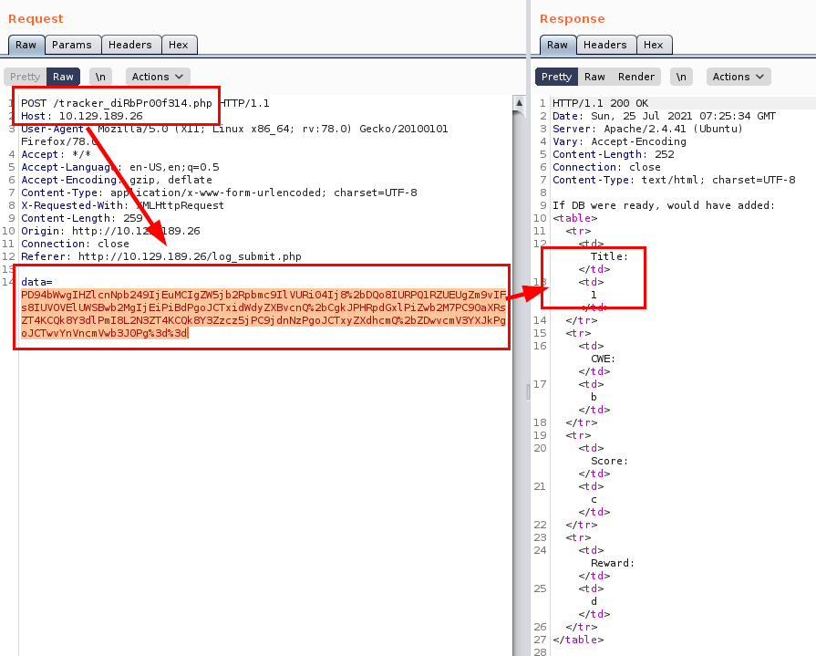

# BountyHunter HackTheBox Writeup
### Level: `Easy` | OS: `Linux`

## Scanning
We run nmap on all ports with scripts and software versions.

## Enumeration
We access the web resource and review the source code.

#### Commented code

We launch **dirsearch**, list some interesting files and directories.

#### Files by extension

#### Directory listing

We review the "*README.txt*" file and find a list of unfinished tasks.

We read the file "*bountylog.js*", we find the url of the application tracker. Seen these files, it seems that the way is to exploit the application.

#### File result

## Exploitation
From the website, we find the "*portal*" section that will take us to this "Beta" form that we will have to exploit. 

Since the application loads "*xml*" tags, it is very likely that we will have to exploit some **XXE** style vulnerability.

Let's get to it! We capture a request from the form, we see a string in **urlencode + base64**.

We modify the values, insert a variable called "*poc*" with the value "*1*", insert in the field "*title*".

We encode again in reverse and see that it works.

#### File read ()
***note: Remember to encode!**

If we remember the dirsearch log, we find a file called "*db.php*", these files usually have the flat credentials of the database connection. It is also possible that passwords are being reused. (in addition, we also have the users thanks to the reading of */etc/passwd*).

We connect through the **SSH** service, read the user flag and see that we can execute a script as root.

## Privilege Escalation
We read the file "*ticketValidator.py*", we do not have permissions to modify it. Inside, we find a conditional that is executed when the variable "*validationNumber*" is greater than *100*, so it returns a "*True*".

We see an example of failed tickets, this will help us with the structuring.

We create in a folder where we have read our malicious file "m3.md".

Now we will call the script as sudo and load our files, we become root and we can read the flag.

---
## About

David Utón is Penetration Tester and security auditor for web and mobiles applications, perimeter networks, internal and industrial corporate infrastructures, and wireless networks.

#### Contacted on:

 [David-Uton](https://www.linkedin.com/in/david-uton/)
 [@David_Uton](https://twitter.com/David_Uton)
