# Driver HackTheBox Writeup
### Level: `Easy` | OS: `Windows`

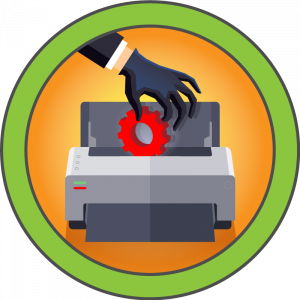

## Scanning
We launch a previous nmap to all ports and launch again an **nmap** with services and scripts to these ports.

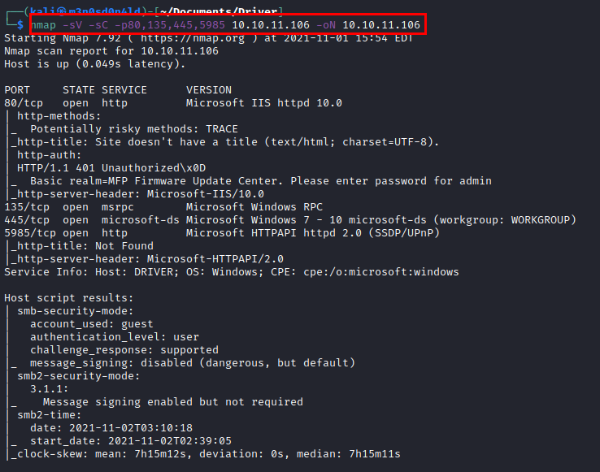

## Enumeration
We access the website, we see that we need a username and password to access what looks like a printer administration panel.

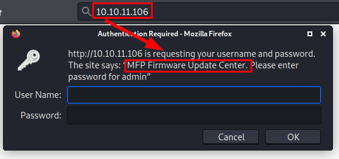

We use the credentials "*admin:admin*" and access the printer control panel. We also enumerate the *driver.htb* domain, we put it in our "**/etc/hosts**" file.

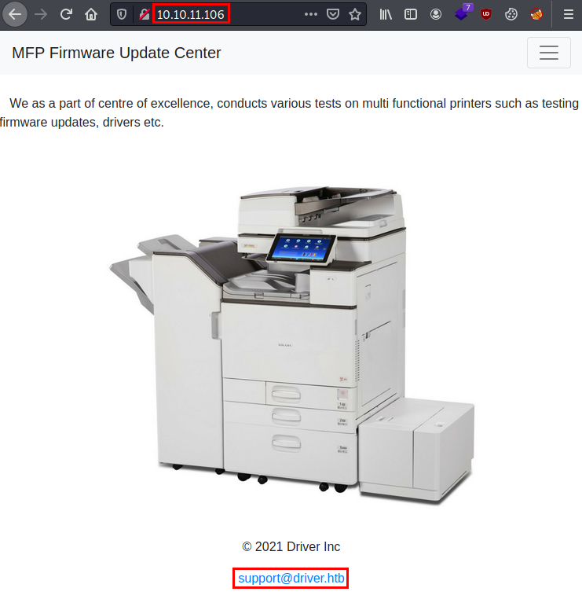

## Exploitation

We upload a reverse shell in **PHP** and see that it accepts it.

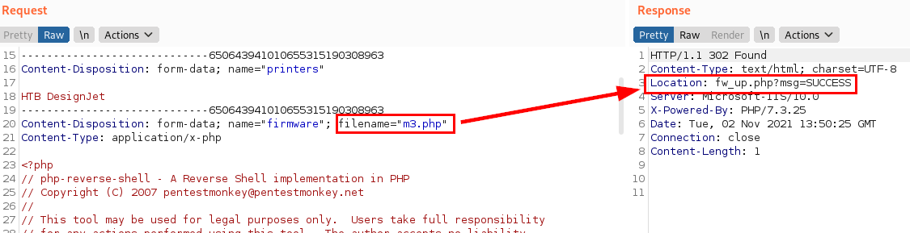

After trying to upload a file to obtain command execution, we see that it does not work.

So, reading the statement, it says "*share*", so it occurred to me to look for information about drivers and samba, I found information about the use of "**.scf**" files (*Shell Command File)*.

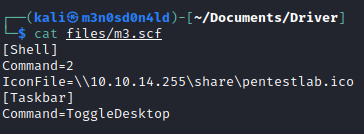

We run "**responder.py**" and upload the file. 
The idea is as follows:
- The machine, will execute the file upload by searching our SMB resource.
- When accessing our resource, it should show the hash "**NTLMv2**".
- We will crack the NTLMv2 hash to get the plain password, as these hashes are not usable for passthehash.

#### Burp request
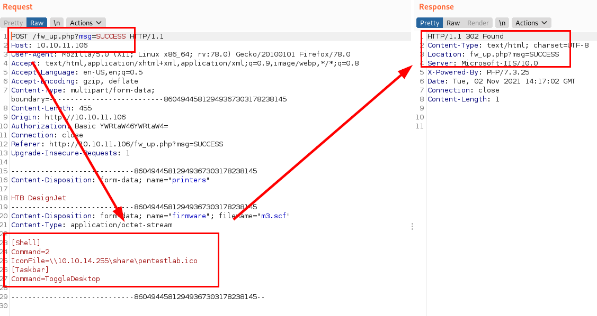

#### Capture NTLMv2 Hash with Responder.py

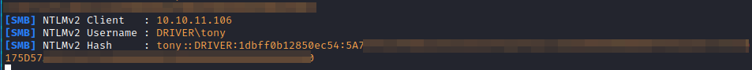

We crack the password with the "**rockyou**" dictionary.

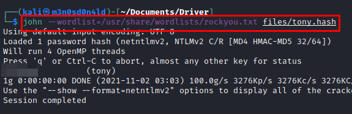

We connect to "**evil-winrm**" and read the flag from *user.txt*.

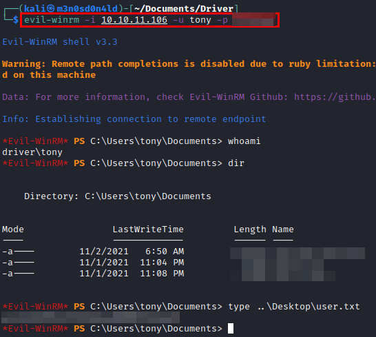

## Privilege Escalation
I didn't bother if there was an alternative route to climbing. Since the machine is called "**Driver**" and uses "**Windows**", I directly escalated privileges by exploiting the "**PrintNightmare**" vulnerability.

We create a user who will be an administrator.

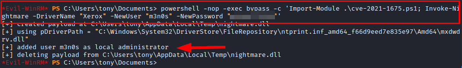

We connect to **evil-winrm**, we see that we are administrators and we read the flag of *root.txt*.

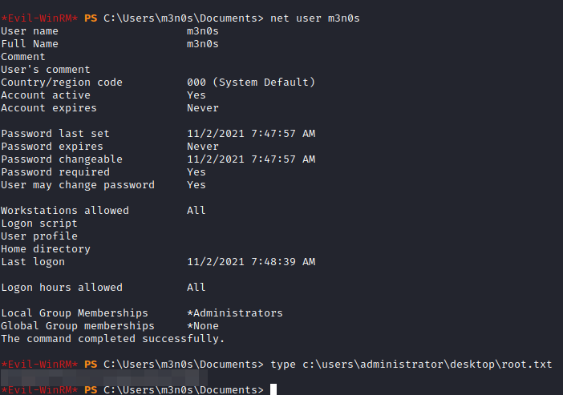

---
## About

David Utón is Penetration Tester and security auditor for web and mobiles applications, perimeter networks, internal and industrial corporate infrastructures, and wireless networks.

#### Contacted on:

 [David-Uton](https://www.linkedin.com/in/david-uton/)
 [@David_Uton](https://twitter.com/David_Uton)
