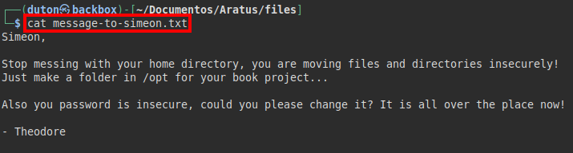
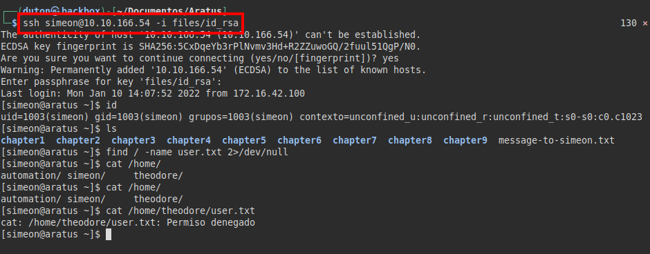
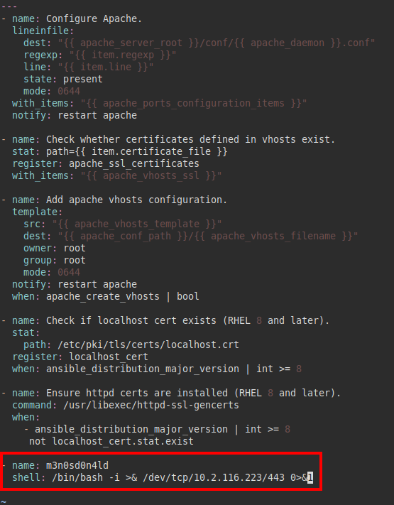

# Aratus TryHackMe Writeup
### Level: `Medium` | OS: `Linux`


## Scanning
We run nmap on all ports with scripts and software versions.


## Enumeration
We list in the **HTTP** and **HTTPS** service the default page of *Apache CentOS*. 


We continue reviewing the services, we continue with the **FTP** service, we see that it is possible to access with the "*anonymous*" credentials, we find a resource but there is nothing useful.


We continue reviewing the **SMB** service, we find a resource that catches our attention "*temporary share*", we try to see the permissions, but we cannot enumerate it with the "**smbmap**" tool.


But you should not be satisfied with what a tool can tell you, you have to check with other tools or manually.
As you can see, the "**enum4linux**" tool tells us that we have read permissions on the Samba resource.


## Exploitation
We connect with the "**smbclient**" tool and see the root path of a user, but we only have access to the "*message-to-simeon.txt*" file and the "chapter" folder listing.


We download and read the file "*message-to-simeon.txt*", we see that the user *Theodore* (looks like an administrator) is complaining that *Simeon* uses bad passwords and is a bit dirty with the files...



Coincidentally, **enum4linux** listed me *3 system users*, so a third one called "*automation*" comes in.


It is time to examine the files in the "*chapters*" directories, it seems that all the files have the same size, this makes it a little difficult to enumerate different files... Or not? We can make use of the "**find**" command and list the last modified files, this works and only one comes out. 

```bash
find . -printf "%T@ %Tc %p\n" | sort -n
```

We read the file "*/chapter7/paragraph7.1/text2.txt*" and find an encrypted SSH private key inside the file. 

*NOTE: To work more comfortably, I set up the SMB resource on my machine.*


We use the tool "**ssh2john**" to obtain the hash of the password used, then we crack the hash with "**john**" and the dictionary "*rockyou*".


We access through the **SSH** service and with the private key, but we still do not have access to the "*user.txt*" file, so we will have to escalate to the "*theodore*" user.



For a moment I saw "*the light*", but it turned out to be a *rabbit hole*, so the password used in the "*.htpasswd*" file is not functional.


We launch the tool "**linpeas.sh**", it lists that we have permissions by "*capabilities*" of the **tcpdump** binary, so we would have the ability to sniff the network traffic.


We run "**ip add**", we see that we have two network interfaces "*lo* and *eth0*".


We ran **tcpdump** on "*eth0*", but found nothing, so I tried it on "*lo*" and we will run **Wireshark** on our computer.


#### Found credentials


We decode the trace to *base64* and find the correct credentials of the user "*theodore*".


We use the credentials to authenticate as "*theodore*" and read the "*user.txt*" file.


## Privilege Escalation
We execute "*sudo -l*", we see that we have permissions as the user "*automation*" to execute a script in **Bash**.

The script appears to run a series of "*Yaml*" files with the "**ansible**" binary.


Reviewing directories and files that follow the script, except for one file, it seems that the rest we do not have write permissions to insert malicious code and make a privilege escalation.


But watch out! There is a "*+*" in the permissions of the file "*configure-RedHat.yml*".


Indeed! We can edit the file! Reading a bit about privilege escalations in "**ansible**", it seems that it is simple, adding a line like "*shell: command...*" we can execute commands as the user that is predefined (in this case, as root).



We put a netcat listening on our attacker's machine and run the script with **SUDO**.


We wait for the remote connection, run our command list and read the flag from the "*root.txt*" file.


---
## About

David Utón is Penetration Tester and security auditor for web and mobiles applications, perimeter networks, internal and industrial corporate infrastructures, and wireless networks.

#### Contacted on:

 [David-Uton](https://www.linkedin.com/in/david-uton/)
 [@David_Uton](https://twitter.com/David_Uton)
