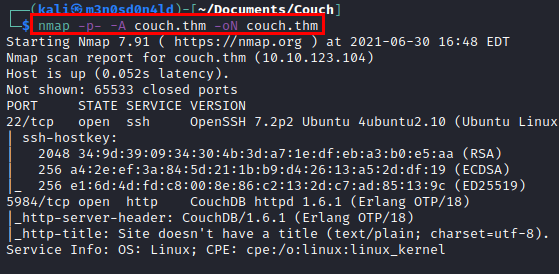

# Couch TryHackMe Writeup
### Level: `Easy` | OS: `Linux`

## Scanning
We launched the **nmap** tool, with script and software versions.

## Enumeration
We access the site, and at first glance we see a **couchdb** information leak.

Looking for information about this software, I find some basic commands that will help us to obtain information from the different databases.

#### List all the databases

#### Displays the database information we specify

#### Example of obtaining relevant information:

## Exploitation
Now that we know how it works, let's check the database called "*secret*" and get some credentials in plain text.

We access through the **SSH** service and read the flag of *user.txt.*

## Privilege Escalation
We read the file "*.bash_history*", we find a record of a connection to **docker**.

#### Reading of the root flag

---
## About

David Utón is Penetration Tester and security auditor for web and mobiles applications, perimeter networks, internal and industrial corporate infrastructures, and wireless networks.

#### Contacted on:

 [David-Uton](https://www.linkedin.com/in/david-uton/)
 [@David_Uton](https://twitter.com/David_Uton)
