# Flatline TryHackMe Writeup
### Level: `Easy` | OS: `Windows`

## Scanning
We run nmap on all ports with scripts and software versions.

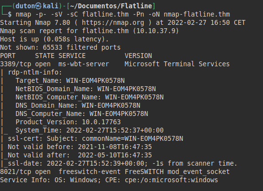

## Enumeration
We access to service on 8021 port, this service have exploit for RCE without authentitation.

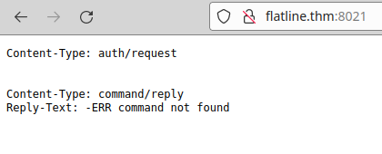

## Exploitation

#### Exploit used: [https://www.exploit-db.com/exploits/47799 ](https://www.exploit-db.com/exploits/47799)

We see is working! 

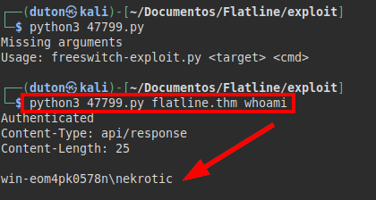

We transfer the **netcat** to the machine, listen on port *443* and run a **netcat** on the victim to get an interactive session.

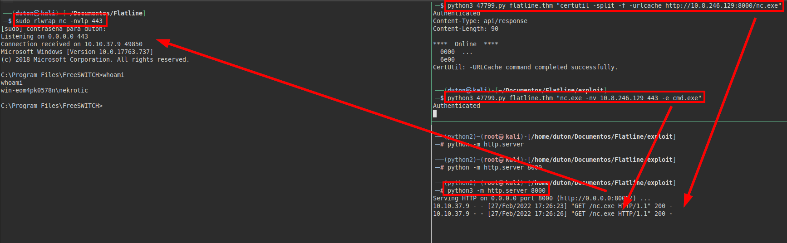

We try to read the *root.txt* flag, but we don't have access, so we only read the *user.txt* flag.
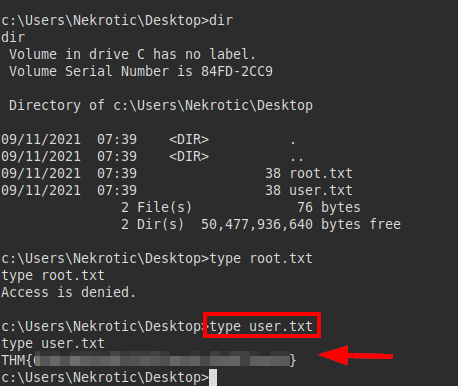

## Privilege Escalation
We see the privileges, we identify the famous "*SeImpersonatePrivilege*", but I can already tell you that the machine seems to be patched.

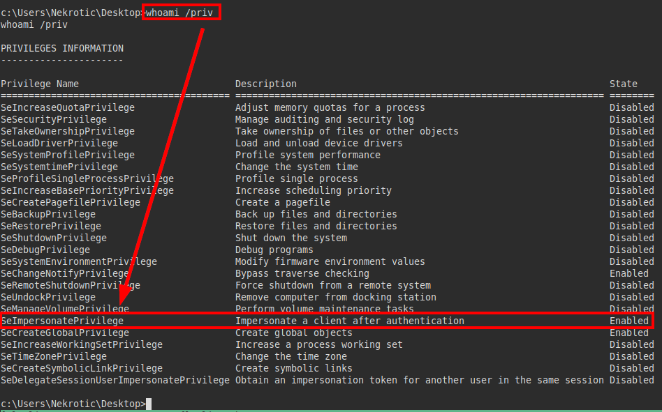

We also identify the operating system and its architecture.
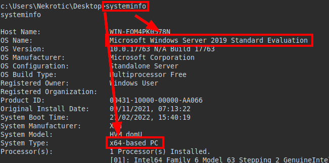

We download the "**Winpeas**" tool, identify a software called "**OpenClinic**" and a "**Tomcat 8**".
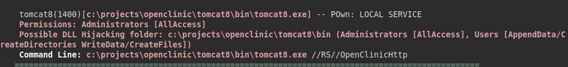

There is a local exploit for privilege escalation:
#### Exploit used: [https://www.exploit-db.com/exploits/50448](https://www.exploit-db.com/exploits/50448)

We create a malicious binary with "**msfvenom**" with a reverse shell to our machine on port 5555.
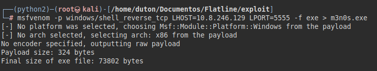

Transfer the malicious binary, rename the file "**mysqld.exe**" to "**mysqld.bak**" and replace the malicious binary with "**mysqld.exe**".
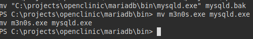

We set our **netcat** to listen on port 5555 and restart the victim machine.
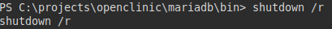

In a few minutes, we will get a connection on our machine and as the user "*nt authority system*".

Finally, we will read the flag from *root.txt*.
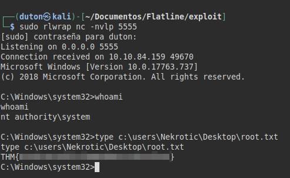

---
## About

David Utón is Penetration Tester and security auditor for web and mobiles applications, perimeter networks, internal and industrial corporate infrastructures, and wireless networks.

#### Contacted on:

 [David-Uton](https://www.linkedin.com/in/david-uton/)
 [@David_Uton](https://twitter.com/David_Uton)
