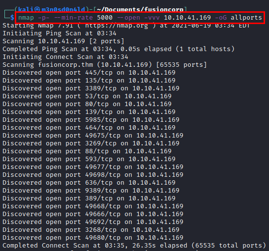
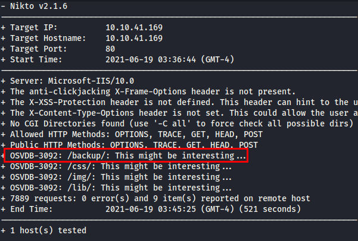

# Fusion Corp TryHackMe Writeup
### Level: `Hard` | OS: `Windows`

## Scanning
We launch **nmap** a bit *"aggressive"* (but we are in a controlled environment and we can afford it :P), to all ports and with verbosity to discover ports as **nmap** is getting them.

### nmap with versions and scripts

## Enumeration
We access the web service, find the corporate website and list some of the organization's users. This is great, as we could use them to brute force some exposed service.

We use the **nikto** tool, it discovers the directory *"/backup/*. 

Accessing the directory, we find an office file containing the name and username of the employees.

#### Content ods file

We use the **kerbrute** tool to check which users exist, it quickly lists the user *"lparker"*.

## Exploitation
Once we have a user, we can check if the account is ASReproastable and consult its hash in the KDC.

We crack the hash with **hashcat** and *rockyou dictionary*, we will get the password in clear.

### Read the first flag 

We do a reconnaissance, we see that AV is enabled in the system and it prevents us from running some reconnaissance binaries.

Seeing that I can't find anything, I launch ldapsearch with the credentials and coincidentally, I find some flat credentials in the description of the user "jmurphy".

#### Credentials evidence

We use the credentials of the new user, read the user flag and see the privileges.... Oh wow! The privilege escalation looks good ;)

## Privilege Escalation
We make use of the great tool **evil-winrm** and this article from [HackPlayers](https://www.hackplayers.com/2020/06/backup-tosystem-abusando-de-los.html). Actually the vulnerability allows to abuse the backup privilege to write and restore the modified ACLs as we wish.

We connect with our user and read the administrator flag.

## Post-exploitation

Once we have gained access, it is time to obtain the hashes of the most relevant users.

#### NTLM HASHES

#### Commitment Active Directory

#### RDP connection

---
## About

David Utón is Penetration Tester and security auditor for web and mobiles applications, perimeter networks, internal and industrial corporate infrastructures, and wireless networks.

#### Contacted on:

 [David-Uton](https://www.linkedin.com/in/david-uton/)
 [@David_Uton](https://twitter.com/David_Uton)
