# Harder TryHackMe Writeup
### Level: `Medium` | OS: `Linux`

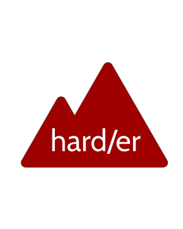

## Scanning
We scan the open ports with the **nmap** tool with scripts and software versions.

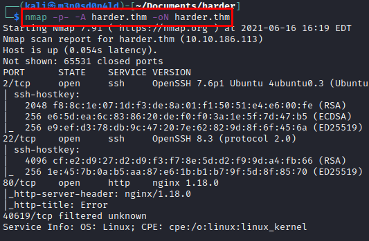

## Enumeration
We access the web service and find the corporate website and the software they use.

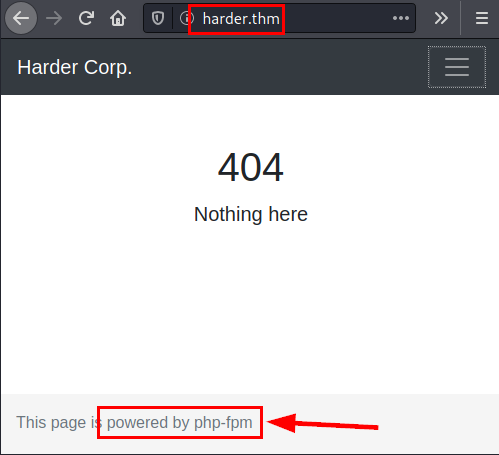

Using the **Nikto** tool, we list a *phpinfo.php* file that can also help us to list deployed software and its exact versions.

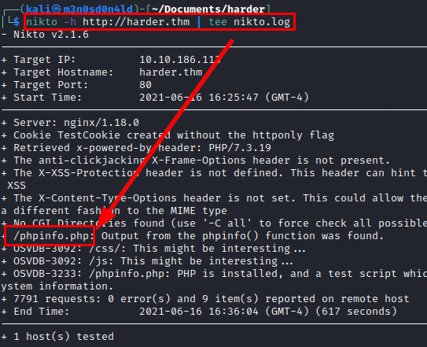

#### PHPinfo File


We see in the server response that it reveals a domain name, we add it to our *"/etc/hosts"* file.

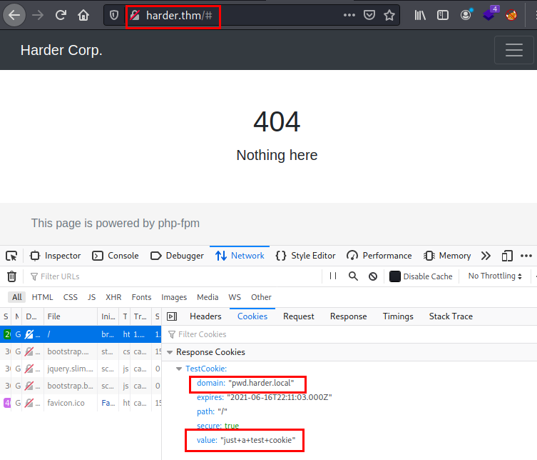

We list an administration panel that asks for credentials.

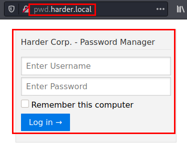

We set the default credentials to *"admin:admin"* and it lets us through, but we get the following message...

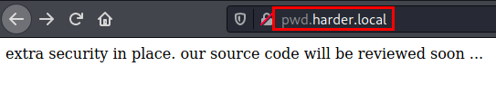

We use **dirsearch** and several **seclist** dictionaries, we list some files and directories that might be relevant.

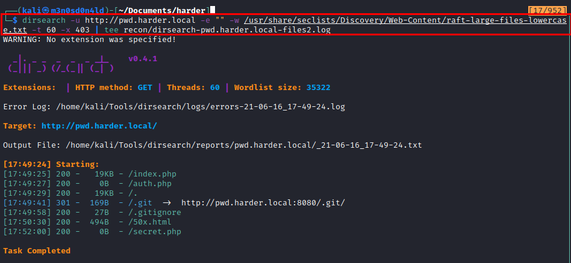

We can't access it from the browser, but we can use the **[GitTools](https://github.com/internetwache/GitTools)** suite to dumpe it.

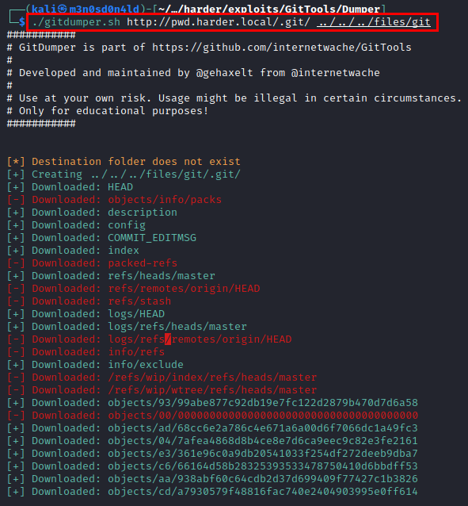

We extract information...

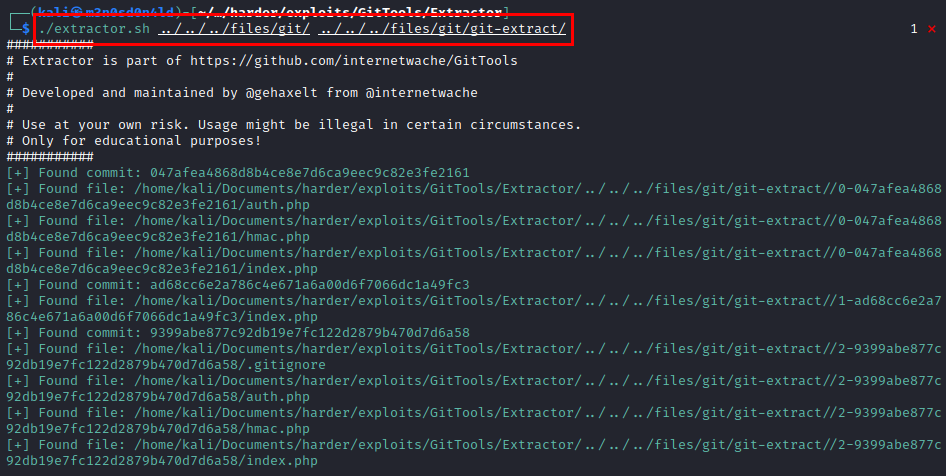

We read the file *"index.php"*, we see that it requires the file *"hmac.php"*.

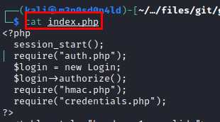

#### Contents of file "hmac.php".


The best way to be able to review code is to play with it, so I used a web to run **PHP** to debug the code and do a test to get an *hmac hash* for a personal host.

```PHP
<?php
$secret = hash_hmac('sha256', "m3n0sd0n4ld.github.io", false);
echo $secret;
```


Now with all the data, we fill in the variables and we see that the site returns a new url and credentials.

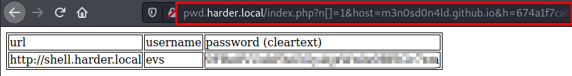

We access the new site, enter the credentials but it seems that it only allows access to a specific network range.

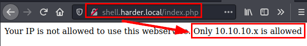

We add the header *"X-Forwarded-For: 10.10.10.X"* and we see that it opens the web site.

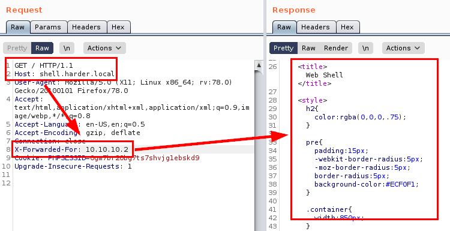

## Exploitation

Once inside, we see that we can execute system commands.

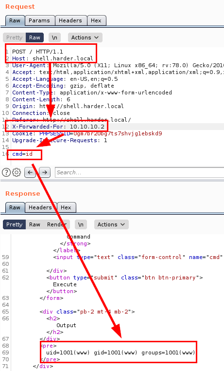

#### Read user flag

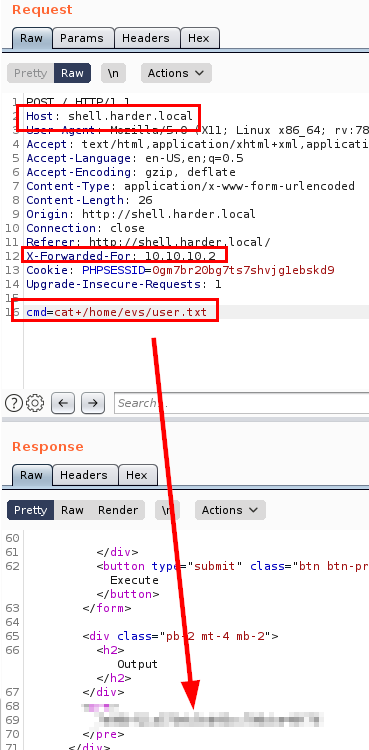

We see that the shell type is an "ash", so we change the netcat type and we will get a more or less stable reverse shell.

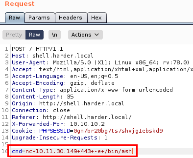

#### Reverse shell

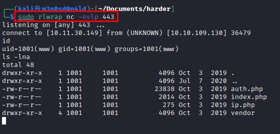

We do an enumeration on the machine, we find a *backup file* that hides the credentials of the user **"evs"**.

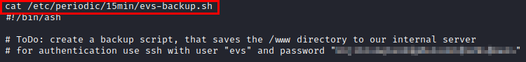

We connect via **SSH** to have a more stable session.

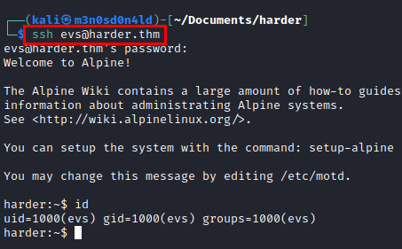

## Privilege Escalation
Let's remember the file we found with the **"evs"** credentials *(ToDo: create a backup script....)*

We use find to list the scripts that we could review.

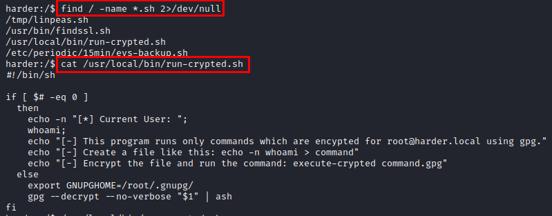

So nothing, we do a test with the **"whoami"** command, encrypt it with **gpg** and run the *"execute-crypted"* binary and see that it executes *"root"*.

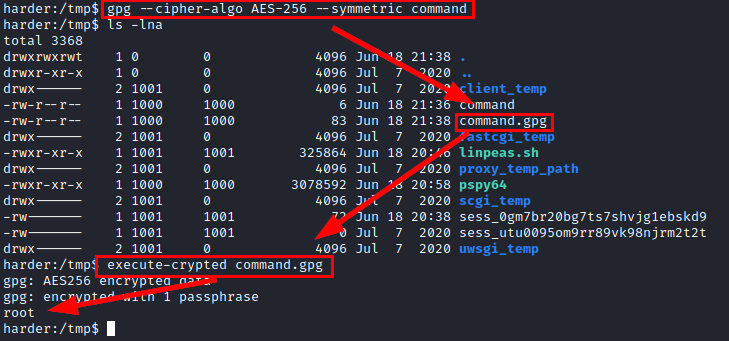

Great! So now we use **netcat** again to establish a reverse shell as root, we put it in the *"command"* file, do a cat to check that it is OK, encrypt the file in **gpg** and run the binary.... Below we will see that we already have a *shell as root* and we can read the flag.

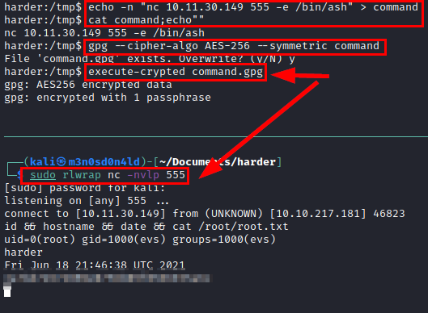

---
## About

David Utón is Penetration Tester and security auditor for web and mobiles applications, perimeter networks, internal and industrial corporate infrastructures, and wireless networks.

#### Contacted on:

 [David-Uton](https://www.linkedin.com/in/david-uton/)
 [@David_Uton](https://twitter.com/David_Uton)
