# IDE TryHackMe Writeup
### Level: `Easy` | OS: `Linux`

## Scanning
We run nmap on all ports with scripts and software versions.

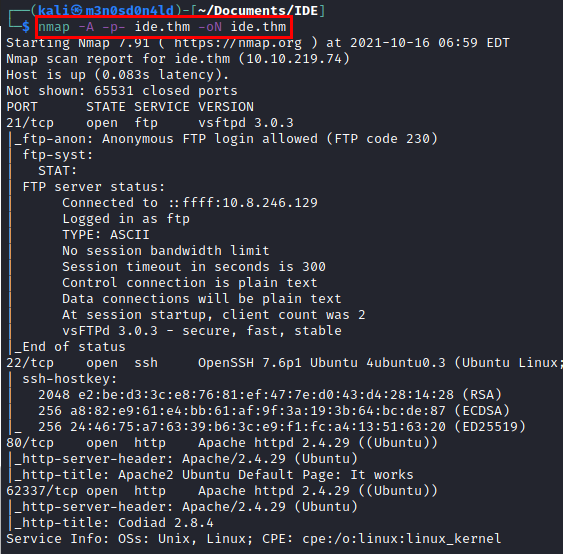

## Enumeration
We access to website, found Apache default page on server

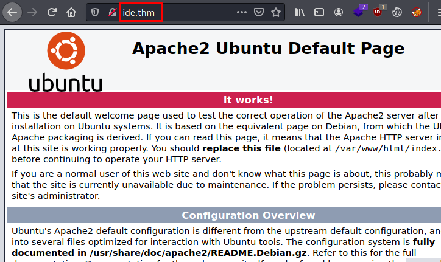

In addition, we have another website on port 62337 with Codiad 2.8.4 software.

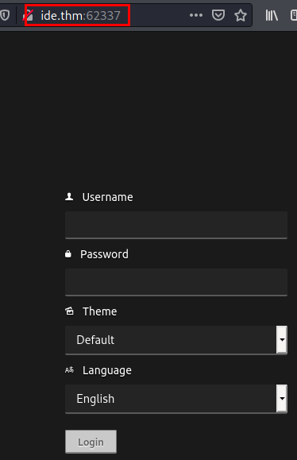

There are exploits for this version, these that we have highlighted *require credentials*.

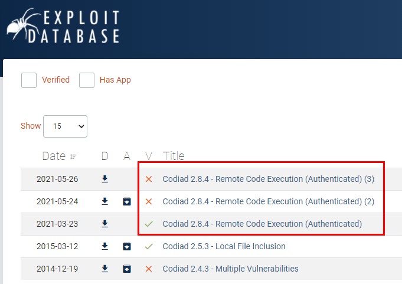

Nmap showed us an FTP service with "*anonymous*" user access. We set up the service with [CurlFtpFS](https://linuxconfig.org/mount-remote-ftp-directory-host-locally-into-linux-filesystem) and found a text file with *two users and the use of a default password*.

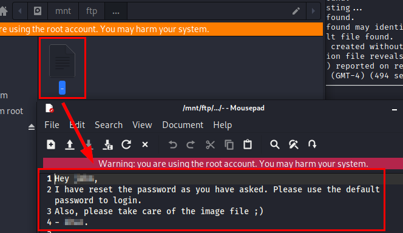

## Exploitation
Knowing the possible users, we could launch a small brute force attack with a basic password dictionary. I manually tested with 5 or 6 classic passwords and one of them worked.

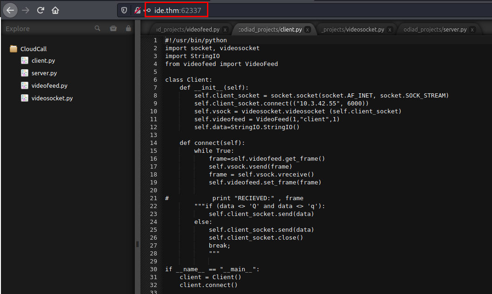

I used this exploit:
##### Exploit: https://www.exploit-db.com/raw/49705

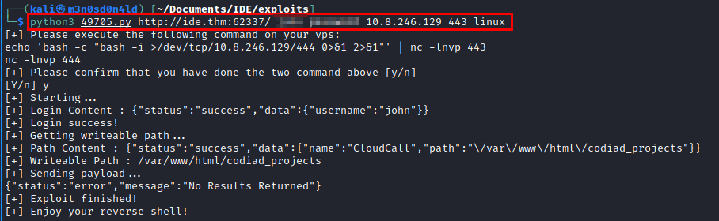

We receive the connection and have access to the machine.

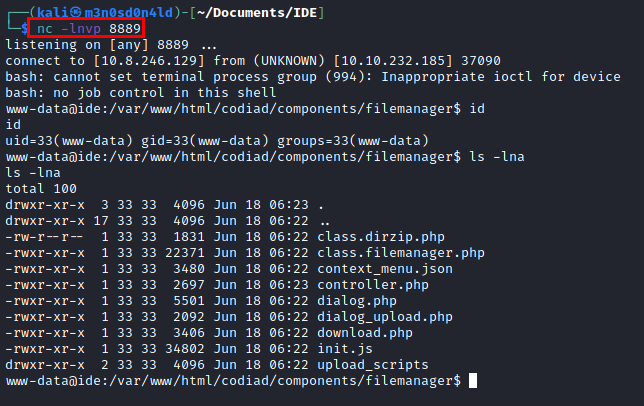

We see that we do not have visibility to the file "*user.txt*" being "*www-data*", but we can read the file "*.bash_history*", here it is evident a connection with the database and the credentials in plane.

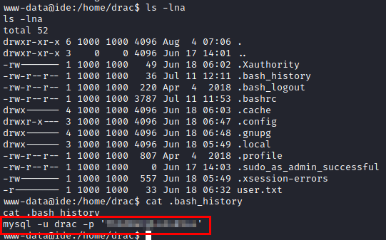

We test if the user reuses passwords, we see that he does and we read the user flag.

Also, we see that we can restart the "**vsftpd**" service with any user.

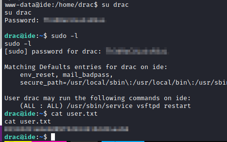

## Privilege Escalation
We use the tool "**linpeas.sh**" and it lists a *.service file*. This reminds me that it is possible to modify or create a .service file where to insert malicious code to be executed when the **vsftpd** service is restarted.

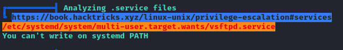

Let's go! We modify the file and insert our malicious code and save. Now, we will put a netcat on the listener and restart the service on the victim machine.

We will receive a connection in our kali as the root user and read the flag in the file "*root.txt*".

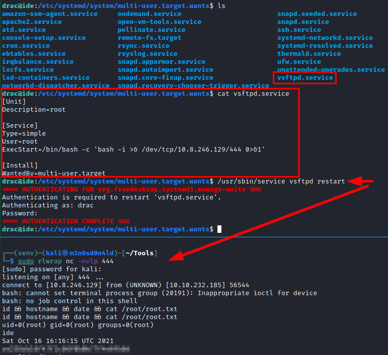

---
## About

David Utón is Penetration Tester and security auditor for web and mobiles applications, perimeter networks, internal and industrial corporate infrastructures, and wireless networks.

#### Contacted on:

 [David-Uton](https://www.linkedin.com/in/david-uton/)
 [@David_Uton](https://twitter.com/David_Uton)