# KoTH Food CTF TryHackMe Writeup
### Level: `Easy` | OS: `Linux`

## Scanning
We performed an **nmap** scan, including all ports and software versions.

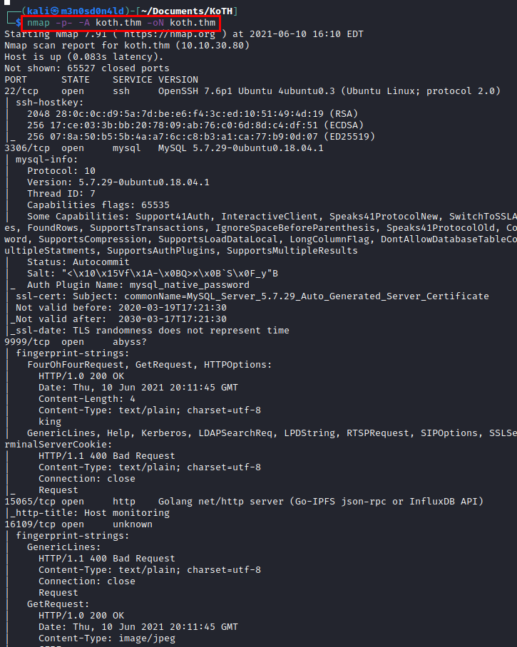

## Enumeration
We access the web resource on a high port.

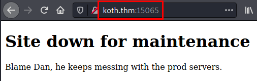

On *port 16109*, it shows an image. This is a CTF, it is possible that this image contains stego, so we download it.

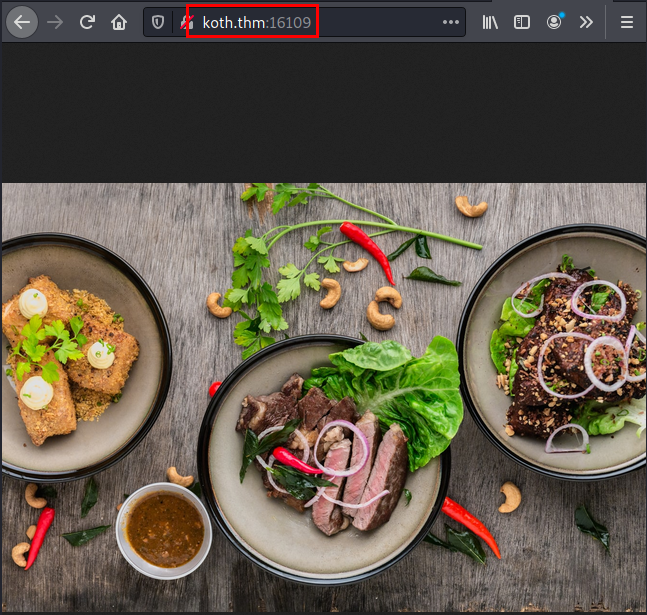

## Exploitation
We run the **steghide** tool without password and get a file containing credentials.

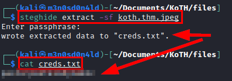

It seems to be very easy, we try the credentials obtained in the **SSH** service and get access to the machine.

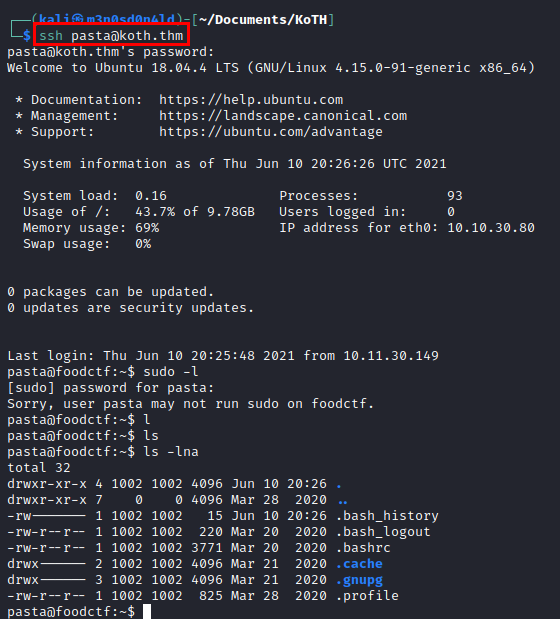

Recall that we had enumerated a **MySQL**, we tried to access with the **default credentials** with success, we enumerated the *"Users"* table, we enumerated the password of the user *"ramen"* and another *flag*.

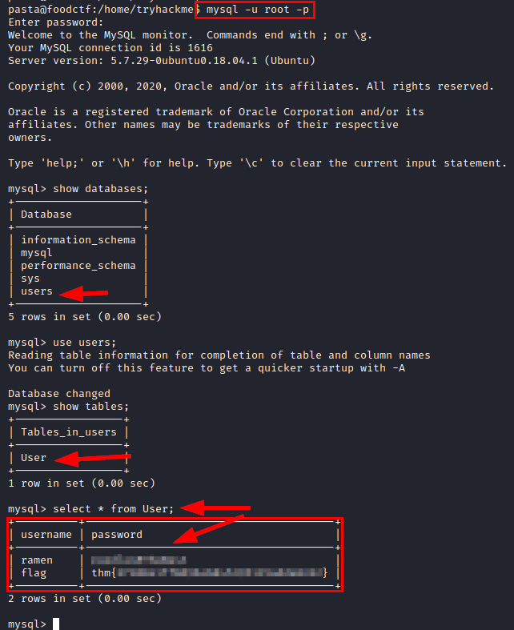

We authenticate as the user *"ramen"*, but it seems that we will not be able to do much with it.

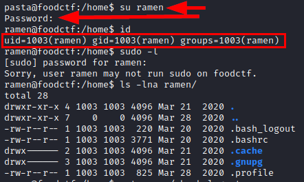

## Privilege Escalation
We launch the tool **lse.sh**, we enumerate the *Screen 4.5.0 binary*, I already knew this binary, it has an **[exploit](https://www.exploit-db.com/exploits/41154)** to escalate privileges.

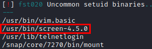

In my case I did it manually, so I compiled the *"libhax.so"* and *"rootshell"* files in my Kali, mounted a server with **Python** to share the files and executed the following commands to escalate privileges to the *root* user.

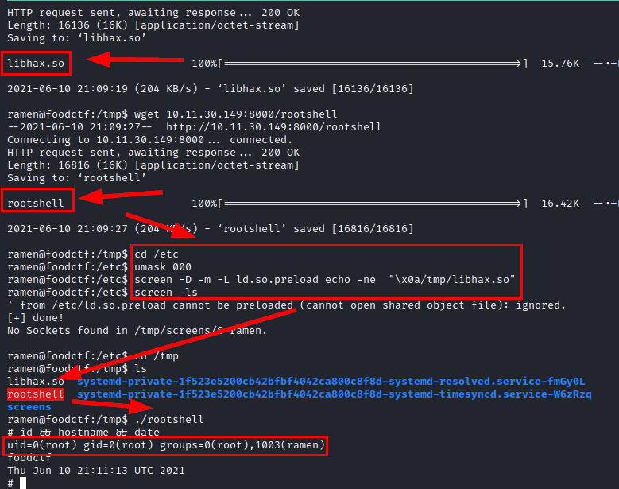

#### Some of the flags found (My idea was just to root the machine)

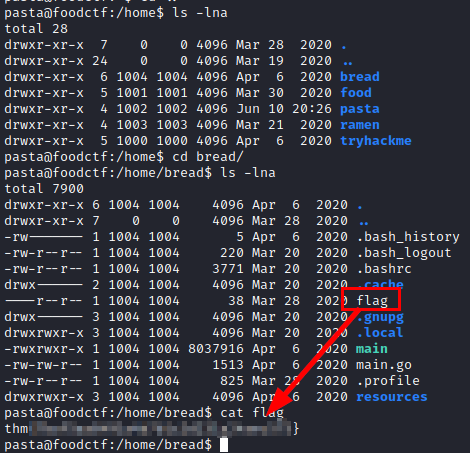
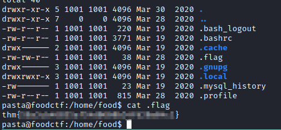
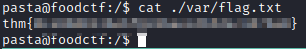
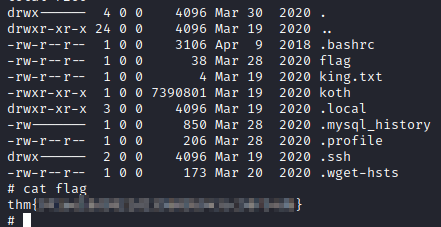
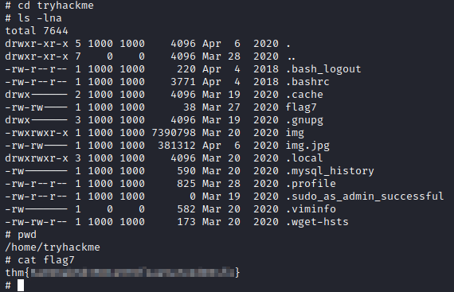

---
## About

David Utón is Penetration Tester and security auditor for web and mobiles applications, perimeter networks, internal and industrial corporate infrastructures, and wireless networks.

#### Contacted on:

 [David-Uton](https://www.linkedin.com/in/david-uton/)
 [@David_Uton](https://twitter.com/David_Uton)
