# KoTH Hackers TryHackMe Writeup
### Level: `Medium` | OS: `Linux`

## Scanning
We scanned with the nmap tool all ports with scripts and software versions.

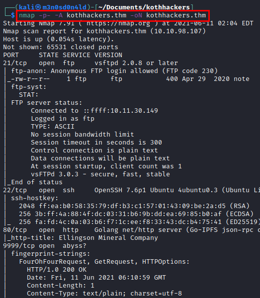

## Enumeration
We access web services and we enumerate the corporate website.

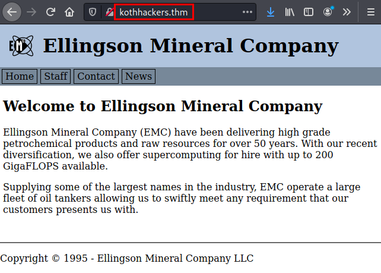

We also list several corporate users.

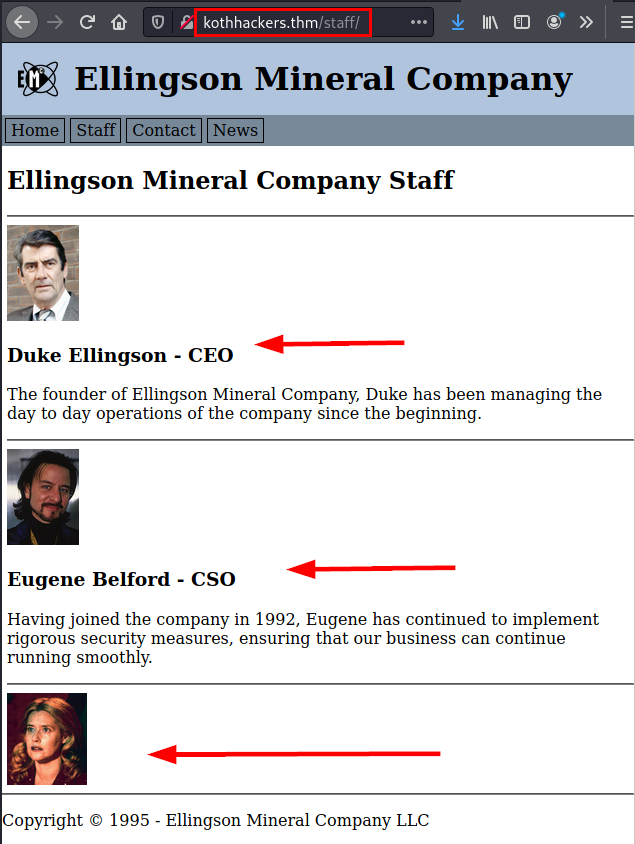

We access the **FTP** service with the default credentials and download a file called *"notes"*, where a list of passwords and user names are filtered.

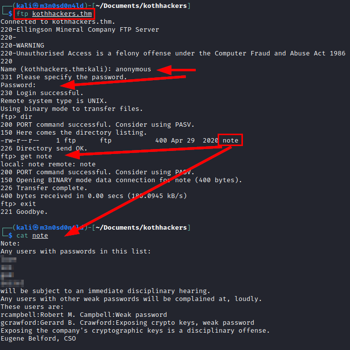

We create a file with listed *users* and another one with the mentioned *passwords*.

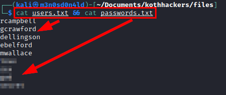

We tried to brute force the **SSH** service without success, so we used the **dirsearch** tool with a medium directory dictionary and listed the *"/backdoor/"* directory.

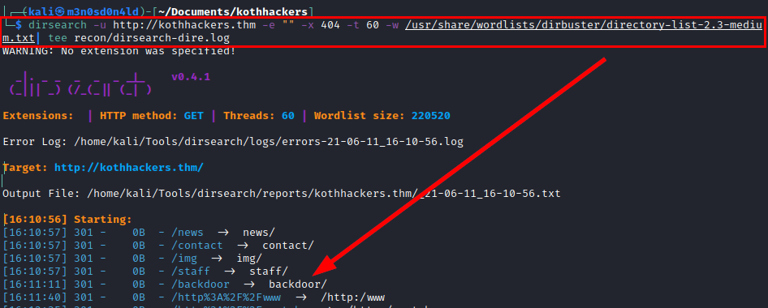

We access and find an authentication system, we will probably have to brute force.

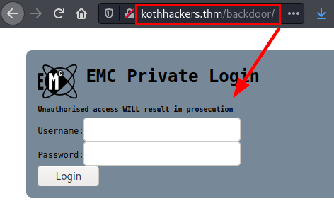

After much testing, there was no way and I had to start again from scratch... This time, I reused the listed users and the *rockyou* dictionary on the **FTP** service.

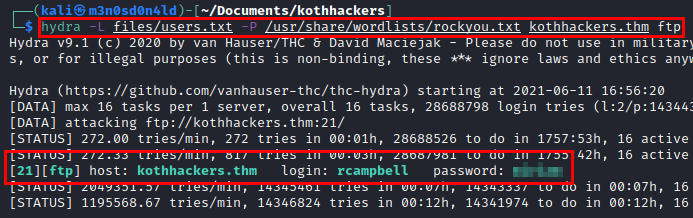

Recall that we found a note stating that the user *"gcrawford"* exposed his cryptographic keys.

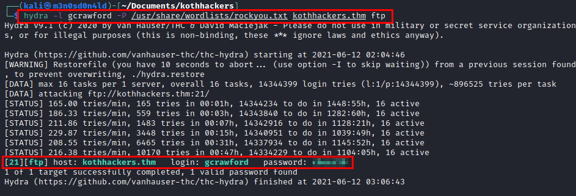

## Exploitation
Access the **FTP** service with the new credentials, check hidden files and find the *".ssh"* directory with the user's ssh keys (private included).

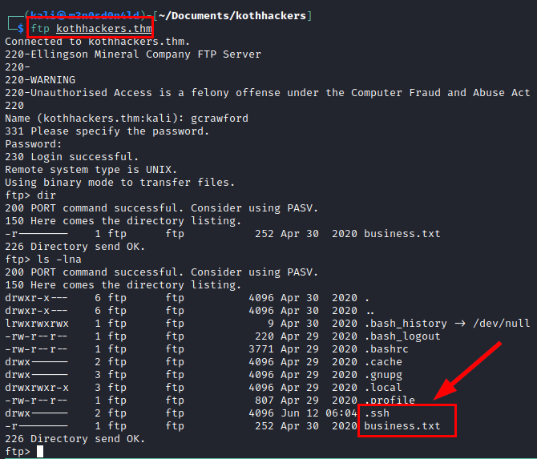

We see that the private key is encrypted and we need the key to be able to use it.

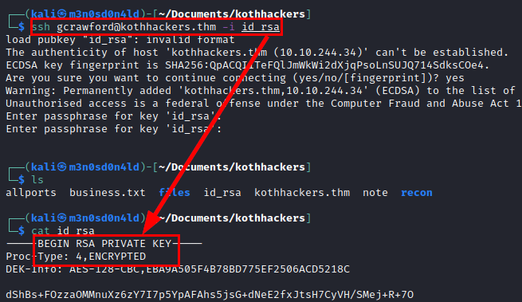

We use the **"ssh2john"** tool to obtain the hash of the *"id_rsa"* file, crack it with the *rockyou* dictionary and in a few seconds we obtain the plain password.

We use the password, access by **SSH** and see that we can run **nano** on a text file and as the *root* user.

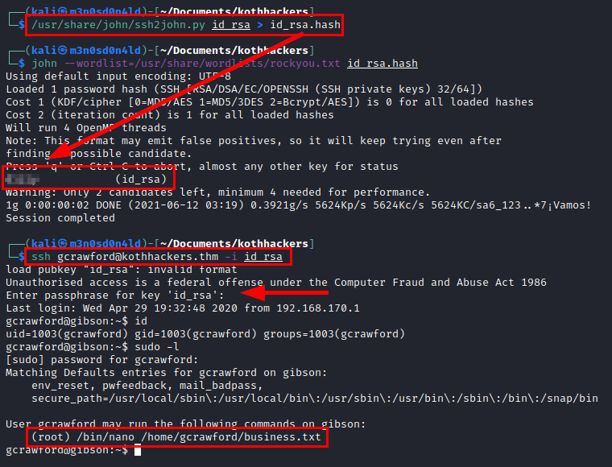

## Privilege Escalation
We run **nano** with sudo calling the text file, there we will execute commands to obtain a shell as root.

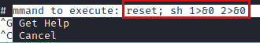

#### Root prompt

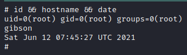

#### Some of the flags found (the idea was just to root the machine)
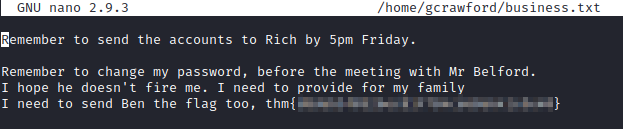

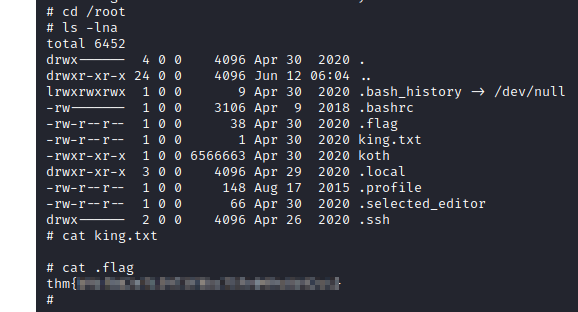

---
## About

David Utón is Penetration Tester and security auditor for web and mobiles applications, perimeter networks, internal and industrial corporate infrastructures, and wireless networks.

#### Contacted on:

 [David-Uton](https://www.linkedin.com/in/david-uton/)
 [@David_Uton](https://twitter.com/David_Uton)
