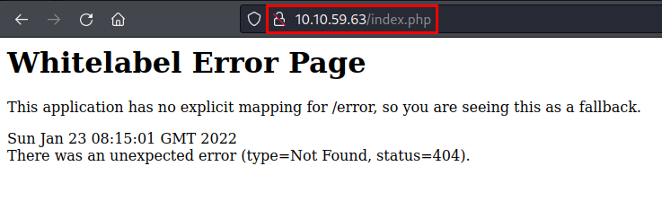

# Lumberjack Turtle TryHackMe Writeup
### Level: `Medium` | OS: `Linux`

## Scanning
We run nmap on all ports with scripts and software versions.

## Enumeration
We access the site, we find a message that gives us a "*hint*" that the site is under **java**.

We use **dirsearch** and find a "*logs*" directory. 

We access and find a phrase that sounds familiar, doesn't it?

Nmap showed us that a Nagios log server is deployed. Searching for information I found this interesting article: https://www.nagios.com/news/2021/12/update-on-apache-log4j-vulnerability/

## Exploitation
As we do not have a control panel, I had to test a "PoC" payload on each header. I quickly realized that the "*Accept*" header is vulnerable to **Log4j**.

### PoC

### Reverse shell
Exploit: https://github.com/pimps/JNDI-Exploit-Kit

I downloaded the exploit and inserted a typical **Pentestemonkey** reverse shell, it worked without any problem as we can see in the following images.

Once inside, we search for files containing "*flag*" and find the hidden flag and read it.

## Privilege Escalation
We are in a somewhat restrictive shell and we are missing several binaries, but we can check binaries by **SUID**, find **mount**, **unmount** and **wall**.

We list the drives and mount the "*/dev/xvda1*" drive and see that we now have access to the machine's files.

But the flag is not in the root folder!

We enter our public key, access via **SSH** and thus get a more stable shell.

We searched by flag, we found two files in the "**Docker**" folder

If we check its integrity, we see that it is the same file.

After a lot of searching, I noticed something that I had not taken into account, there is a folder with three dots "...". The flag is hidden there!

---
## About

David Utón is Penetration Tester and security auditor for web and mobiles applications, perimeter networks, internal and industrial corporate infrastructures, and wireless networks.

#### Contacted on:

 [David-Uton](https://www.linkedin.com/in/david-uton/)
 [@David_Uton](https://twitter.com/David_Uton)