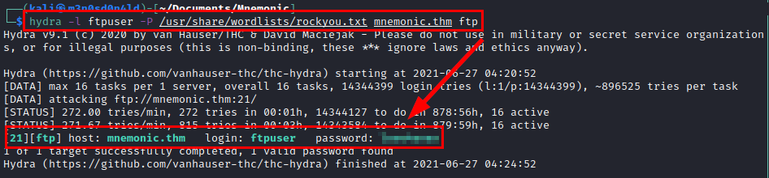
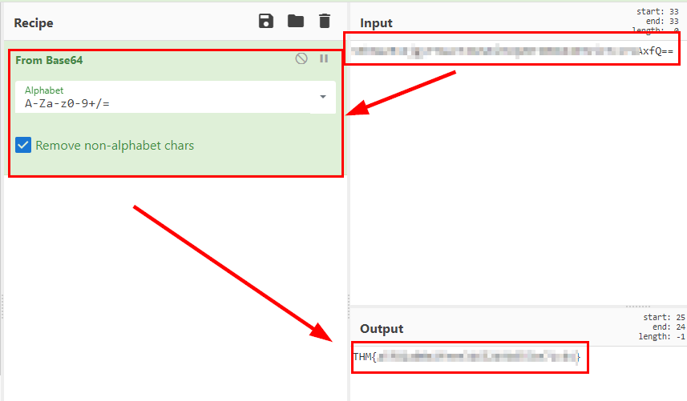

# Mnemonic TryHackMe Writeup
### Level: `Medium` | OS: `Linux`

## Scanning
We launch **nmap** with scripts and software versions.

## Enumeration
We access the web service, we only see that it is in test mode.

We access the file *"robots.txt"* and list the directory *"/webmasters/"*.

We run the **dirsearch** tool with some known extensions and a common dictionary in the directory listed above.

We list some interesting directories.

We listed an administration panel in the "/webmasters/admin/" directory, but it does not work.

We continue with **dirsearch** and start searching for files by known extensions in the directories listed above. 

We list a *backups.zip* file:

We see that the file has a password to decompress, we use **zip2john** and crack the hash with the **rockyou** dictionary.

We use the password and read the file, it gives us the username of the **FTP** service.

We performed brute force with the enumerated user, the **rockyou** dictionary and the **Hydra** tool. We managed to find the password of the **FTP** service.

We use the **FTP** service credentials, list several folders and two interesting files *"id_rsa"* and *"not.txt"*.

#### Content of both files:

## Exploitation
We use the **ssh2john** tool, crack the hash with john and the wordlist **rockyou** to get the password.

We use the credentials in the **SSH** service to gain access to the machine.

We see that we have a restricted bash, so we reopen the ssh session with *"bash --noprofile"* and export a couple of environment variables so we can have an interactive shell.

I search the internet for the words "*Mnemonic crypto*", find this tool on this **[github](https://github.com/MustafaTanguner/Mnemonic)**, download the tool and try the numerical file.

At the moment there is nothing we can do, as we need a photograph.

If we try to list the directories and files, we are able to list a couple of files of the user "Condor", there we see two files with the title in base64.

#### A file is the flag of user.txt

#### Content 2nd file

We go back to the tool, specify the photo and the path to the text file, we will get the password of the user "*condor*".

## Privilege Escalation
We authenticate as the user "*condor*" and we see that we are able to run a python script with **SUDO**.

#### Python script in execution

We see that "**date**" is executed without mentioning the absolute path, this would allow us to replace it and modify the path to execute our malicious binary and gain access.

But it does not work! So we continue reviewing the code, we see something suspicious, the function with *code 0* allows you to write, so we would still be able to execute commands like root....

#### Proof of concept

Well, easy, we call the bash binary with the flag *"-p"* and we will get a shell as root.

---
## About

David Utón is Penetration Tester and security auditor for web and mobiles applications, perimeter networks, internal and industrial corporate infrastructures, and wireless networks.

#### Contacted on:

 [David-Uton](https://www.linkedin.com/in/david-uton/)
 [@David_Uton](https://twitter.com/David_Uton)
