# Mustacchio TryHackMe Writeup
### Level: `Easy` | OS: `Linux`


## Scanning
We performed an nmap scan of all ports, with scripts and versions.

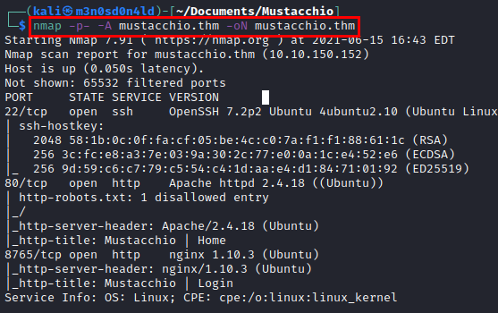

## Enumeration
We access the first web resource (port 80), check the website and its source code, but find nothing useful.

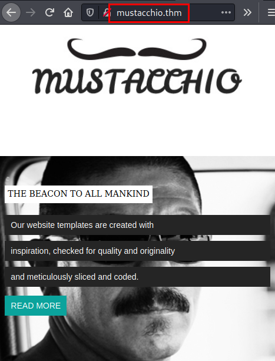

We launch the **dirsearch** tool, list the directory *"/custom/"* which looks interesting.

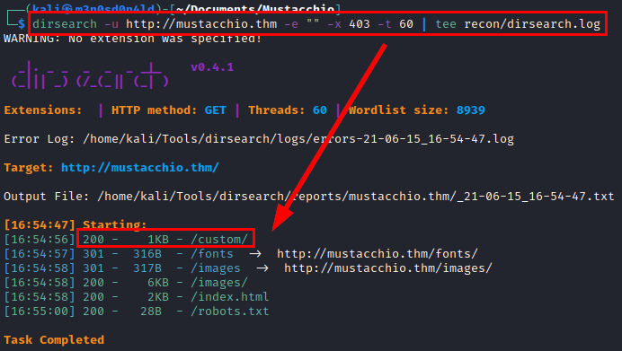

We access the directory and find a file *"users.bak"* which usually contains relevant information.

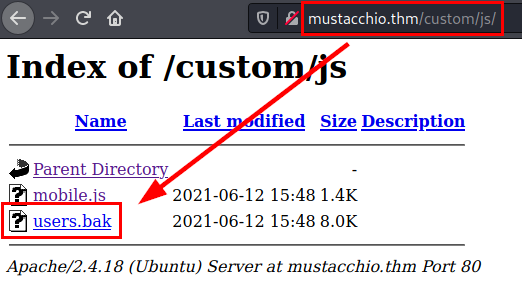

Download the file, crack the password hash with an online tool and get the password in clear.

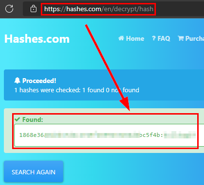

We access the other web resource (port 8765), insert the credentials in the administration panel and access the inside of the application.

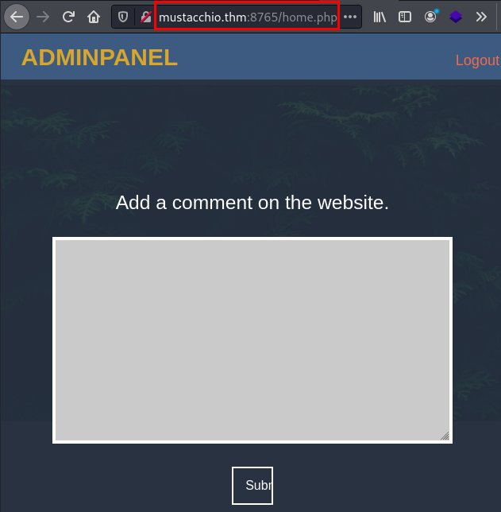

## Exploitation
We see that the site asks us to write **XML code**.

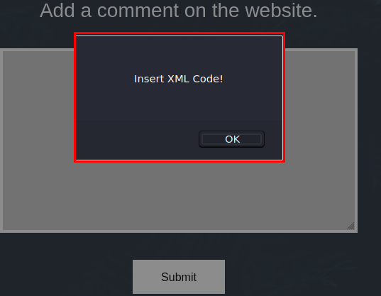

We do some XML code tests, nothing interesting so far. But on the other hand, we see a new path to a *.bak* file and we get a hint that the user *"Barry"* can connect via **SSH** service with his private key.

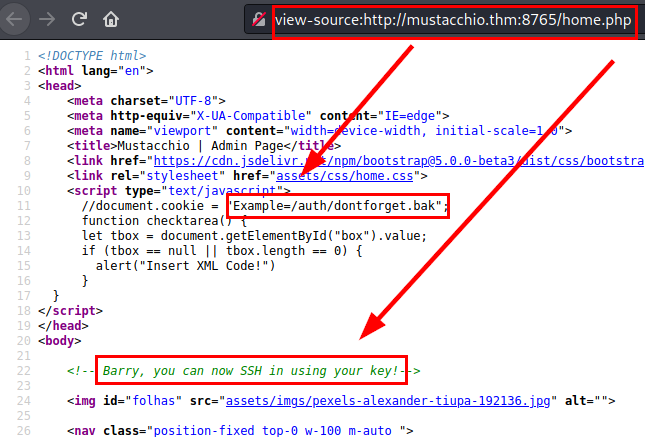

We download the file, we see that we have listed the structure of the XML in question, so we could continue investigating to exploit it.

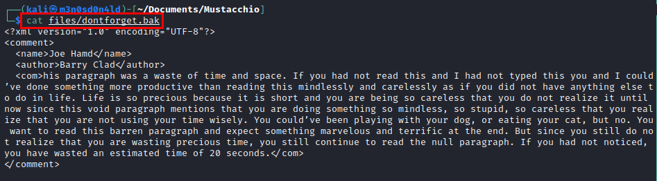

#### Testing

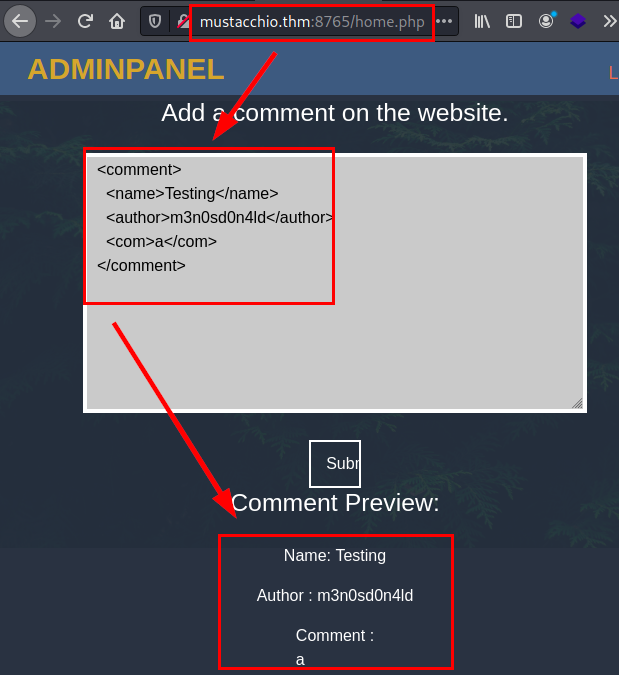

#### PoC XXE/XEE
```XML
<!--?xml version="1.0" ?-->
<!DOCTYPE foo [<!ENTITY xxe SYSTEM "/etc/passwd"> ]>
<comment>
  <name>Testing</name>
  <author>m3n0sd0n4ld</author>
  <com>&xxe;</com>
</comment> 
```

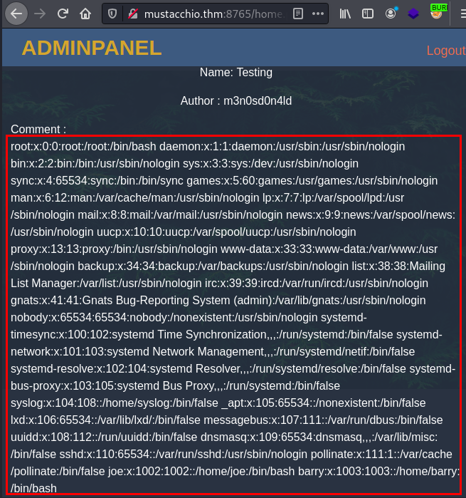

We repeat the same process, this time we will read the **id_rsa** file of the user *"Barry"*.

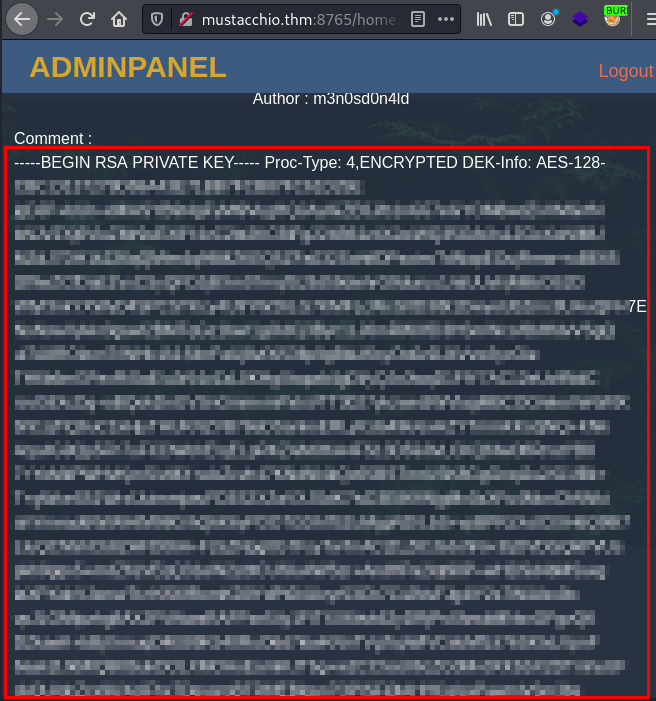

We copy the key, we see that it is encrypted. We use the tool **ssh2john.py** and crack it with the *rockyou dictionary*.

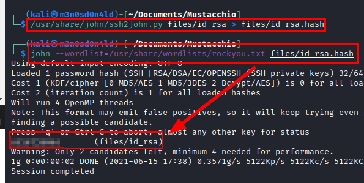

We authenticate through the **SSH** service and read the *user.txt* flag.

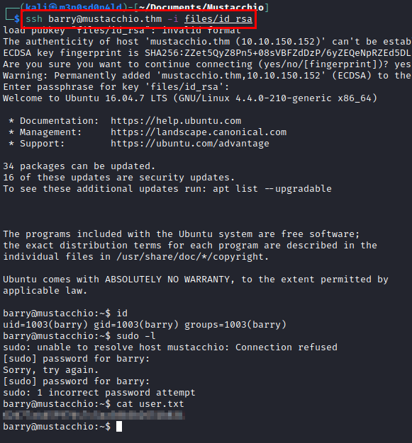

We list the binary *"live_log"* in the path of the user *"joe"*.

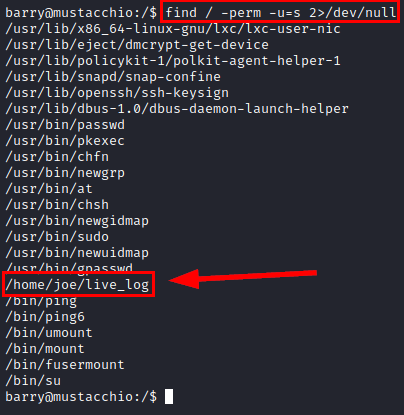

#### Use strings in file

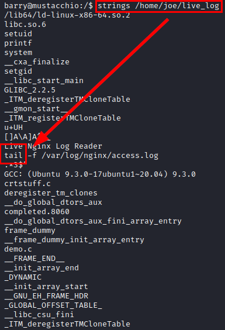

## Privilege Escalation

Since the call to the **"tail"** binary is not made with its absolute path, an attacker could create a malicious binary and change its *PATH* to execute the illegitimate one.

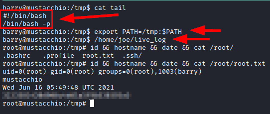

---
## About

David Utón is Penetration Tester and security auditor for web and mobiles applications, perimeter networks, internal and industrial corporate infrastructures, and wireless networks.

#### Contacted on:

 [David-Uton](https://www.linkedin.com/in/david-uton/)
 [@David_Uton](https://twitter.com/David_Uton)
