# Wgel CTF TryHackMe Writeup
### Level: `Easy` | OS: `Linux`

## Scanning
We use nmap to scan all ports with scripts and software versions.

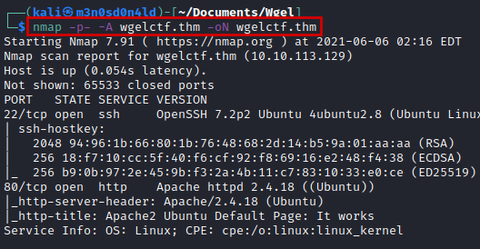

## Enumeration
We access the web service and find a default Apache page.

We enumerate the "Jessie" user in code HTML.

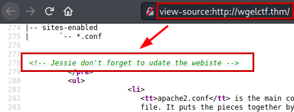

We use the **dirsearch** tool with a common dictionary and we enumerate the *"/sitemap/"* directory.

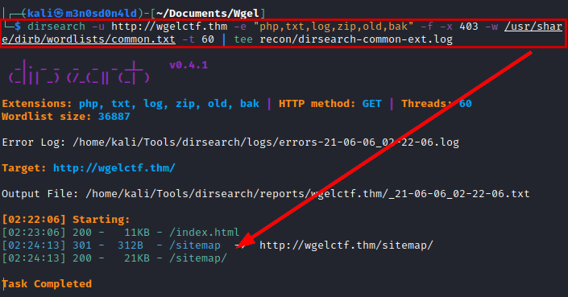

We access to this web, we find a corporate web.

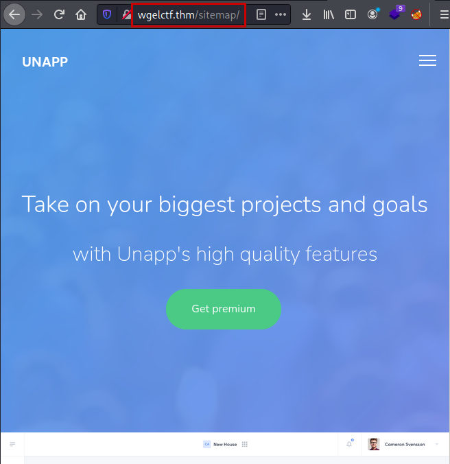

We return use **dirsearch** tool in the new directory and we find the *"/.ssh/"* directory with *id_rsa* file.

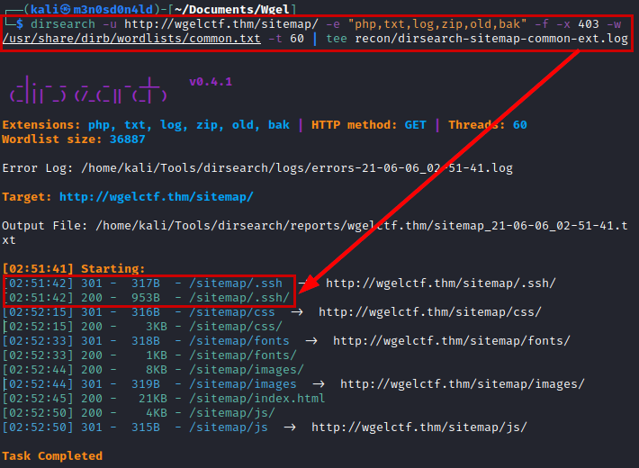

#### Evidence a id_rsa file

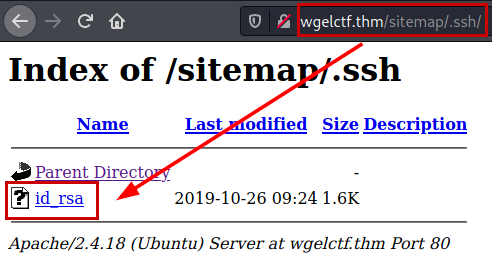

## Exploitation
We use **id_rsa** file with *"Jessie"* user in SSH service, We enumerate commands SUDO and we reading *"user_flag.txt"* file.

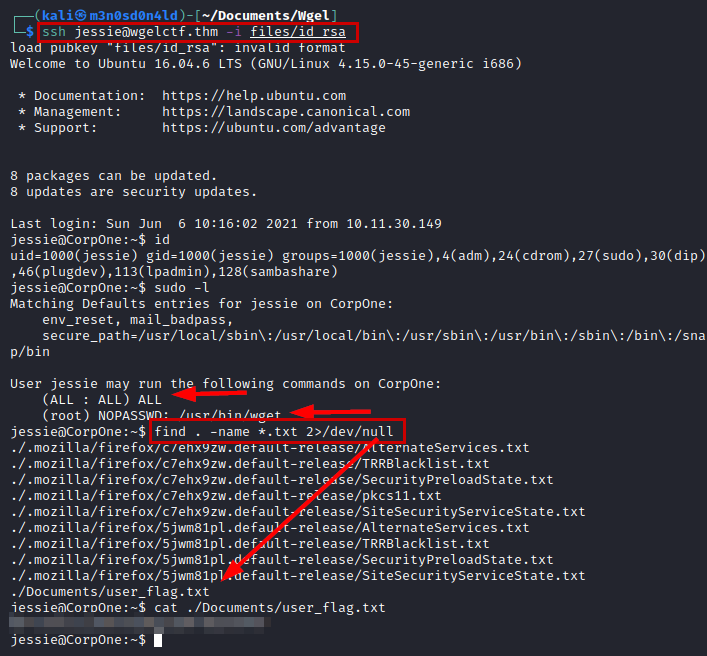

## Privilege Escalation

Previously, we saw that we can run **wget** as **SUDO**. We use the flag *"--post-file"*, we put a **netcat** listening and we see that it prints the file *"/etc/shadow"*. 

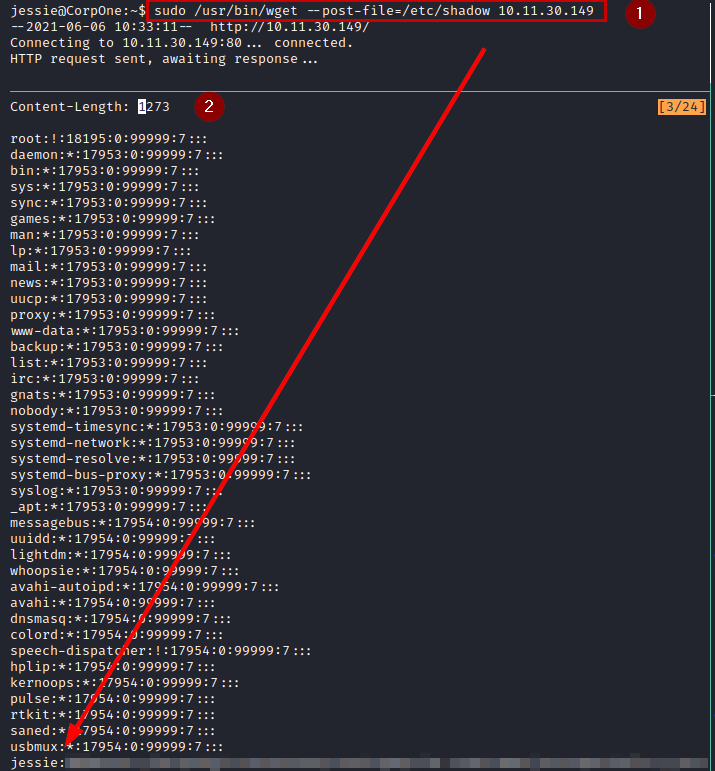

After that, we tried to crack the hash with rockyou, but I can't get the password. So I think, if I can read any file.... Why not read the root flag? 

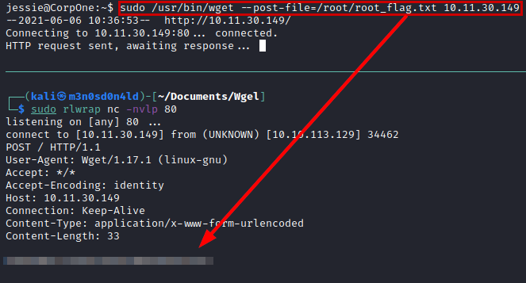

But please... This is cheating! Let's break the machine as it deserves.

So we will not complicate it, we will copy the file *"/etc/passwd"* and save it in our local kali.

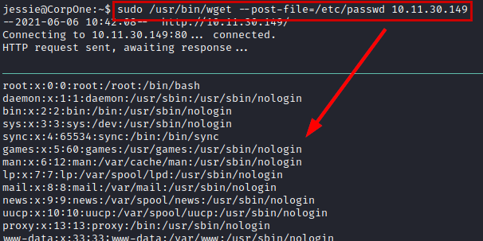

We will create a new user, specify the hash of a password we know and save our *"passwd"* file.

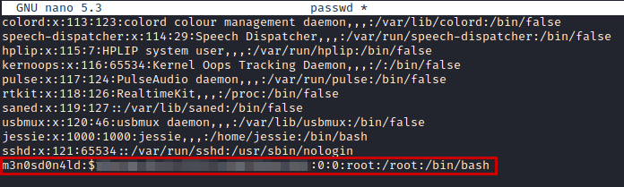

Perfect! Then we will put in the variable *"URL"* the address of the file to our machine, *"LFILE"* will be the destination where the legitimate file will be replaced and we will execute the **wget** command as **SUDO**.

After seeing the *"saved"*, we will authenticate with our **new user**, we will be root and we will be able to read again the root flag.

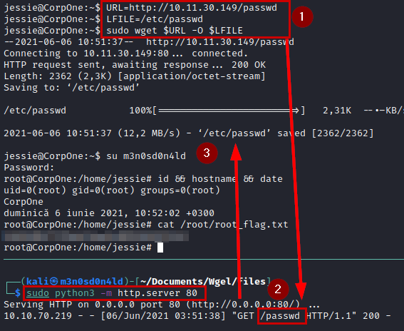

---
## About

David Utón is Penetration Tester and security auditor for web and mobiles applications, perimeter networks, internal and industrial corporate infrastructures, and wireless networks.

#### Contacted on:

 [David-Uton](https://www.linkedin.com/in/david-uton/)
 [@David_Uton](https://twitter.com/David_Uton)
