# Zeno TryHackMe Writeup
### Level: `Medium` | OS: `Linux`


## Scanning
We run nmap on all ports with scripts and software versions.

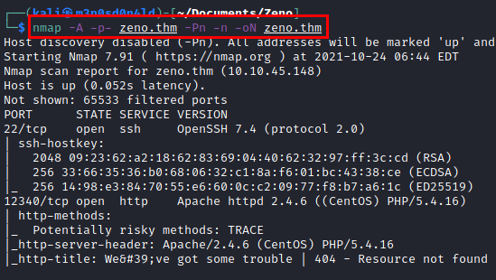


## Enumeration
We access the high web port and find an inactive resource.


Launch "**dirsearch**" and list the directory "*rms*".
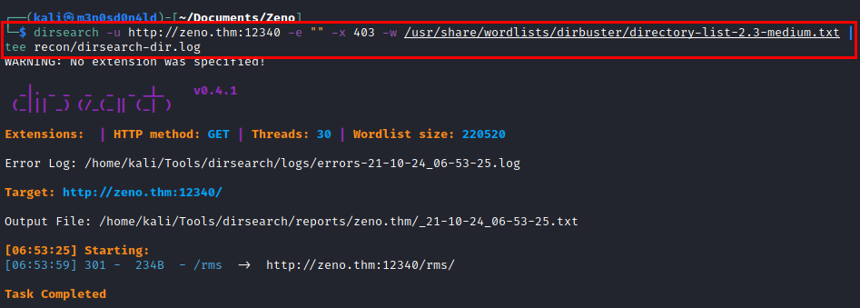

Accessing the directory, we find a website with "*Restaurant Management System*" displayed.

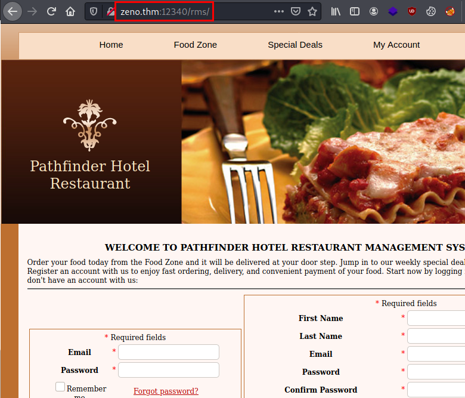

## Control panel
We listed the control panel, but it is out of service.

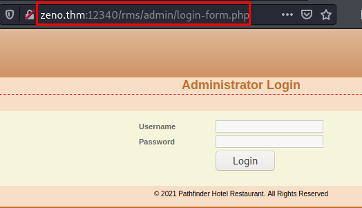

We create a user and see that it is vulnerable to SQL Injection (Time-Based).

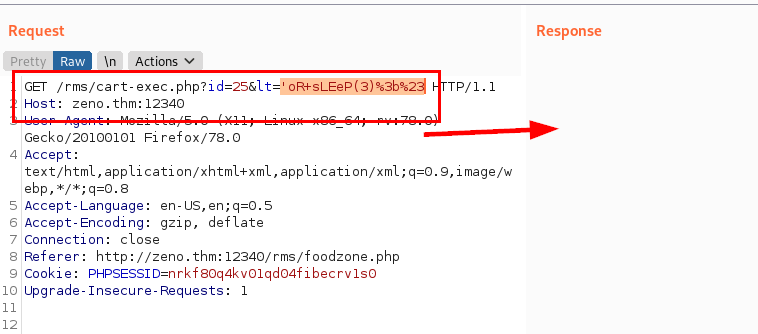

We use the "**sqlmap**" tool, we manage to enumerate the databases and obtain some credentials, but it does not help us to connect via **SSH**.

### Databases name

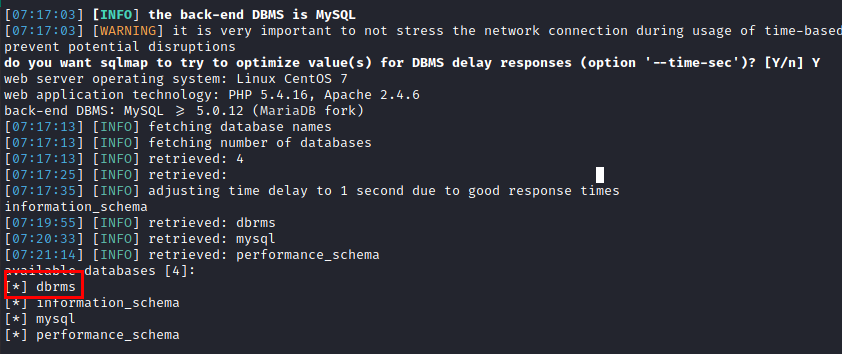

### Members table

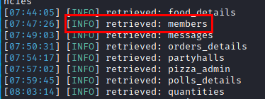

### Columns name

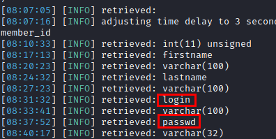

### Users

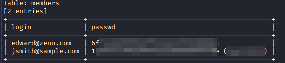


## Exploitation
We reviewed exploits and found this one for Remote Code Execution (RCE).

#### Exploit: [https://www.exploit-db.com/exploits/47520](https://www.exploit-db.com/exploits/47520)

The exploit has some faulty lines, we fix the exploit, run it and we have a command shell via **PHP**.
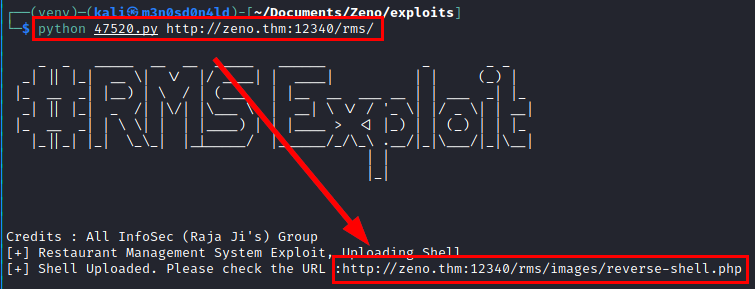

### PoC


We put a Netcat listening and run a reverse shell and gain access to the system.

### Reverse shell

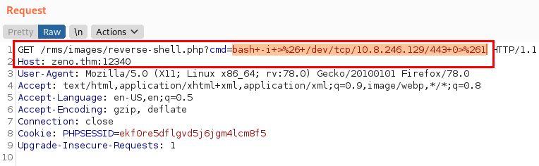

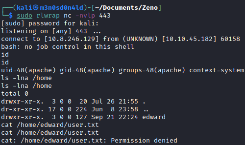

We read the "*config.php*" file of the CMS, but the password is not valid for the user "*edward*".

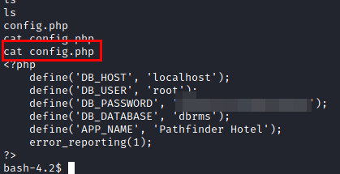

We do a quick reconnaissance with the "**lse**" script, we find two interesting things:
- A credentials.
- A service file that we have write permissions.

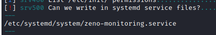

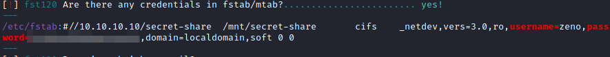

We use the password on the user "*edward*" and read the user flag.


## Privilege Escalation
We check if we can run any script or binary with SUDO, we see that we can restart the system.

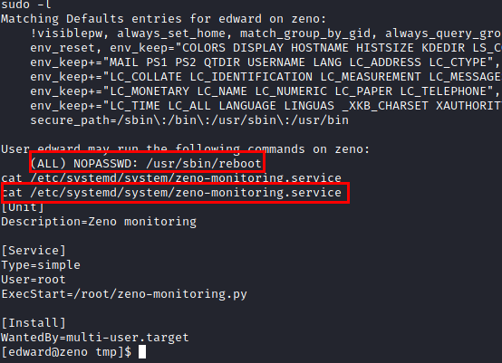

We remember that previously we found a service file that we can modify, we have already done this procedure in other machines, so we modify the file and restart the machine, so we will force the new loading of the service file.

We create a service file with the following content:

```bash
[Unit]
Description=root

[Service]
Type=simple
User=root
ExecStart=/bin/bash -c 'echo "edward ALL= (root) NOPASSWD: /usr/bin/sudo " >>/etc/sudoers'

[Install]
WantedBy=multi-user.target
```

When the machine restarts, it will grant us to use sudo as root, so we can run a bash, become root and read the flag.


---
## About

David Utón is Penetration Tester and security auditor for web and mobiles applications, perimeter networks, internal and industrial corporate infrastructures, and wireless networks.

#### Contacted on:

 [David-Uton](https://www.linkedin.com/in/david-uton/)
 [@David_Uton](https://twitter.com/David_Uton)
